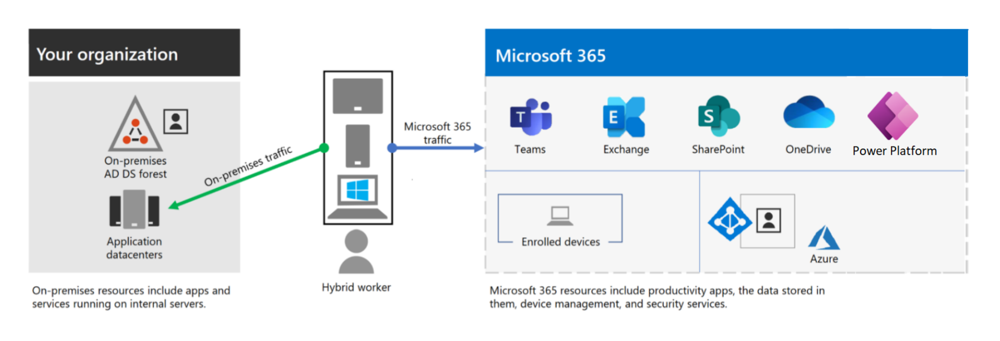

# Introduction

Our goal is to provide our customers with the most up to date and relevant documentation surrounding the various products and services we support. Despite our strong focus to using PAAS and SAAS services, which are already well documented online, it is often a challenge to find the most relevant information based on the specific implementation details of what our company has deployed to your environment(s).

The Compliance Case Management System is being implemeted in Microsoft's 365 suite of products, in partular the Power Platform. The image below depicts where Power Platform Lives within the Myriad of Azure and M365 services at a high level.


# Architecture

To accomplish a seamless and automatable source controlled documentation static generator, Implementation leverages Microsoft's Open Source Documentation system called [DocFx](https://dotnet.github.io/docfx/). 

The architecture for Microsoft's DocFX Documentation Platform can be found here: [docfx Design Spec | DocFX website (dotnet.github.io)](https://dotnet.github.io/docfx/spec/docfx_design_spec.html)

# Building

To get started quickly, follow the guide in the DocFx documentation. [Getting Started with DocFX | DocFX website (dotnet.github.io)](https://dotnet.github.io/docfx/tutorial/docfx_getting_started.html)

To convert a word doc use <b>ALL WORD DOCS TO CONVERT MUST ALSO BE COMMITTED TO THE REPOSITORY UNDER THE WORDDOCS FOLDER IN THE documentation FOLDER</b>:

```mardown
pandoc documentation/Solution\ Design\ \&\ Architecture/docfxSDD-v2.6.docx --from=docx --to=markdown_strict+yaml_metadata_block --output=documentation/Solution\ Design\ \&\ Architecture/SDD-v2.6.md --wrap=none --metadata title="Solution Design"
```

Next, you must also extract all media references with the following command (example, but make sure htat )
```
pandoc --extract-media ../SDD/images ocumentation/Solution\ Design\ \&\ Architecture/docfxSDD-v2.6.docx  -o --output=documentation/Solution\ Design\ \&\ Architecture/SDD-v2.6.md --wrap=none --metadata title="Solution Design"
```

Once you are familiar with the solution, you are ready to clone Implementation's docfx instance. Simply Git Clone into a local folder, and ensure that you have the required dependencies for DocFx on your machine/server. Once the solution is cloned locally, execute the following command:

```mardown
    docfx docfx.json --serve
```

# Building (PDF)

To get started quickly, follow the guide in the DocFx documentation. [Create/Downloadable PDF Files | DocFX website (dotnet.github.io)](https://dotnet.github.io/docfx/docs/pdf.html)
To build PDF files, first install wkhtmltopdf by downloading the latest binary from the official site or install using chocolatey: choco install wkhtmltopdf. {TBD: MUST FIND UNIX VERSION OR MACOS EQUIV AS I DONT WANT THE PDF CONVERSION STUCK USING WINDOWS}
Make sure the wkhtmltopdf command is added to PATH environment variable and is available in the terminal.

## PDF Config

Add a pdf section in docfx.json:

```json
{
  "pdf": {
    "content": [{
      "files": [ "**/*.{md,yml}" ]
    }],
    "wkhtmltopdf": {
      "additionalArguments": "--enable-local-file-access"
    },
  }
}
```

Most of the config options are the same as build config. The wkhtmltopdf config contains additional details to control wkhtmltopdf behavior:

    filePath: Path to wkhtmltopdf.exe. 
    additionalArguments: Additional command line arguments passed to wkhtmltopdf. Usually needs --enable-local-file-access to allow access to local files.

Running docfx command againt the above configuration produces a PDF file for every TOC included in the content property. The PDF files are placed under the _site_pdf folder based on the TOC name.

See this sample on an example PDF config.
Add Cover Page

A cover page is the first PDF page before the TOC page.

To add a cover page, add a cover.md file alongside toc.yml. The content of cover.md will be rendered as the PDF cover page.

## NOTE on PDF ##

Dont use DocFX's PDF generator as all it does is create one huge PDF which is obviously not what we want. So please make sure to review the scripts in the .pipelines folder (PS1). These scripts will loop through the documentation folder content sub folder's .md files and run the following pandoc command:

pdfgen.ps1 -> this creates the pdf's but will also create the PDFs in the _site/documentation subfolders with the HTML files so that the web server can reference the pdf files in the anchor tag as ./ 

```console
#Note that this script  is ran in the loop so make sure you example the actual PS function. Also you need to have this executable installed in your local environment or in your DevOps agent - so this needs to be refactored at somepoint so that we can reference this exe - perhaps in our GIT repo
pandoc .\ALM.md -o output.pdf --pdf-engine="C:\Users\Fred\AppData\Local\Programs\MiKTeX\miktex\bin\x64\pdflatex.exe"
```

addpdflink.ps1 -> creates the anchor in the md file. Make sure that once you run this, you run the docfx docfx.json command again to regenerate the content and re-deploy the site.

```console
 # Read the content of the Markdown file
    $content = Get-Content -Path $file.FullName
    # Find the first heading in the Markdown file
    $heading = $content | Select-String -Pattern "^#\s+(.*)" | ForEach-Object { $_.Matches.Groups[1].Value }

    if ($heading -ne $null) {
        # Generate the link to the PDF file
        $pdfLink = "[Download PDF](./$($file.BaseName).pdf)"
        # Add the link below the first heading
        $newContent = $content -replace "^#\s+$heading", "# $heading`r`n$pdfLink"
        # Write the updated content back to the file
        $newContent | Set-Content -Path $file.FullName
    }
```

This is the original configuration in the DocFX.json file which I've removed but kept here for reference.
<!-- 
 "pdf": {
    "noStdin": true,
    "content": [
      {
        "files": [
          "documentation/**/*md",
          "documentation/toc.yml"
        ],
        "exclude": [
          "**/bin/**",
          "**/obj/**"
        ]
      }
    ],
    "resource": [
      {
        "files": [
          "images/**/**"
          
        ],
        "exclude": [
          "**/bin/**",
          "**/obj/**"
        ]
      }
    ],
    "wkhtmltopdf": {
      "filePath": "C:/Program Files/wkhtmltopdf/bin/wkhtmltopdf.exe",
      "additionalArguments": "-q --enable-local-file-access"
    },
    "dest": "_site/pdf"
  },
  "word": {
    "content": [
        {
            "files": [
                "documentation/**/*md",
                "documentation/toc.yml"
            ],
            "exclude": [
                "**/bin/**",
                "**/obj/**"
            ]
        }
    ],
    "dest": "_site_word"
  } -->