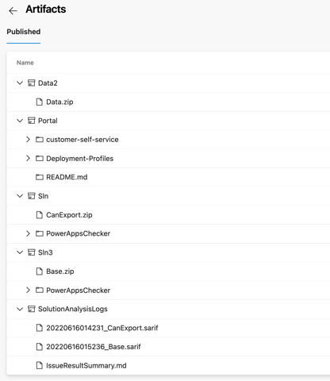

# Power Platform ALM
[Download PDF](./ALM.pdf)

The purpose of this document is to describe and illustrate the
application lifecycle management (ALM) strategy at GAC. The Dynamics
365 implementation at GAC is quickly growing and new features are being
added every quarter. In addition to new features, more and more line of
businesses are onboarding as well. To accommodate frequent changes and
optimizations to the platform to meet evolving business requirements,
GAC is embarking on an exercise to optimize their ALM process to
achieve a greater level of configuration management integrity.

## ALM CHECKLIST

### CONVENTIONS

  -----------------------------------------------------------------------

- Solutions are unpacked and version controlled in GIT hosted repo in
  Azure DevOps

- Solutions are repacked through an automated process and stored as
  artefacts for releasees

- Packages are built through an automated process that combines the
  required solutions and configuration data into a PackageDeployer.zip
  file

- Solutions are exported and imported as managed

- There is at least one discrete development instance per solution being
  developed (by line of business). A base solution includes common
  components is imported into LOB environments

- Where multiple solutions are developed for deployment to a single
  production environment, the same solution publisher and prefix are used

- Pipeline can support both standard solutions and solution patches

- Solution.zip files and their contents are never manually edited

- Where a solution being developed has dependencies on one or more
  solutions, the dependencies are satisfied through always importing
  those solutions as managed solutions into the discrete development
  instance for the solution being developed (e.g. Base solution)

- Only managed solutions are deployed to environments downstream of
  development

- All solutions are deployed via the release pipeline

- No unmanaged changes are made directly to environments downstream of
  development

- Each test case has traceability back to requirement

- Test cases are automated

- The pipeline supports configuration data transfers

- Exported configuration data is saved as artefacts

- The pipeline's runtime variables map to their own stage and run in the
  sequence they are provided by the user

- If any stage fails, the pipeline exits (so will not execute subsequent
  stages to avoid faulty deployments)

- Each stage generates a log artefact (e.g. Solution, Portal checker,
  diagnostics)

- Release managers can create a release from a build which will leverage
  the artefacts from the build (instead of exporting these from an
  environment)

- Any issues that are deemed critical by the solution checker and the
  portal checker will exit the pipeline

- A default variable group is available to the build team. Each developer
  can clone the variable group for specific connection parameters.
  Alternatively, the organization can opt to leverage a single variable
  group to govern the connection parameters to each environment.
  Developers will always have access to a runtime variable and successful
  builds will store the resulting artefacts from these variables for
  future release.

- The primary development stream solution set is static. Developers can
  create as many solutions as they need however, their components must be
  migrated to the primary solutions that make up the system. The same
  applies for the schema files. The pipeline allows a developer to deploy
  their solutions to the primary dev environment where the pipeline will
  merge its components to the primary solution

- (Optional) In a scenario where GAC opts for developer environments or
  developer solutions, the pipeline will support solution component mover
  API calls to merge developer solution components to the BASE,
  CanExport, and Sonar 360 solutions (and others for future LOB
  implementations)

  -----------------------------------------------------------------------

## IMPLEMENTATION

### Overview

The PowerPlatform CI/CD implementation is comprised of a scripts that
provides the PowerPlatform build teams with the ability to check-in
their Dataverse solutions, configuration data schema files, and portal
code to the organizations primary repository(ies) hosting the source
code and deployment artefacts that make up the Department's grant
funding system. This pipeline extension is built to be generic to any
PowerPlatform implementation that is comprised of both Model-Driven-Apps
and PowerApps Portals. Canvas Apps are not yet fully supported in this
implementation, however support for these types of applications will be
released in version 1.3. That being said, since Canvas apps are
typically stored in a solution, this pipeline automation extension can
include Canvas Apps but will not include certain features like automated
tests designed for these types of applications. Version 1.3 is scheduled
to be released on June 28, 2022 along with an updated version of this
document.

### Continuous Integration

For the organization to achieve stability, predictability and quality of
their Dataverse application deployments, the build team needs to be
equipped with tools that will automate the export for solutions,
configuration data, and portal data and apply version control. In
addition, members of the build team need the capability to deploy new
features and or bug fixes frequently to minimize the complexities
associated with less frequent and very large deployments. Having the
ability to continuously release changes to the Dataverse applications
will allow the developer to address issues such as missing dependencies,
critical bugs, and potential misconfigurations or mis-interpreted
requirements which can cause issues downstream. By catching these issues
early, the team can resolve these issues and re-deploy. The deployment
processes in the PowerPlatform can take a significant amount of time if
executed manually which can cause overall productivity issues.
Therefore, by implementing a robust continuous integration framework,
developers can instead rely on the DevOps Pipelines feature to automate
deployments which will not only provide overall productivity gains, but
will also standardize the deployment processes, provide a facility for
automated testing to ensure best practices are followed, validate that
the solution, data and portal artefacts can be successfully deployed
based on their latest changes etc. In this section, the extension for CI
is described.

### Option 1: Developer invoked integration

Developers have the option of manually invoking a pipeline for which the
developer will be supply a series of variable values in a specific
sequence. Once the variables are defined, and the pipeline invoked, the
extension will interpret the supplied variables and will deploy the
developer's solution(s), configuration data (from the schema), and (or)
the portal configuration changes automatically. As part of this process,
the extension will run the solution and portal checker API's provided by
the Dataverse build tools and will export the Dataverse resources
informed by the variable(s) provided by the developer. These artefacts
are stored in the DevOps project storage for future usage such as
release to a downstream environment such as UAT and PROD.

### Option 2: Integration Automation

The organization can configure the pipeline to trigger automatically via
Pull-Requests. In this scenario, pull-requests are invoked to a branch
such as TEST which will automatically deploy the solutions, data files,
and (or) portals using pre-defined variable values in both the variable
group and run time variables. In this scenario developers will be
responsible to move their solution components to the primary solutions
set in the variable artefacts. The release manager will then issue a PR
to the relevant branch will execute the pipeline, save the artefacts in
preparation for a release to a downstream environment. The benefits of
this approach include a reduction of effort associated with developers
having to manually invoke pipelines. The downside will be less
traceability of who made the changes and when as with this approach,
changes are published by a single (or multiple) release managers for the
sole purpose of deployment and generation of artefacts to deploy to
downstream environments.

### Summary

GAC can opt to use a combination of the two options instead of picking
one. In this scenario, developers will be responsible to commit their
work, indirectly through the pipeline script in DevOps, and the cadence
for option 2 would be that the release manager would run the same
pipeline at specific time intervals during a release cycle to prepare
the artefacts for a full release to UAT and Production. If GAC opts to
leverage only a single option, Option 1 would be more beneficial as it
would align better with modern ALM standards whereby developers can test
their own releases and receive feedback on any potential defects
associated with their development artefacts through the automated test
outputs provided by the pipeline so that when its time a full release,
issues like missing dependencies, bugs and mis-configurations are
minimized or eliminated resulting in a more reliable deployment process.

## Continuous Deployments

This pipeline extension includes a release pipeline targeted to UAT and
PRODUCTION environments. Releases are invoked by release managers who
will have the ability to select any successful and issue a release to
UAT and PROD using that build's artefacts. The script is identical to
the build integration script and will use the same variable group. The
only delta is that the release pipeline script will loop through its
source build integration artifacts and set the runtime variables
automatically so that the release manager does not need to re-set these
variables at run time.

### Option 1: Release manager intervention

The release pipeline can be invoked manually by a release manager from
any build or from the release's menu in DevOps.

### Option 2: Deployment Automation

Like the automated build integration, a release manager can choose to
have the release pipeline execute as part of a PR and thus tied to a
branch. The processes demonstrated below are the same, with t

## DESIGN

### Security

Only build administrators can modify the pipeline and execute the full
release pipeline. Contributors (developers) can execute the build
integration pipeline. This baseline implementation also restricts any
modifications to the variable group that is linked to the pipelines.
Only build administrators can modify these groups. However if GAC
employs a developer environment strategy, it is recommended that the
variable groups are cloned and that each developer will have access to
the build integration pipeline within their own branch and these would
be tied to a variable group whose source and target would reflect their
developer environment and point to the consolidated dev environment.

This current version of the scripts supports OOB variable groups and
variable secrets but assumes that the DevOps projects is not linked to a
KeyVaults. If GAC links the project to a KeyVaults, the variable group
values will be updated to include the KeyVaults name and secret IDs
instead of using "masked" secrets.

### Service Connections

The table below includes the service connections required for this
extension. In addition to service connections, since this extension is
leveraging the community version of the build tools, connecting strings
must also be configured. However, the connection strings are
automatically generated by other variables (e.g. the SPN -- App
Registrations/App User's TenantID, URL, ClientID and Secret all of which
are concatenated within the source and target connection strings for
each environment. These variables, including the service connections
(Target and SourceSPN-{ENV} variables are available in the Variable
Group (Connection-Parameters).

A service connection should be created for each environment that will
service as a source and target environment for the integration and
deployment pipelines. All connection parameters should be pre-defined in
the connection parameters variable group.

## Variables & Variable Groups

| Variable Name          | Description                                                                                                                                      |
| ---------------------- | ------------------------------------------------------------------------------------------------------------------------------------------------ |
| ClientID               | App Registration’s ClientID (ApplicationID – SPN for Dataverse Environments’ App User (assumes 1 SPN for multiple environments)                  |
| DeploymentProfile-PROD | Portals -> PROD Global settings (located in Deployment-Profiles folder in repository – prod.deployment.yml                                       |
| DeploymentProfile-TEST | Portals -> TEST Global settings (located in Deployment-Profiles folder in repository – test.deployment.yml                                       |
| DeploymentProfile-UAT  | Portals -> UAT Global settings (located in Deployment-Profiles folder in repository – uat.deployment.yml                                         |
| Secret                 | App Registration’s Client Secret (SPN for Dataverse Environments’ App User (assumes 1 SPN for multiple environments)                             |
| SourceConnection-DEV   | Value is populated by ClientID, Secret, Source and Target URLs, and TenantID – this is for data transfers                                        |
| SourceConnection-UAT   | Value is populated by ClientID, Secret, Source and Target URLs, and TenantID – this is for data transfers                                        |
| SourceSPN-DEV          | Service Connection name for DEV (Source environment)                                                                                             |
| SourceSPN-UAT          | Service Connection name for UAT (Source environment)                                                                                             |
| SourceURL-DEV          | Source URL for DEV (feeds SourceConnection variable)                                                                                             |
| SourceUAT-DEV          | Source URL for UAT (feeds SourceConnection variable)                                                                                             |
| TargetConnection-DEV   | Value is populated by ClientID, Secret, Source and Target URLs, and TenantID – this is for data transfers (source environment connection string) |
| TargetConnection-UAT   | Value is populated by ClientID, Secret, Source and Target URLs, and TenantID – this is for data transfers (target environment connection string) |
| TargetSPN-DEV          | Service Connection name for DEV (Target environment)                                                                                             |
| TargetSPN-UAT          | Service Connection name for UAT (Target environment)                                                                                             |
| TargetURL-PROD         | Target URL for PROD (feeds TargetConnection variable)                                                                                            |
| TargetURL-UAT          | Target URL for UAT (feeds TargetConnection variable)                                                                                             |
| TargetURL-DEV          | Target URL for DEV (feeds TargetConnection variable)                                                                                             |
| TenantID               | Azure tenant ID hosting App registration record                                                                                                  |

## Runtime Variables

| Variable Name             | Description                                                                                                                                                                                                                                                                                           |
| ------------------------- | ----------------------------------------------------------------------------------------------------------------------------------------------------------------------------------------------------------------------------------------------------------------------------------------------------- |
| Artefact1                 | Provide the name of a solution (doesn’t need to be in the repository, the pipeline will perform the export and commit etc.) or configuration migration xml file (must be in the data directory in the repo)                                                                                           |
| Artefact1-Target Solution | If Artefact1 is a solution, and you need to copy its component to a primary solution, provide the name of the primary solution here                                                                                                                                                                   |
| Artefact2                 | Provide the name of a solution (doesn’t need to be in the repository, the pipeline will perform the export and commit etc.) or configuration migration xml file (must be in the data directory in the repo)                                                                                           |
| Artefact2-Target-Solution | If Artefact2 is a solution, and you need to copy its component to a primary solution, provide the name of the primary solution here                                                                                                                                                                   |
| Artefact3                 | Provide the name of a solution (doesn’t need to be in the repository, the pipeline will perform the export and commit etc.) or configuration migration xml file (must be in the data directory in the repo)                                                                                           |
| Artefact3-Target-Solution | If Artefact3 is a solution, and you need to copy its component to a primary solution, provide the name of the primary solution here                                                                                                                                                                   |
| Artefact4                 | Provide the name of a solution (doesn’t need to be in the repository, the pipeline will perform the export and commit etc.) or configuration migration xml file (must be in the data directory in the repo)                                                                                           |
| Artefact4-Target-Solution | If Artefact4 is a solution, and you need to copy its component to a primary solution, provide the name of the primary solution here                                                                                                                                                                   |
| Deploy Portal?            | If set to yes, the pipeline will export the portal via CLI and commit to source. It will also deploy the portal to the target environment (using SourceURL and TargetURL)                                                                                                                             |
| Comments                  | Used to issue the git comments when the pipelines automatically commit your artefacts                                                                                                                                                                                                                 |
| Project Name              | Optional, provides project context                                                                                                                                                                                                                                                                    |
| Variable-Group            | Name of the variable group that is linked to the pipeline to leverage. The group must have the same variable names (and types) as the “Connection-Parameters” variable group. This is useful to isolated dev environments with specific Dataverse environments that fall outside the main dev stream. |

## .NET/NuGET Libraries / Marketplace (Dependencies)

The following marketplace plugins and nuget packages are leveraged in
this extension. The goal is to reduce the number of marketplace plugins
and slowly transition towards using the CLI exclusively coupled with
Dataverse API calls to reduce dependencies.

| Name                      | Type                      | Purpose                                |
| ------------------------- | ------------------------- | -------------------------------------- |
| PowerPlatform Build Tools | DevOps Marketplace Plugin | Helper YAML extensions for pipelines   |
| Power DevOps Tools        | DevOps Marketplace Plugin | Helper YAML extensions for pipelines   |
| PowerPlatforms CLI        | Nuget Package             | Office Microsoft CLI for PowerPlatform |

## Developer initiated multi-stage pipeline

The process below illustrates the typical process for which a developer
will execute the build integration pipeline. In this example, the
developer is transferring Organizations and Contacts from developed to a
staging environment before transferring the CanExport solution as this
solution has workflow dependencies relying on Organization and Contact
lookup values being populated. At the same time, the user wants to
deploy his/her latest portal changes to the staging. \*NOTE\* to enable
CI, you can opt to have this pipeline trigger when a PR issued to a
specific branch. However, the process below is recommended as it
provides the build team with the ability to check-in their work and
automatically deploy and commit their changes and generate the artefacts
and test logs. If you decide to employ full automation, simply update
the trigger of this pipeline to a specific branch and ensure that the
runtime variables configured are pre-defined (see variables section) --
the variable group is already pre-defined so not additional
configuration required there.

If successful, each stage (1 per artefact specified in the variables),
will store its artefact in the Agent's Artefact Staging Directory for a
release to a UAT and eventually PROD environment. The pipeline
execution's success means that the source developer environment
artefacts provided in the variables will be deployed on the target
staging environment (or test environment, depending on your deployment
strategy for build integration). The solutions are deployed as managed,
and the portal is deployed using the CLI and only delta portal changes
are also deployed to the target staging environment (or build
environment).

To view the artefacts, click on the artefact anchor in one of the
stages. You can then view the download the artefacts and the solution
and portal checker log files for review. Note that this is the happy
path. If any of the stages fail, the pipeline will exit to ensure that
no subsequent solutions, data files or portal is deployed. In this case,
you can click on the failed stage(s) to view the detailed log of the
failure.

Below demonstrates the artefact storage structure. Notice that the
folder names will include an integer as a suffix which informs the
eventual release of the sequence for which to deploy these artefacts to
downstream environments.

\**Note that as you add additional tests to this CI/CD extension, you
should consider adding your test report(s) to the artefacts instead of
just in the GIT repository so that in the future, you have the ability
to leverage other pipeline tasks to send these report artifacts to a
SIEM to archiving system\**

In the event the pipeline execution fails, you can view the logs by
clicking on any failed stage to view the details. In the example below,
the TargetSPN was misspelled in the variable group resulting in a
connection issue to the target environment for the data import.

## Release Manager multi-stage release

The process below illustrates the typical process for which a release
manager will execute a full release to UAT and invoke the PROD release
manually only once UAT is completed. This is useful because, once the
artefacts are deployed to UAT, the client can test against the
acceptance criteria and if everything is ok, the release manager can
return to this release and execute the production stage knowing that the
same artefacts deployed to UAT successfully will be used to deploy to
production.

Using the example build from the previous section, the release manager
can navigate to the successful build, select the ellipsis and press
"Release"

When creating the new release, ensure to select the "Production
Deployment Stage" as a stage to run "Manually". This ensures that the
artefacts will only be deployed to your UAT environment to allow for
client UAT. You will execute the production deployment stage once UAT is
completed in a subsequent step.

Once created, the release anchor will be displayed just below the
breadcrumb, but you can also view the progress of the release under the
releases menu.

In the release details, you will notice that the UAT deployment is being
exectuted whereas Production is not being deployed. In addition, the
artefacts from the release are those that were generated by the
successful build.

Once succeeded you should see the following.

\**Note that if you would like to re-deploy the same artefacts but to a
different environment, the UAT stage below relies on the same variable
group used in the build integration pipeline. To do so you could update
the TargetURL-UAT, TargetSPN-UAT, ClientID and Secret (if the App User
is different in the new target) OR simply clone the
Connection-Parameters variable group, re-run the same build (in this
case \_20220616.3) and edit the Variable-Group variable to your new
group name and re-run the build integration pipeline and issue a new
release. The latter would be recommended to avoid any disruption from
updating connection parameters of your main development stream. IN
summary, if you would like to employ the same release pipeline
deployment strategy to another set of downstream environment(s), simply
clone the Connection-Parameters variable group, everything else an
remain the same as this CI/CD extension allows you to specify a variable
group at runtime to give you control over which environments you would
like to apply CI/CD to\**

Once UAT has been successfully completed, and you are ready to deploy to
production. Navigate to the release that deployed the UAT artefacts that
resulting in the successful UAT testing cycle and execute the production
deployment

## CONFIGURING THE CI/CD PIPELINE

This section describes how to deploy and configure the CI/CD artefacts
to your DevOps project.

### Pre-Requisites

- Make sure to have the full repo cloned and the yml files at root and your pipeline scripts folder. These files must be updated to ensure your local values are updated
  
- Create a Solutions folder in your repository's root directory

- Create a Data folder in your repository's root directory

- Create a ExportedData folder in your repository's Data folder
    (created in the previous step)

- Create a Portals folder in your repository's root directory

- Create a Logs folder in your repository's root directory

- Create a Deployment-Profiles folder in your repository's Profile
    directory

- Create a folder that matches the name of your PowerApps Portals
    website record in your repository's Portals folder. In that folder,
    create a deployment-profiles folder and include your dev, test, uat,
    and prod YAML profile files (e.g. test.deployment.yml \<- where test
    is the CLI parameter flag that will inform the CLI which deployment
    profile to use for your portal deployments.

The example below demonstrates the above folder structure implemented in
a DevOps repository to leverages this extension

### Install the following marketplace plugins

