# Azure Storage - Diagnostics & Technical Documentation & User Guides
[Download PDF](./Storage-Diagnostics.pdf)

## Pre-Requisites

-   **Dataverse environment administrator including user with PowerPlatform Administrator rights and System Administrator** security role assigned / access to the environment for which diagnostics is being configured.
-   **Global Administrator, Owner** of an Azure subscription hosting the Azure Storage resource

## Purpose

PowerApps Portals has a feature that will send runtime exception details and other errors to a series of log files that can be hosted in an Azure Storage Blob. This is useful to avoid displaying detailed trace logs to portal users and provides portal developers / administrators with the ability to review a detailed and verbose log of any exception / error thrown by the portal.

## Azure Storage & Blob Address

Navigate to the subscription that will host the Azure Storage resource and add a new resource. Search for Azure Storage (or Storage Account)

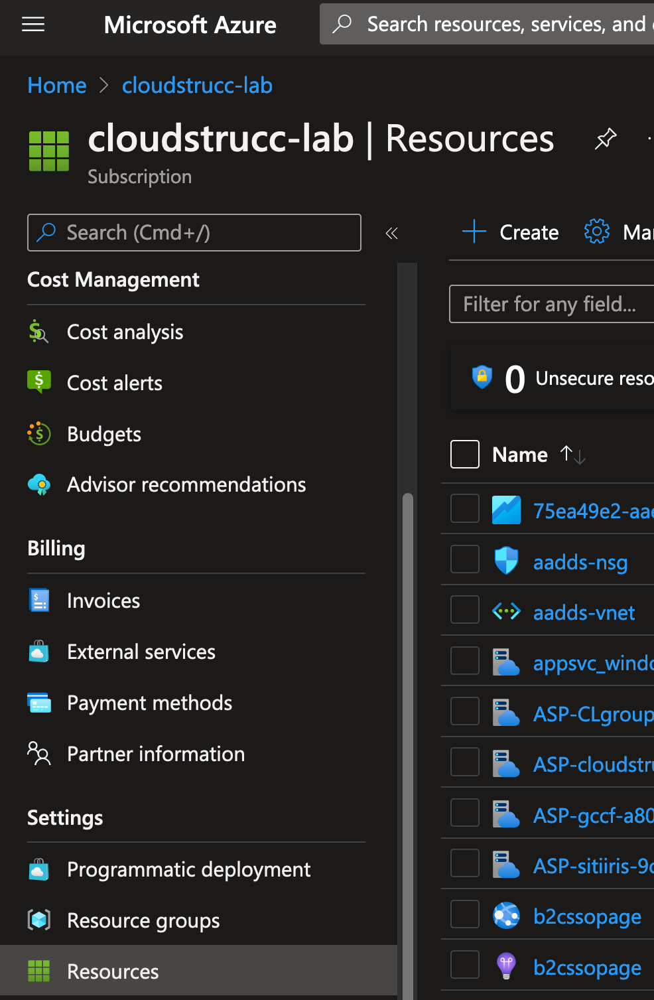

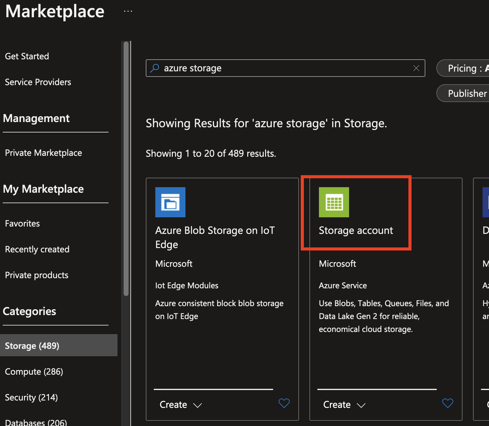

Set the appropriate resource group and set the following parameters and go through the entire wizard and leave the defaults. These diagnostics are for development only.

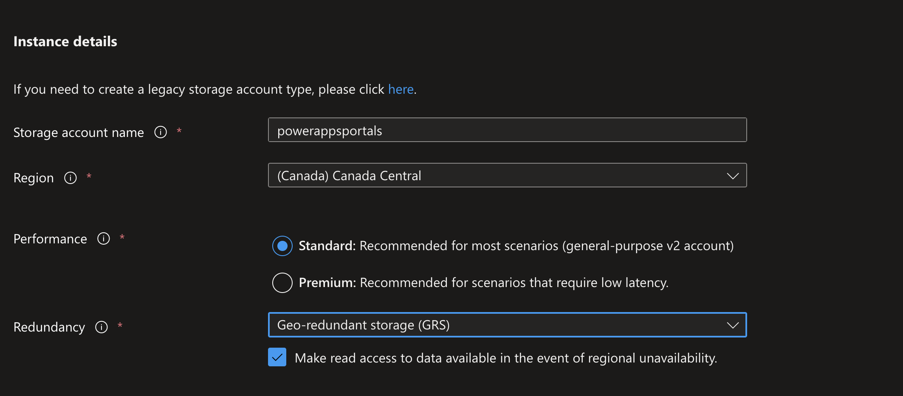

Once created, go to the newly created Azure Storage resource, click on the Access Keys menu and provide both the Key and Connection string to the PowerApps Portal developer / admin who is configuring the Portal settings to send the diagnostics log to the newly created blob.

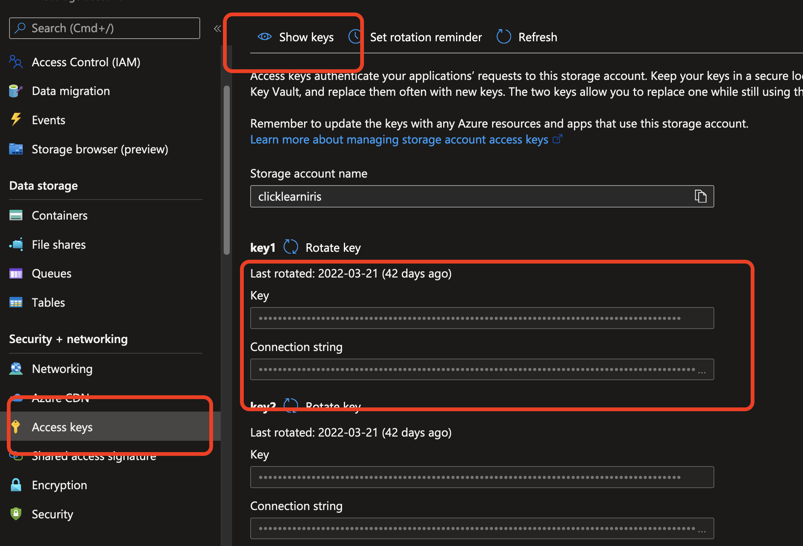

Next, provide Reader access to the PowerApps Portal developer/admin(s) who will need to inspect the logs

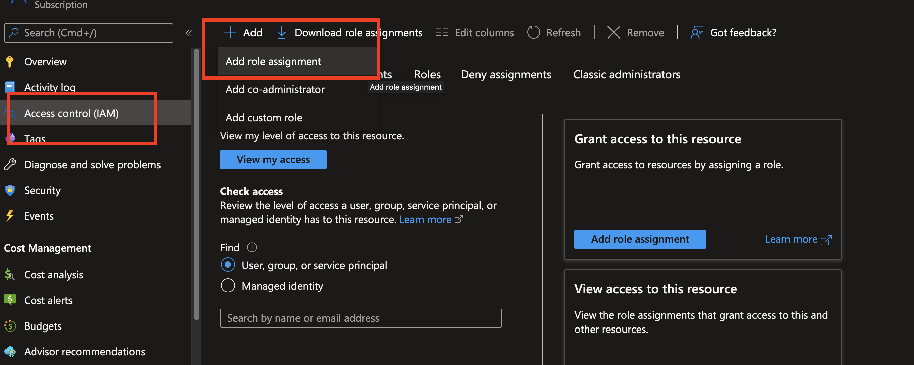

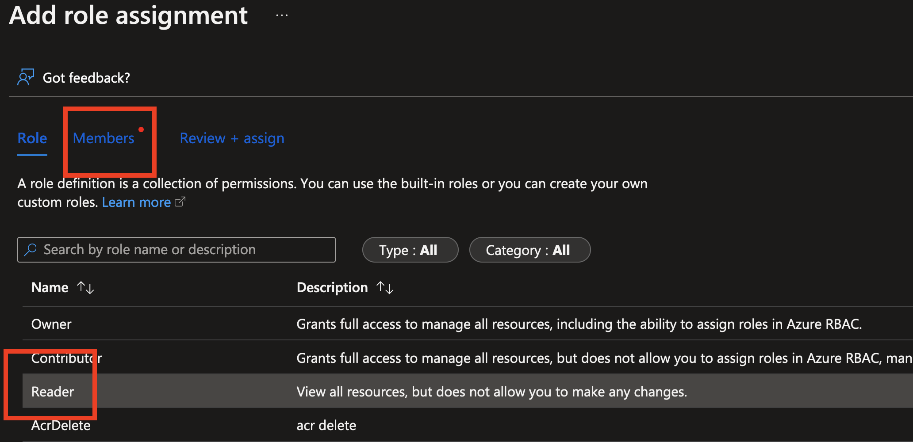

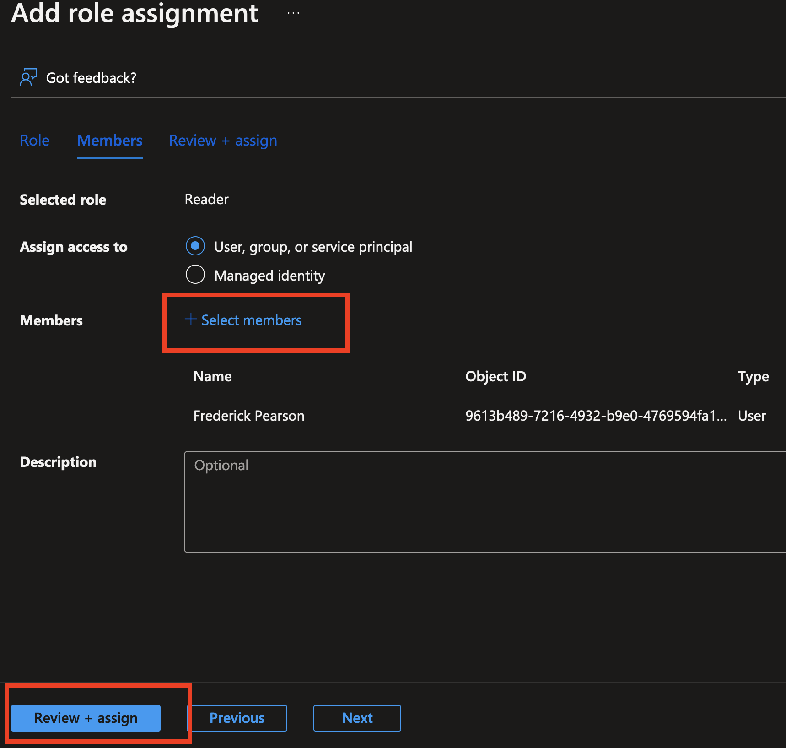

## PowerApps Portal – Configure Diagnostics

*To complete the steps below you will need a connection string and key from the Azure Storage Resource created in the previous section.*

Navigate to <https://make.powerapps.com> and select the environment where diagnostics will be configured. Once selected, navigate to apps, click on the ellipsis next to the portal app, press “settings” and then “administration”

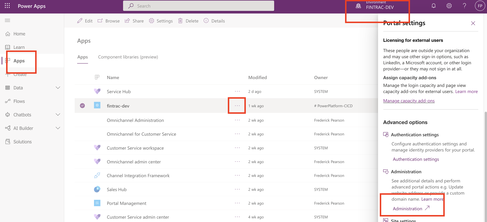

In the portal administration console, click on Portal Actions and select “Enable Diagnostic Logging”

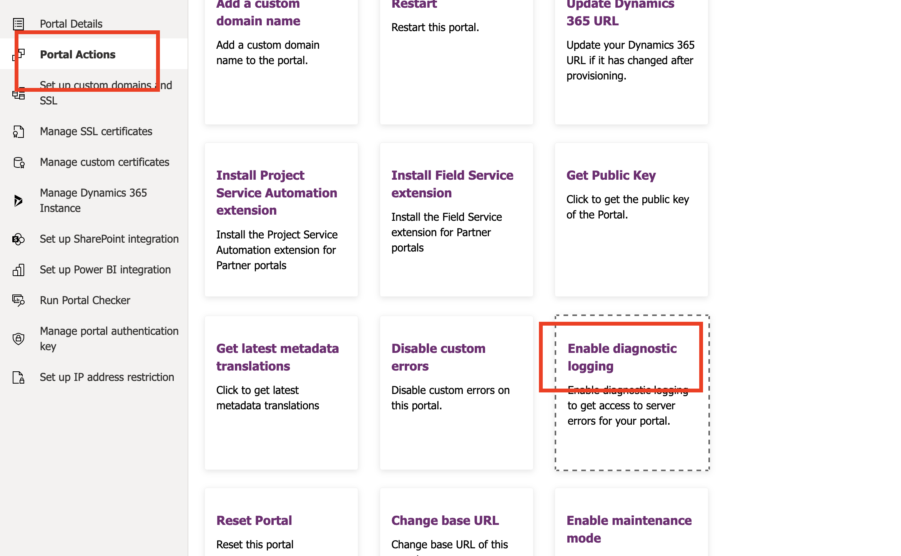

Paste the Connection String from the Storage Account and press configure

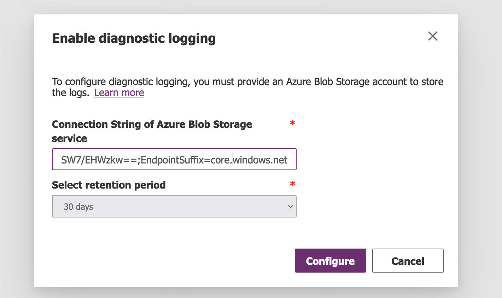

Once completed, all portal diagnostics will be stored in the Azure Storage in a blob container and logs will be stored in folders by Date and the Portal’s App Registration ID. To view logs, go the Azure Storage resource, click on Containers and “telemetry-logs”.

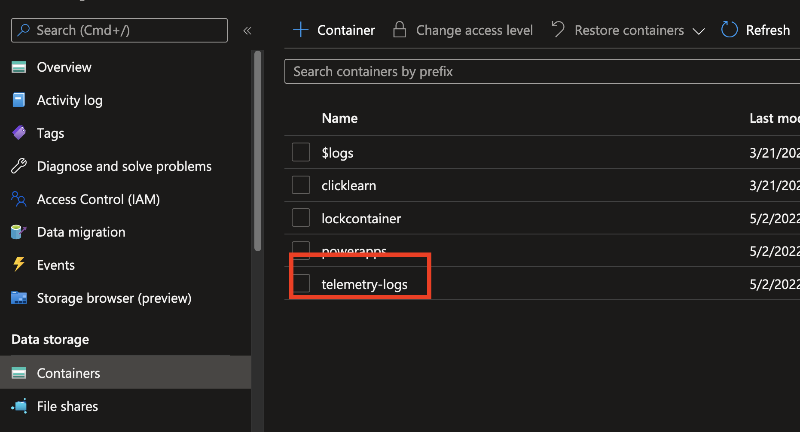

Each portal configured to send its diagnostics to this container will have a dedicated folder with there respective App Registration Record ID’s

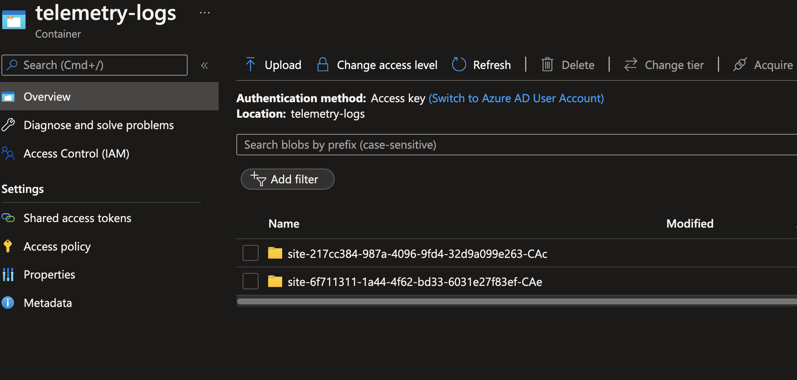

Logs within the portal folder have a folder for each day and a file for each diagnostic sent to the container

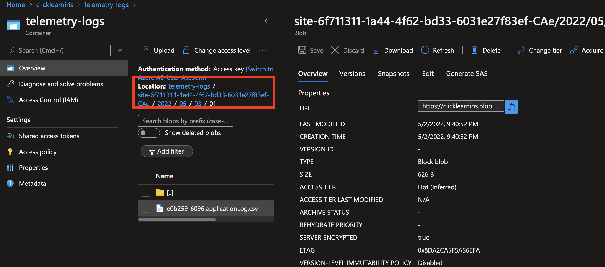

