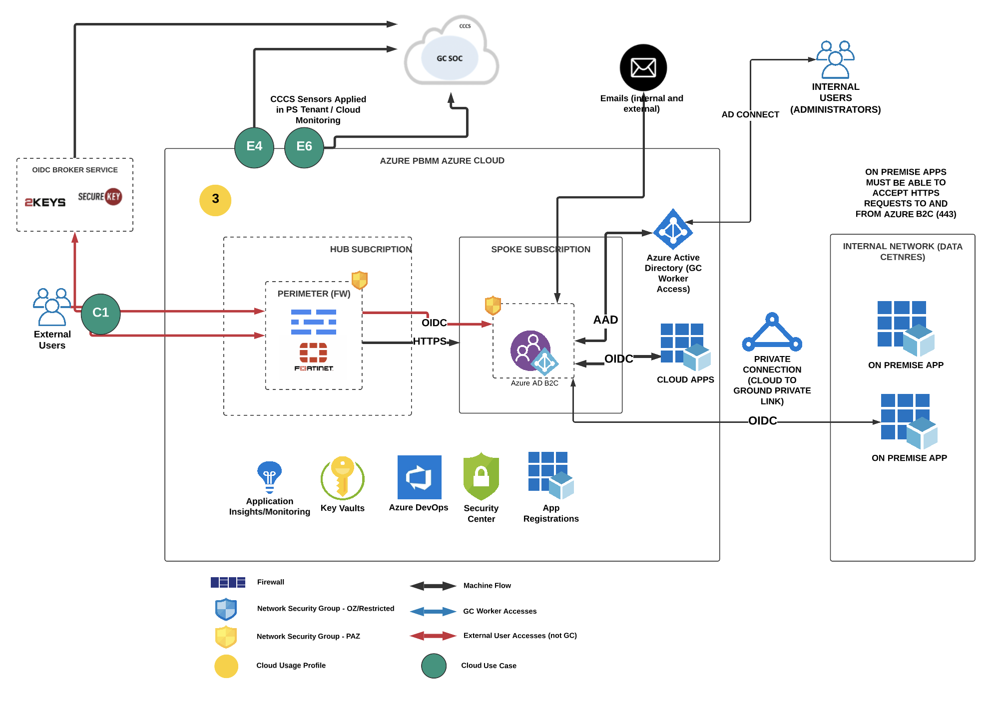
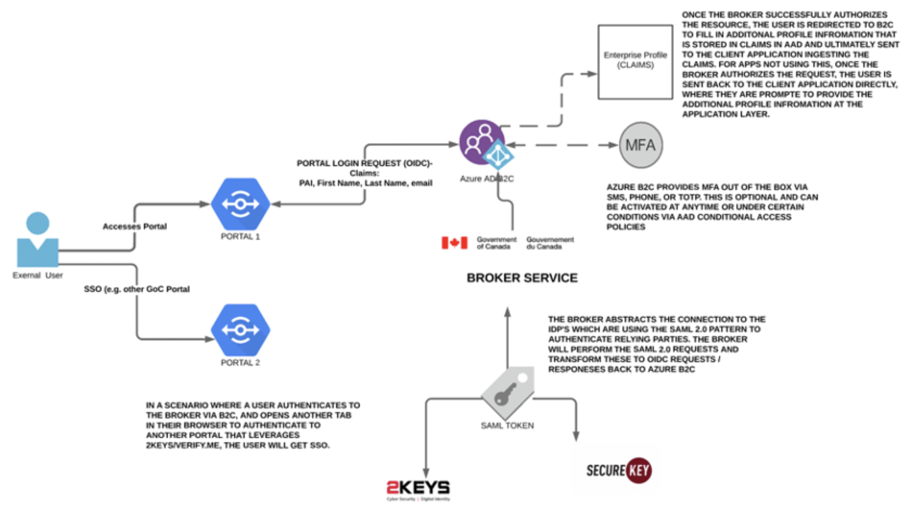
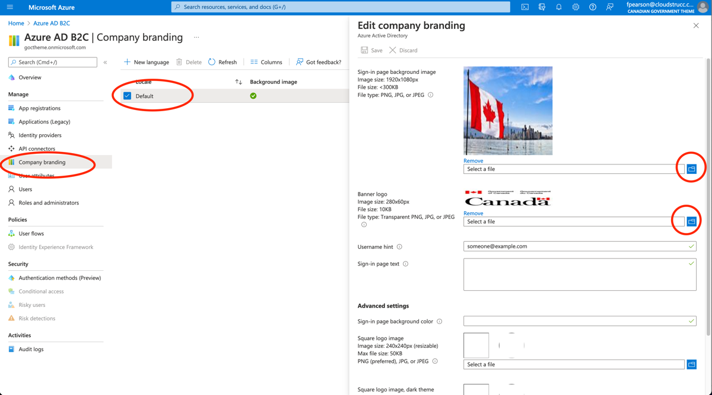
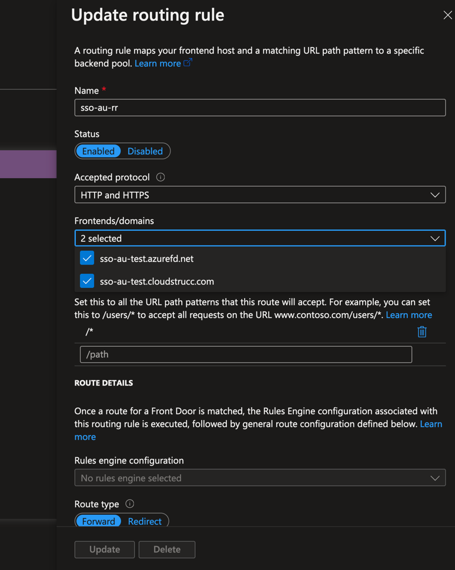
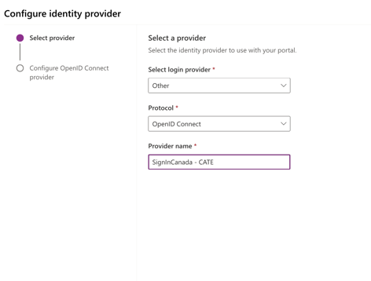

# AZURE B2C

[Download PDF](./Combined.pdf)

THIS DOCUMENT DESCRIBES THE AZURE B2C AND THE PROCESS FOR IMPLEMENTING AND OPERATIONALIZING AZURE B2C FOR SECURE SINGLE SIGN ON FOR PORTALS AND API AUTHORIZATION. THE GUIDE DESCRIBES LEVERAGING B2C FOR MULTIPLE PLATFORMS INCLUDING POWERAPPS PORTALS, .NET CORE, .NET FRAMEWORK, AND NODE.JS USING OPENID CONNECT (WEB APPS SSO) AND OAUTH 2.0 (API’S). IT WILL ALSO DEMONSTRATE HOW B2C CAN BE LEVERAGED TO INTEGRATE WITH THE GOVERNMENT OF CANADA’S SSO PLATFORMS (ENTERPRISE AUTHORIZATION BROKER (EAB), AND SIGNIN CANADA (SIC)) AND PLUS IMPLEMENTING A STANDALONE SSO & ENTERPRISE PROFILE SO THAT THE DEPARTMENT CAN CENTRALIZE EXTERNAL USER DATA VIA AZURE AD CLAIMS FOR INTEGRATED APPS TO CONSUME. BY LEVERAGING AN ENTERPRISE SSO, CLIENTS CAN LEVERAGE A SINGLE SET OF CREDENTIALS TO ACCESS ANY EXTERNAL FACING APPLICATION AND SINCE B2C PROVIDES AN OIDC LAYER WITH AZURE AD – THE DEPARTMENT CAN IMPLEMENT CONDITIONAL ACCESS POLICIES (CAP), MFA AND OTHER SECURITY FEATURES WITH THE GOAL TO ADHERE TO ITSG 33/ISO STANDARDS. FINALLY, THIS DOCUMENT WILL OUTLINE THE RECOMMENDED GUARDRAILS TO ACHIEVE A PROTECTED B POSTURE AND DESCRIBE THE ALM PROCESS TO GOVERN DEPLOYMENTS AND CHANGES TO AZURE B2C VIA AZURE PIPELINES (AND WILL ALSO DEMONSTRATE MANUAL DEPLOYMENTS).

## PREFACE

{ORGANIZATION} is undertaking an initiative to provide a secure single sign on
service (SSO) by implementing Azure B2C to its subscription services and
configure this technology up to a Protected B posture. Azure Active
Directory B2C provides business-to-customer identity as a service and is
targeted external users and {ORGANIZATION} offers several external facing web
applications and API's that require a secure authorization layer for
user and machine authentication. Azure B2C has been chosen as the right
tool as it provides secure local account identities to get single
sign-on access to FINTRACs web applications and APIs but also provides the
necessary support to integrate as a relying party to SAML 2.0 and OpenID
Connect (OIDC) identity providers such as the Enterprise Access Broker
(GCCF CONSOLIDATOR) and SignIn Canada (SIC) both of which are OIDC
brokers to the GCCF SAML 2.0 Identity Providers (2keys & Verify.Me). By
using this technology, {ORGANIZATION} benefits by centralizing its authentication
services into a platform that specializes in this domain and benefits
from the leveraging the robust Active Directory toolset including
conditional access policies, MFA, groups, monitoring for risky users,
automated release pipeline integration, App Registration records (SPN's)
to integrate applications. This document will detail the architecture of
the Azure B2C implementation and provide the detailed steps to configure
and maintain the service. The illustration below depicts the high-level
architecture of Azure B2C and its integration with PowerApps Portals,
Web Applications and APIs.

# OPTION 1 b2c with custom domain using afd

SECURITY GOVERNED BY B2C -- SAAS, FRONT DOOR LEVERAGED AS CDN AND PROXY
FOR CUSTOM DOMAIN


# OPTION 2 (TBD-FUTURE PHASE - SECURITY PERIMITER GOVERNED BY SCED)



# OPTION 3 -- b2c without custom domain (OPTIONAL ONLY for instances with sign in canada integration or without a third party identity provider integration)


# ALIGNMENT TO TBS CLOUD USAGE PROFILES AND CONNECTION PATTERS

This section describes AzureB2C's adherence and mapping to the TBS cloud
usage profiles and connection patterns. The Government of Canada has a
suite of recommendations and hard requirements for implementing cloud
systems that host Protected B data or perhaps has inter-connectivity
with the data centres hosting Protected B data. Azure B2C is considered
a SAAS based technology and therefore, only a subset of the usage
profiles and connection patterns will apply to this technology. The
entire list of scenarios is outlined below, and the ones that apply to
Azure B2C are highlighted below and further described in context of B2C
in the following section.

| **Reference** | **Scenario (connection pattern)**                     | **Description**                                                                                                                       |
| ------------- | ----------------------------------------------------- | ------------------------------------------------------------------------------------------------------------------------------------- |
| A             | GC user access to cloud-based service from GC network | A GC worker accessing a cloud-based GC service on the GC network.                                                                     |
| B             | GC user access to cloud-based service from Internet   | A GC worker accessing a cloud-based GC service from outside the GC network over the public Internet.                                  |
| C             | External user access to cloud-based service           | A non-GC external user accessing a cloud-based GC service from outside the GC network.                                                |
| D             | Service/Application Interoperability                  | Service and application communications with cloud-based GC services.                                                                  |
| E             | Cloud Administration and Management Traffic           | Management of cloud-based components and support for Network Operations Center (NOC) and Security Operations Center (SOC) activities. |

## Scenario C: External User Access to Cloud-Based GC Service

The diagram below depicts an external user accessing Azure B2C
indirectly via the internet. The user will access Azure B2C indirectly
by first accessing a Web Application that leverages Azure B2C for
authentication. This application will redirect the user to Azure B2C for
authentication. In the officially approved cloud flow below, this is
depicted in use case "C2": Non-GC user access to cloud-based GC service
hosted in Dept. SaaS Application (in this case Azure B2C).


## Scenario D: SERVICE/APPLICATION INTEROPERABILITY

The diagram below depicts an external service (e.g. API) accessing Azure
B2C indirectly via the internet. The service will access Azure B2C
indirectly by first accessing a {ORGANIZATION}'s service (e.g. API) that leverages
Azure B2C for authentication. This application will request a token via
OAUTH 2.0 using a Client ID and Secret (or certificate) to perform
subsequent http requests over the internet or via trusted channel such
as Express Route or Azure AD Application Proxy. In the officially
approved cloud flow below, this is depicted in use case "D1", "D2",
"D4", "D6".


## Scenario E: CLOUD ADMINISTRATION AND MANAGEMENT TRAFFIC

The diagram below depicts how a GC Administrator would access the Azure
B2C service's administrative console. Since Azure B2C is a SAAS
application, use case E2 applies to this implementation.


The table below describes the official GoC cloud usage profiles. These
are meant to characterize the different types of use cases for cloud and
whether they apply to SCED. The **_profiles 1 and 2_** apply to Azure
B2C's development environment whereas **_profile 4_** is applicable to
the production Azure B2C implementation. Even though, Azure B2C serves
as an authentication mechanism for both cloud and on-premises
applications, since the connection to this services leverages OpenID
Connect, the entire flow happens over HTTP/TLS from a client's browser
to the B2C and back. In terms of machine-to-machine flows (APIs), Azure
B2C serves an OAUTH 2.0 endpoint to obtain tokens for API calls (bearer
tokens). Tokens can only be generated by trusted applications who are
awarded an App Registration with a secret or certificate. The API must
perform HTTP requests once they've received a token from the OAUTH
endpoint by passing a ClientID, Secret (or Certificate), TenantID, and
Reply URI (unique identifier) in its payload.


# AZURE B2C CONNECTION PATTERNS -- MICROSOFT

This section describes and illustrates the relevant connection patterns
that Azure B2C supports out of the box. These patterns are officially
supported by Microsoft; however, {ORGANIZATION} does have additional flexibility
to extend and go beyond the boundaries of these patterns. However, it is
recommended that {ORGANIZATION} does not deviate or attempt to significantly
customize and extend Azure B2C's capabilities and instead leverage its
OOB features and where limitations are found, attempt to refactor the
connecting application to integrate with B2C in a native fashion. This
is important because Azure B2C has implemented the OpenID Connect and
OAUTH 2.0 specifications and, especially, for web portal authentication,
following the OIDC specifications is key to ensuring that security
standards are met to avoid any potential pitfalls associated with
non-standard ways to integrate with the platform.

## Web Applications

For web applications (including .NET, PHP, Java, Ruby, Python, and
Node.js) that are hosted on a server and accessed through a browser,
Azure AD B2C supports OpenID Connect for all user experiences. In the
Azure AD B2C implementation of OpenID Connect, the web application
initiates user experiences by issuing authentication requests to Azure
AD. The result of the request is an id_token. This security token
represents the user\'s identity. It also provides information about the
user in the form of claims. This also applies to SAAS portal
applications such as PowerApps Protals. This technology will abstract
the B2C configurations into a user interface to facilitate the
integration rather than configuring OIDC parameters and implementing
library interfaces and functions in a custom application via code.

Once a JWT is issued to a trusted application, the decrypted version may
look like the following:

```json

{

\"name\": \"John Smith\",

\"email\": \"john.smith@gmail.com\",

\"oid\": \"d9674823-dffc-4e3f-a6eb-62fe4bd48a58\"

\

}
```

The above is applicable only to a user flow (described in a later
section), that is configured to capture claims beyond the baseline ones
like OID and IDP.

For applications that leverage GCCF CONSOLIDATOR or SIC (GCCF services),
and where Azure B2C is acting as a pass through service to broker the
authentication request between the web application and the third party
IDPs, the id_token will simply include the GCCF persistent anonymous
identifier (PAI). Therefore the object may look like the following:

// Partial content of a decoded id_token

```json
{

\"sub\": \"3fffreefde54554efdfdfdfdf32113434232\", //PAI

\"oid\": \"d9674823-dffc-4e3f-a6eb-62fe4bd48a58\"

\

}
```

Finally, in a hybrid scenario, whereby the user flow leverages both the
third party IDP and a B2C profile, the object will include both the PAI
(sub claims) returned by the third party IDP along with the additional
claims provided by the user in B2C once redirected to B2C to complete
their profile before being redirected to the web application as an
authorized user:

```json
// Partial content of a decoded id_token

{

\"sub\": \"3fffreefde54554efdfdfdfdf32113434232\", //PAI

\"name\": \"John Smith\",

\"email\": \"john.smith@gmail.com\",

\"oid\": \"d9674823-dffc-4e3f-a6eb-62fe4bd48a58\"

\

}
```

In a typical web application that is using Azure B2C takes these
high-level steps:

- The user browses to the web application.

- The web application redirects the user to Azure AD B2C indicating
  the policy to execute.

- The user completes policy.

- Azure AD B2C returns an id_token to the browser.

- The id_token is posted to the redirect URI.

- The id_token is validated, and a session cookie is set.

- A secure page is returned to the user.

Validation of the id_token by using a public signing key that is
received from Azure AD is sufficient to verify the identity of the user.
This process also sets a session cookie that can be used to identify the
user on subsequent page requests.

The sequence diagram below depicts

### SINGLE PAGE WEB APPS (SPA)

In the event the organization integrates an SPA with Azure B2C, a token
needs to be generated and returned to the client to perform API calls
using JavaScript. SPA's (without a server side renderer like NextJS)
will need to perform API calls to the web API that performs CRUD
operations to the server application that governs requests to some
persistent store like a database or no SQL database or example, because
an SPA architecture means that the entire application is rendered to the
client browser and therefore all application interactions happen in the
browser using the DOM or Shadow DOM (e.g. React JS). Unlike
client-server applications, an SPA wont perform server requests each
time a user clicks on a link or navigates to another route, therefore,
in the event that the SPA also implements authentication, the SPA must
use JavaScript to call Azure B2C (via the Graph API). This means that in
the JavaScript request, the SPA will need to pass a bearer token which
it receives via the oauth2 endpoint and then uses that token to make
authorized requests to the server without having to reload the page.
These tokens are short lived to minimize the risk of someone hijacking
the token to make malicious requests. This journey is demonstrated in
the sequence diagram below:


## ~~API's~~

~~Applications that contain long-running processes or that operate
without the presence of a user also need a way to access secured
resources such as web APIs. These applications can authenticate and get
tokens by using their identities (rather than a user\'s delegated
identity) and by using the OAuth 2.0 client credentials flow. In order
to configure this, the administrator will set up a credential flow using
the AAD and MIP token endpoint:
[https://login.microsoftonline.com/TENANT.onmicrosoft.com/oauth2/v2.0/token](https://login.microsoftonline.com/TENANT.onmicrosoft.com/oauth2/v2.0/token)

~~Upon receiving a token, the application (Dameon Apps) can perform
subsequent HTTP requests using OAUTH 2.0 with a bearer token in the
header of the request.~~

~~This means that there is no user interaction and OIDC is therefore not
being leveraged in this flow. Instead, the API that connects to B2C to
interface with another API is responsible in obtaining tokens
automatically. This API will be issued a Client ID, Secret (or perhaps a
certificate) that will be used to obtain short lived tokens. It is
recommended that the secret or certificate are rolled over (or changed)
at regular intervals of 6 months. The diagram below depicts this
scenario.~~


## IMPLEMENTATION ARCHITECTURE COMPONENTS

This section describes {ORGANIZATION}'s specific implementation of Azure B2C. More
specifically, {ORGANIZATION} will be integrating with the official Government of
Canada's GCCF service which is SAML 2.0 based with a OAUTH Broker to
support more modern applications and libraries. Furthermore, {ORGANIZATION} will
be leveraging PowerApps Portals for its external facing portal services
and is leveraging Azure B2C as its authentication mechanism. {ORGANIZATION} wishes
to use Azure B2C for not only PowerApps but potentially other web
applications that require authentication to take advantage of creating a
single profile for its external user base and facilitate monitoring,
administration, reporting and enhance security by standardizing to one
authorization platform rather than having multiple portals implement
their own authentication systems or patterns which can be prone to
security vulnerabilities and costly to maintain/upgrade. {ORGANIZATION} is also
hoping to continue its effort to minimize IAAS in favor for SAAS
applications that can operate at Protected B and therefore minimize the
complexities associated with hosting complex infrastructures and
maintain servers and or containers to ensure that the latest security
patches and other OS artefacts are up to date. By leveraging SAAS, {ORGANIZATION}
can focus on the application layer, encryption, and enforcing OIDC /
OAUTH norms across the organization while providing a better user
experience to its clients who will no longer need to maintain multiple
sets of credentials to interact with {ORGANIZATION} services.

The diagram below depicts, at a high level, how one or more web
applications would interface with Azure B2C and in turn, how Azure B2C
would then broker the authentication requests (login and logoff) to the
Government of Canada's Identity Provider services (2Keys-GCKey &
Verify.Me -\> partner credentials (banks)).



### AZURE FRONT DOOR (CDN)

Because {ORGANIZATION} is integrating with the GOC Identity Providers via the
Broker, to avoid issues such as CORS or third-party cookie / session
restrictions in modern browsers, it is recommended that a custom domain
on Canada.ca and gc.ca is configured for Azure B2C rather than
leveraging the OOB issued domain. Furthermore, TBS and SSC recommend
that FINTRACs force the use of TLS 1.2x and even though Azure B2C does
support TLS 1.2x, it still supports earlier versions. Both factors
warrant the need to implement Azure Front Door as a Proxy/CDN in front
of Azure B2C. AFD has native support for B2C and has a configuring to
force TLS 1.2x flows to the service and a custom domain to it as well
and block the OOB domain. For this implementation, these are the only
two requirements to implement in AFD however AFD has additional features
that could be leveraged in the future such as WAF (additional custom
firewall policies), custom headers, and health probes. AFD is
recommended as it's a PAAS and therefore will simply compliment the use
of B2C while living within the same cloud usage profile and connection
patterns as B2C (e.g. unlike Azure Gateway, AFD is not assigned an IP
which would otherwise deem it as IAAS).

### KEYVAULTS & ENTRUST CERTIFICATES

B2C provides full support for the usage of certificates to encrypt and
decrypt tokens that are sent and received by client applications.
Furthermore, since a custom domain is leveraged with TLS, a certificate
is required for the AFD CDN in front of AB2C. These certificates are
directly installed in both AB2C and AFD however it is recommended that
the CSR's are generated from Azure KeyVaults and once created by the
Entrust CA, KeyVaults should be leveraged to generate the PFX files that
are installed in both platforms. This ensures that administrators are
aware of where the certificates are and when they expire. At the same
time, for apps that are leveraging "secrets" (keys) instead of
certificates to authenticate using the App Registration, these secrets
can be referenced in Azure KeyVault's via their Secret ID. By using the
KeyVaults to centralize all of the certs and keys for B2C and AFD, {ORGANIZATION}
has control over who is accessing these certs, how, and when they need
to be renewed. Furthermore, the release pipeline automation for
deploying AB2C artefacts (polices) leverages Variable Groups that are
linked to the Azure KeyVaults hosting the certs and secrets to avoid
referencing secrets or certificates directly in configuration files in
DevOps / service connections.

### APP REGISTRATIONS

App Registrations are fundamental in AB2C as they are the primary
mechanism used to connect to the service. An App Registration is
generated for each client application that needs authentication to the
GCCF services. The same applies to Apps that require access to API's
that are protected by AB2C. The App Registration is synonymous with an
"SPN" or "Service Account" which is like a machine user that is
leveraged by an application to perform authorization requests to the
AB2C service. When configuring App Registrations, {ORGANIZATION} will not allow
"Implicit Flows" and therefore should always avoid selecting "ID Tokens"
under the authorization flow. Applications must provide a Reply URI as a
unique identifier and a "front channel logout" URL which B2C will invoke
if it receives a logout request in a different browser tab to ensrue
that all sessions within the users' browser is purged. Once this
information is received by the B2C administrator, the requester will
receive a ClientID (unique ID that identifies the application
integrating with the service -- which is the app registration assigned
to it), a Secret (key) or Certificate (for apps that can support this),
and the tenant ID (if needed) to configure within their application's
code based (or configurations -- e.g. PowerApps Portals).

### OPENID CONNECT & SAML 2.0

The GOC Identity Providers GCKey and Verify.Me (formerly SecureKey) that
are ran by the Canadian company "Interac" provide a SAML 2.0
authentication pattern. SAML 2.0. Security Assertion Markup Language
(SAML) is a login standard that helps users access applications based on
sessions in another context, in other words, allowing applications to
offload their authentication to another service rather than implementing
their own user name and password (or similar) pattern directly within
their own application. This pattern allows for single sign on whereby
users can reuse the same set of credentials across multiple applications
in a secure way using XML and RSA certificates issued by a trusted CA on
both sides (application and identity provider). SAML authenticates users
by redirecting the user's browser to either the GCKey or Verify.Me (or
chosen bank) login page, then after successful authentication on that
login page, redirecting the user's browser back to the integrated web
app where they are granted access. The key to SAML is browser redirects.

The diagram below depicts the typical user authorization flow that
**SAML 2.0** provides to applications:


There are three key artefacts that make up the SAML architecture:

**Identity Provider (IdP)** - The software tool or service (often
visualized by a login page and/or dashboard) that performs the
authentication, checking usernames and passwords, verifying account
FINTRACus, invoking two-factor, etc. This is GCKey and Verify.Me.

**Service Provider (SP)** - The web application where user is trying
to gain access. This is {ORGANIZATION}'s web application (e.g. PowerApps
Portals, or Broker service such as GCCF CONSOLIDATOR or SIC.

**SAML Assertion** - A message asserting a user's identity and often
other attributes, sent over HTTP via browser redirects. This is the
primary artefact that generates / persists the session.

The issue with SAML is that it is less commonly used in modern
applications today as its more complex to implement, and a newer and
more streamlined and simplified pattern OAUTH 2.0 has become the norm
and standard in the industry.

However, both the IDPs still only support SAML 2.0. As a result, SSC and
TBS have developed OIDC Broker services that abstract the need to
implement a SAML Service Provider for web applications. Although Azure
B2C does support SAML, it requires a non-trivial customization using
custom policies. Furthermore, both IDPs only support the SOAP binding
for logout in SAML which is no longer being used by not only B2C but
many (most) other SAML supported platforms. As a result, if {ORGANIZATION} were to
connect to the IDPs using AB2C directly, they would not be able to
implement the back channel single logout pattern implemented by the IDPs
as B2C will only support single logout via the redirect binding (so
browser based only, not SOAP). Therefore, {ORGANIZATION} would not be fully
compliant with the GOC's CATS 2.0 standards and would need to seek an
exemption to leverage AB2C. There are ways to implement the SOAP binding
and integrate this custom service with AB2C but this would add
additional complexity to the architecture and require additional
maintenance and niche knowledge.

SSC and TBS is aware of the emerging industry standards and therefore
have developed an OIDC broker service that handles the connection to the
IDPs via SAML and provides an OIDC interface to {ORGANIZATION} and therefore AB2C
will interface indirectly with the IDPs using OIDC rather than SAML and
therefore is only responsible to meet the CATS 3.0 requirements which
map to the official OIDC specifications which AB2C is fully compliant
with.

This broker service / SAML abstracted is illustrated below:

############################### Login Flow- GCCF Consolidator

The illustration below depicts the login flow.


############################### RP-Initiated Logout Flow - GCCF Consolidator

The illustration below depicts the relying party-initiated logout flow.


################################

############################### Single Logout Flow - GCCF Consolidator

The illustration below depicts the single logout flow. The OP must
invoke the **[end session endpoint (e.g.
https://\<subdomain\>.canada.ca/\<b2csubdomain\>.onmicrosoft.com/b2c_1\_\<policyname\>/oauth2/v2.0/logout)]**
indicated in the B2C metadata document. This will trigger the single
logout / global logout mechanism in B2C


### LOCAL ACCOUNTS (CLAIMS) Passthrough IDP via oidc broker

The GOC IDPs will only provide a PAI token to the B2C. This means that
B2C will be informed that the user has successfully authenticated to one
of the IDPs and the only information returned to B2C from the IDP is a
token that uniquely identifies the user. Once a token arrives to B2C,
B2C will first try and match this value in its storage and if not found
will treat this user as a new user and prompt them to provide more
information such as their email, first name, last name. If the returning
token is found, B2C will simply redirect the user back to the
application along with the associated email, first name and last name so
that the integrated application knows who the person is and can
therefore assign them a session under their user context. For the
initial implementation, B2C will not be responsible to gather any claims
once it receives a token, instead it will simply store the token and
redirect the user to the integrated application where this application
will be responsible to gather additional claims such as email, first
name and last name plus any additional information that is needed for
the application itself. The next time this user signs in, B2C redirects
the user to the integration web application and if this application
finds this user by its token in its own storage, then the user will not
be directed to fill in profile information (unless the application flow
forces a user to confirm their profile information before accessing the
application). Both options will be implemented in {ORGANIZATION} -- the benefit of
requiring the user to provide their profile information in B2C is that
{ORGANIZATION} can now share additional claims beyond just the PAI between
multiple applications and therefore streamline the user experience by
eliminating the need for that same user to enter profile information
multiple times in different applications despite using applications
within the same {ORGANIZATION}. For the enterprise profile, only a limited set of
fields (claims) will be populated by a user and integrated apps will
receive this information and can opt to ask the user for more profile
information that is specific to their app's domain (e.g. a permit
application might be interested in knowing which company the user works
for, whereas a travel permit or visa application might be interested in
obtaining the user's DOB -- these claims would not be captured in B2C
but instead directly in the app).

## MONITORING

AB2C provides extensions for both Azure Monitor to route sign in and
auditing logs to the SIEM for longer retention or integrate with
security information and event management (SIEM) tool (e.g. Sentinel) to
gain more granular insights into the B2C implementation. To route log
events, Azure Storage, a Log Analytics Workspace and Event Hub services
are used. Most of these services get auto generated by the ARM template
(provided in references).


Once the monitoring is configured, the user insights and authentication
visual will demonstrate which usage by country, browser, app (portals),
by identity provider, by policy (e.g GCCF CONSOLIDATOR, SIC, Local), and
Failures with Reason codes. This provides {ORGANIZATION} with a generalized
overview of the overall behavior and key metrics for AB2C.


In addition to the common metrics for the overall health and access
telemetry of AB2C, the Risk Detection is another report to be
implemented that uses Azure AD B2C Sign-in logs to capture risk
detections.

The dashboards / reports will provide the following data and
visualizations

- Aggregated Risk Levels

- Risks Levels during SignIn

- Risk Levels by Region

- Risk Events by IP Address (Filterable)

- Risk Events by Type (Filterable)

- Risk Events Details (based on selected Risk Type)

- Risk Events by Geo Coordinates (Filterable)

- Risks Events Over Time

By default, the risk detection criteria's include the following:

- Anonymous IP address use

- Atypical travel

- Malware linked IP address

- Unfamiliar sign-in properties

- Leaked credentials

- Password spray


## AUDITING

The information in B2C is limited to the user's object ID (Azure
generated ID) and details about the GCCF Identity Provider coupled with
any additional claim information configured for the Enterprise Profile
(first name, last name, and email). Audit logs are retained for 7 days,
however this can be extended by leveraging Azure Monitor and Application
Insights to extend beyond this period.


Figure : B2C User Tracking - User Object

As illustrated in the capture below, GCCF only provides the SAML 2.0
issued Token that uniquely identifies the user which is stored in B2C's
Issuer ID field (Claim). B2C will also capture the source of the
identity provider being either 2keys (te.clegc-gckey.gc.ca \[TEST\],
clegc-gckey.gc.ca \[PROD\]) or Verified.Me (cbs-uat-cbs.securekey.com
\[TEST\], cbs.securekey.com \[PROD\])


Figure : User Object Login Identity Issuer (GCCF Identity Provider
chosen)

Subsequent logins from the SAML 2.0 federated user is tracked in the B2C
audit logs.


Figure : B2C User Login Audit Log

There are two key events stored, one for successful SAML 2.0 Federation
with the Identity provider which provides useful metrics such as the
user's location, browser, his/her SPN, which IDP they authenticated to
as well as the date and time for the authentication. See below capture
of this log in {ORGANIZATION}'s B2C TE environment.


Figure : B2C User Login - Audit Detailed View


\*Modified Properties always blank as GCCF does not map to any property.

Figure : Target IDP Detail

The second log is the information around the issuance of a Token to the
client Application, in this case PowerApps Portals. The log provides the
same metrics as the previous log captured above however outlines the
target application (AAD App Registration Record):


Figure : B2C Audit Log Detail - PowerApps Registration Record

## GUARDRAILS

Since AB2C creates a new Azure AD Domain that is targeted for external
user authentication. A subset of the guardrails {ORGANIZATION} would implement for
access management by B2C administrators will be implemented. In addition
to the access controls, there are a series of settings described in the
tables below that need to be configured or activated to ensure that {ORGANIZATION}
achieves a Protected B posture in its B2C implementation. For the most
part, since AB2C is a service that falls within FINTRACs tenant
subscription, the majority of guardrails will be inherited. However, at
the AB2C application layer, additional guardrails should be implemented
to ensure that the external user and API authentication platform is
fully secure and well managed.

## Guardrails

Have a minimum of 2 Global Admins with MFA enabled. The Global Admins
should be AD federated accounts and not cloud only accounts.

**Optional:** All other tenant administrators responsible for managing
app registrations, connectivity to the OIDC brokers and
certificate/secret maintenance are assigned to a newly created B2C
Administrators with the following roles: Application Administrator,
External Identity Provider Administrator, External ID User Flow
Administrator, External ID User Flow Attribute Administrator, User
Administrator, B2C IEF Policy Administrator, B2C IEF Keyset
Administrator, Domain Name Administrator. A group of type security and
dynamic assignment can be created with these roles but **requires P2
licensing**

Create Security Group for each web application or API integrating with
B2C (segment and separate)

**Optional:** Enforce TLS 1.2 by deploying AFD -- required only if your
organization will have applications connecting to B2C that don't
support TLS 1.2 and higher

Use a Canada.ca or GC.ca domain by deploying AFD (block the Microsoft
domain)

Use Entrust TLS Certificate for custom domain

(For GCCF Consolidator and SAML implementations) Use Entrust PKI --
Encryption and Decryption Certifications

Use RSA 2056 or higher for the Tenant Encryption Key (or Use
CSE-approved cryptographic algorithms and protocols)

**Optional:** Use JWT signatures for login and logout requests if using
IDPs (signature should be done by trusted CA cert -- entrust, and not a
self-signed certificate) -\> this only applies to applications that
support this feature. For most applications within the PB context, a
secret is sufficient.

Prohibit the use of implicit flows for applications except for SPA's &
certain SAAS portals (consider leveraging server side for authorization
rather than client side)

**Optional:** Do not share Secrets directly with Apps. Instead provide
'SecretID' from KeyVaults -- this only applies to applications than can
support this feature

Enforce Front Channel Logout implementation to client applications by
ensuring that the Front Channel Logout URL of an application is always
configured in the App Registrations

Use Risky Users and Risk Detection monitoring services for
significantly greater control over risky authentications and access
policies. **Azure AD B2C Premium P2 is required**

Ensure one of the Canada regions are set when installing B2C

Create multiple environments (Production and non-production) -- 2 is
sufficient

**Optional:** Audit log events are only retained for seven days.
Integrate with Azure Monitor to retain the logs for long-term use, or
integrate with existing (SIEM) tool -- extend the retention period to 1
year (instead of 30 days)

**Optional:** Setup active alerting and monitoring "Track user
behavior" feature in Azure AD B2C using Application Insights.

## CONFIGURING AZURE B2C

This section describes the process of coniguring the B2C tenants (P1 & P2).

### PRE-REQUISITES

- Global Administrator rights to the {ENVIRONMENT} subscription that
  will host the Azure B2C Instance

- Access to a "Dev" or "Sandbox" Azure subscription used for creating
  the AzureB2C Development resource

- Access to a "Production" Azure subscription used for creating the
  AzureB2C Production resource

- Access to a "Dev" or "Sandbox" Azure subscription used for creating
  the Azure Front Door (CDN) Development resource (can be provisioned
  within the same subscription as b2c)

- Access to a "Production" Azure subscription used for creating the
  Azure Front Door (CDN) Production resource (can be provisioned
  within the same subscription as b2c)

- Access to an Azure KeyVaults resource to store TLS certificates,
  Secrets and Keys

**_\*Note -\> since Azure B2C is a PAAS, the 2 tenants can be associated
to the same Azure subscription. Secondly, only 1 Azure Front Door
instance can be deployed as you can create multiple proxies to each B2C
tenant. Another consideration is that since Azure B2C is a PAAS, 1
tenant is enough to support multiple "user flows" (environments) to
delineate development and production flows._**

### PROVISIONING AZURE B2C

- Sign into the Azure portal as GA.

- Switch to the directory that contains the primary subscription (or a
  Dev subscription preferably). The directory should be on the domain
  that is connected to the on premise active directory so that B2C
  configurators leverage their federated accounts instead of cloud
  only domain accounts (optional-this can be done using your
  .onmicrosoft.com identity).

Once in signed into the Azure subscription as Global Administrator or
Subscription Owner, select "Create Resource"


Search for Azure Active Directory B2C, press Enter and select "Create"


In the Create blade, click on "Create a new Azure AD B2C Tenant"


In the following step, enter {ENVIRONMENT}b2cdev for both the
organization name and initial domain name (which will be the subdomain)
and fill in the country, subscription, resource group and resource group
region


Click on Review and Create and if Validation has passed click on Create.


### In the event you encounter the following error when provisioning the tenant: "The subscription is not registered to use namespace 'Microsoft.AzureActiveDirectory' " follow the steps below


This error is created because on the subscription you want to configure
this B2C tenant on creating extra Azure Active Directory's is not
enabled (registered). To fix this go to the subscription page


Click on the subscription and navigate to the resource providers pane.
In the filter by name type in Active Directory.


You will see that the Microsoft.AzureActiveDirectory FINTRACus is not
registered (enabled). So click on register.


The FINTRACus will change from NotRegistered to Registering and after a
while it will change to Registered


After that redo the steps from the beginning of the provisioning section
and you will see that the B2C tenant is created.

### Inviting B2C Configurators

The steps below outline the steps required to provide B2C configurators
with the necessary roles to configure identity providers (GCkey), app
registrations (integrated portals leveraging GCkey), user flows (the
OIDC providers), and maintenance of secrets and certificates once the
B2C tenant is created.

Click on your profile in the top right, and select switch directory, and
switch to the new Azure B2C directory just created


Once you are in the new directory search for Azure AD B2C


Select Users from the Menu Blade


Select New User


Select "Invite User", enter the name and email, click on Role "user" and
select "Global Administrator" **[(*note this only applies Global Admin
rights to the newly created Dev B2C tenant)*]** and press
select. Once completed, press "Invite". **[Alternatively, the roles
listed under the following screen capture can be assigned to the B2C
configurator.]**


If Global Administrator is not associated to the B2C Configurators, the
following roles need to be assigned for the B2C Configurator to
configure the tenant:


### Optional: Creating a group (applicable only with AAD Premium P2 licensing)

To streamline the process of identity governance in the B2C domain, AAD
Premium P2 Licensing is required to create groups with Dynamic role
assignment. That being said, this is optional -- and can be implemented
in a later phase.

Return to the azure portal home page and search for or click on Azure
Active Directory. **_Note this is the AAD associated with the B2C domain
and not the AAD associated with your primary Azure subscription._**


Click on Groups and press "New Group"


Fill in the group details as per below and press create \*Ensure to
select "Dynamic for Membership Type"\*. **_Note the group description
is: "Group whose members have the privileges to configure identity
providers, app registrations, manage user flows, and administer keys,
secrets, and certificates"_**


### CONFIGURING THE AZURE B2C THEME (TENANT WIDE)

Select "Company Branding" and choose the Default brand. In the modal,
upload the Government of Canada JPEG to the Sign-in page background
image and the Canada logo under the Banner logo file upload.



### CONFIGURING A STANDALONE USER FLOW FOR LOCAL AUTHENTICATION (WITHOUT LEVERAGING A THIRD PARTY IDP LIKE GCCF CONSOLIDATOR OR SIC)

Select User Flows, and click on New user flow


Next, select Sing up and sign in and the recommended tile under
"Version"


Select Email Signup, TOTP, and Conditional for MFA enforcement (policies
to be defined in a later section). For user attributes, select Email
Address, Given Name and Surname, press Ok and Create


Once created, navigate to the newly created user flow and click on
properties. Ensure to check "Require ID Token in Logout Requests".

Next, create a profile and password reset policy.


**\*Apply the same settings from the Sign up and sign in user flow for
both policies. For the Password reset policy ensure that the Reset
password using email address option is checked.**


## CONFIGURING SIGN IN CANADA SIC (TBS)

Azure B2C supports integrating with both OpenID Connect and SAML 2.0
Identity Providers. It can act not only as a "service provider" to
Applications inside and outside our organization but also as an Identity
Provider for your apps. In this section, the guide demonstrates how to
integrate Azure B2C with the Government of Canada's OpenID Connect
provider - SignIn Canada. The initial set up connects to SignIn Canada's
test environment (CATE). The same steps are required for configuring
production. We recommend creating a separate Azure B2C environment for
Production.

### CREATE A NEW IDENTITY PROVIDER

Navigate to the Identity Provider menu blade, and select "New Open ID
Connect Provider" and enter the following metadata:


**Name**: Sign In Canada CATE

**Metadata URL**:
<https://te-auth.id.tbs-sct.gc.ca/oxauth/.well-known/openid-configuration>

**ClientID**: {CLIENTID} - ENTER ANY STRING FOR NOW. THIS VALUE WILL BE
UPDATED LATER ONCE YOU RECEIVE FROM SIC

**Client secret**: {CLIENTSECRET} - - ENTER ANY STRING FOR NOW. THIS
VALUE WILL BE UPDATED LATER ONCE YOU RECEIVE FROM SIC

**Scope**: openid

**Response Type**: code

**Response Mode**: query

**User ID**: sub

**Display Name**: sub

### CREATING A USER FLOW

Select User Flows, and Create a new user flow with the following
configurations


In the Name field enter SignInCanada-CATE (or something that clearly
identifies the service), select "None" for the Local Accounts, and Check
"SignIn Canada CATE" (the identity provider created in the previous
step) and leave everything else as default and press "Create"


Once created click on "Run User Flow" and copy the Metadata URL as you
will need to send this to the SignIn Canada mailbox in your request to
onboard to their test service.


Next, locate your Azure B2C TenantID and copy this value in preparation
for your request.


Once the user flow created and metadata ready you can send the request
to SignIn Canada by sending an encrypted email to
<Signin-AuthentiCanada@tbs-sct.gc.ca>.

**_Example email (must be sent by an official Government email that can
accept encrypted email -- Entrust CA)_**

We would like to onboard to the SignIn Canada's CATE environment, the
information you require is provided below:

Our tenant ID is **{GUID of Azure B2C's tenant ID}**

Our Metadata URLs:

-\> All frameworks support

[https://gckeyep.b2clogin.com/tfp/\<tenantID-\>GUID\>/\<nameofuserflow\>/v2.0/](https://gckeyep.b2clogin.com/tfp/%3ctenantID-%3eGUID%3e/%3cnameofuserflow%3e/v2.0/)
-\> .NET 4.7.2 support -\> optional

Our Redirect URLs:

-\> .NET 4.7.2 support --\> optional

Please provide the information required for configuration of your
service in Azure B2C.

SIC will respond by providing you with the information you need to
configure the service which will include their metadata information,
configuration options and a client ID and Secret. At which point you can
proceed to the next steps.

Once you've received the response, navigate to the Identity Provider
menu blade, and select the SignIn Canada identity provider and update
the ClientID and Secret values you've received from SIC:


Once the identity provider is configured, edit the user flow and check
the new Identity Provider instead of email sign up


The same steps above apply for GCCF Consolidator integration (SSC) which
is an alternative OIDC broker service managed by 2Keys and governed by
SSC. The only difference is instead of the email request, you will need
to request for a "OIDC workbook" and instruction from SSC by contacting:
<Kurt.Magalhaes@ssc-spc.gc.ca> or <louis.leduc@ssc-spc.gc.ca>

## Configure custom domain and force tls 1.2 using azure front door -\> [*tls 1.2 rule* *required only if your organization hosts applications that use b2c only support tls 1.1 -- further, tls 1.1 support in b2c to be deprecated (same timeline as azure ad support for tls 1.1)*]

The following section describes how to configure a custom domain in
Azure B2C using AFD. AFD is also required to force TLS 1.2 flows to
Azure B2C to meet the GOC guardrail. The illustration below depicts the
integration between B2C and AFD


## Add custom domain to Azure Active Directory from within the Azure B2C tenant


Once added, send the TXT record to the Canada.ca DNS. The request should
read:

Type: TXT, Host: mydomain.canada.ca, TXT: MS-ms658, TTL 3600.

Once actioned, you can press verify and proceed to next steps.
NOTE, once verified, SSC needs to delete the TXT entry as this
domain will be configured as CNAME in a subsequent request.

Once SSC has created the DNS record, click on the Verify button and if
successful, the FINTRACus will show "Verified"


### Azure Front Door resource for custom domain & rule to force TLS 1.2

In an Azure Subscription, as subscription owner or global administrator,
create a new AFD resource.

1. To choose the directory that contains the Azure subscription that
   you'd like to use for Azure Front Door and not the directory
   containing your Azure AD B2C tenant

   a. Select the **Directories + subscriptions** icon in the portal
   toolbar.

   b. On the **Portal settings \| Directories + subscriptions** page,
   find your Azure AD directory in the **Directory name** list, and
   then select **Switch** button next to the directory (the primary
   directory):

> 

On the Create a Front Door profile page, enter, or select the following settings:

> 

1. Select Review + Create and then select Create to deploy your Azure
   Front Door profile.

2. Next, send the CNAME request to SSC: **_Source_**:
   _yourfrontdoorsubdomain-randomstring.azurefd.net -\>
   **Destination**: yourcustomdomain.canada.ca \`_

3. Using the AFD designer, create a new Frontend for the newly
   registered domain and create a backend pool that points to the
   tenant.b2clogin.com OOB domain


Create a routing rule that accepts HTTPS protocol and select both
the AFD and custom domains under the frontend/domains drop down.
Ensure that the backend pool is chosen and that HTTPS only is chosen
under Forwarding protocol.




1. Once completed, the configuration can take up to 10 minutes to take
   effect.

To test that your new domain is configured correctly, select an existing
user flow, and then select "run user flow"


Copy the Run user flow endpoint, and replace the sub-domain with the new
domain and copy it to your browser to validate that it renders

For example, instead of:
<https://contoso.b2clogin.com/contoso.onmicrosoft.com/oauth2/v2.0/authorize?p=B2C_1\_susi&client_id=63ba0d17-c4ba-47fd-89e9-31b3c2734339&nonce=defaultNonce&redirect_uri=https%3A%2F%2Fjwt.ms&scope=openid&response_type=id_token&prompt=login>

Use:
https://{customsubdomain}.canada.ca/contoso.onmicrosoft.com/oauth2/v2.0/authorize?p=B2C_1_susi&client_id=63ba0d17-c4ba-47fd-89e9-31b3c2734339&nonce=defaultNonce&redirect_uri=https%3A%2F%2Fjwt.ms&scope=openid&response_type=id_token&prompt=login

## INTEGRATING web portals TO AZURE B2C

To onboard web applications that require SSO, you will need to provide
them with the metadata URL, and a ClientID and Secret. When a client
creates a request, they will need to provide you with their "Redirect
URL" and their "Front Channel Logout URL". The latter is required for
B2C to know which URL to invoke when it receives a logout request from
another integrated web application to ensure that the other apps that
have an active session are also logged out. Once you have this
information, you can proceed with the steps below.

## Onboarding a PowerPage Site

**Step 1 (Client):** The PowerApps developer will need to provide you
with a "Redirect URL". To do so they must go to the
<https://make.powerapps.com>, select the environment for which they
would like to leverage SignIn Canada, select the portal authentication
settings and press "Add Provider", select Other, and choose "OIDC
Provider". Once the modal is displayed, PowerApps generates a "Redirect
URL" and before they can configure your service, they will need to email
you this URL. In addition to this URL, the client should also provide
you with the logout URL for their portal. By default, this should always
be (for portals without a custom domain). Alternatively, if you already know the portal URL, you
can create the app registration record in advance and enter any redirect
URI using the following convention and provide the details to the
developer to configure in PowerApps. Otherwise, the developer will be
responsible to provide you with the Redirect URI.

To obtain the Redirect URI directly from PowerApps, the developer can
follow these steps:


Select "Add Provider" and enter the following details in the Wizard



Copy the "Reply URL" and send to the AzureB2C Administrator to obtain
the OIDC data you need to finish the configuration


The PowerApps developer will resume the configuration once you've
provided them with the App Registration information.

**Step 2 (App Registration) -- completed by AzureB2C administrator:**
Once you receive the Reply URL, navigation to the App Registrations
Blade and create a new App Registration. The naming convention is at
your organization's discretion, but in this example the convention is
simply the sub-domain of the PowerApps Portal being on boarded.
**_Please note that the PowerAppsPortals.com domain is typically not
used in Production. Therefore, the same client may request you to add
additional redirect URLs in the Authentication blade within the App
Registration record in the future once SSC enters the DNS entry for
their Portal in the Canada.ca DNS._**


Press "Register"

Next, in the "Authentication" Blade, enter the front channel logout URL
which is always the portal URL with /Account/Login/LogOff (for
PowerApps). Make sure to select "Access Tokens" and press save.


Next click on "Certificates and Secrets" and generate a secret and copy
the secret to your clipboard (or somewhere as you will need to send this
via encrypted email to the PowerApps Portals developer)


Next click on overview and copy the ClientID.

Send the following information back to the PowerApps Portals developer:

- ClientID

- Secret

- Metadata:[**Error! Hyperlink reference not valid.**]()

**Step 3 (Finish configuration -- PowerApps)**: In your email that
includes the ClientID, Secret and Metadata URL to the client, include
the following example configuration for the developer to finish the
configuration.


(**Optional**) -\> If the PowerApps Portal wants users to automatically
be redirected to the SSO service upon navigating to the "SignIn" page,
the developer can set the new provider as default


Once completed, you can test by navigating to the integrated portal and
invoking the sign in button (or anchor) which will automatically send an
authorization request to B2C which in turn will send the request to SIC.


You can then sign up to a GCKey or Sign-In Partner (banks) account, and
once successfully signed in, you should be redirected to your portal's
home page if you are an existing portal user.

**_GCKEY Example:_**


**_Canadian Banks Example (recommended during development for ease of
use)_**


Enter test with an integer suffix (e.g. test12345) and scroll to the
bottom of the page and press Login. For a returning user, use the same
username (e.g. test12345 in this example) you've used as part of the
full registration to PowerApps. _When simulating a new PowerApps user
registration use a new integer suffix._


For a new user, you should be prompted to create a profile in the
Application as B2C will only send the "Subject-ID" claim to the
integrated application which can be leveraged as a unique identifier in
the portal application. If a subject-id is not yet associated to a
profile in the integrated application, the application should invoke a
user journey to create a profile in the application (provided the
application requires the use of a profile). Below is what a new user (or
new subject-id sent to the app) would invoke in PowerApps Portals (GOC
PowerApps Theme)


Once the profile is created OR if it's a returning user, the
authenticated home page (or post login redirect) would render. The
example below demonstrates the authenticated home page for the GOC
PowerApps Theme.


## GENERAL SUPPORT AND OPERATIONS

This chapter describes the on-going maintenance and governance
activities associated with the Azure B2C tenants implemented at {ORGANIZATION}

## ACCESS CONTROL

This section describes the roles and responsibilities surrounding the
governance and operational activities surrounding Azure B2C. All Azure
B2C administrators including Cloud Ops and SIAZ, except for Global
admins on 005gc will inherit the department's policy on PAW devices and
use admin accounts to configure and maintain the b2c tenants.

### Cloud Operations

responsible for provisioning the Azure B2C tenants and inviting Azure
B2C administrators from SIAZ to administer the B2C tenant. Cloud
Operations is also responsible in creating the B2C Administrators AD
Group in the new tenants and assign the roles listed below to that
group. When inviting administrators from SIAZ, the G.A from Cloud Ops
will assign the B2C administrators' group to the administrator who will
automatically inherit these roles and can therefore administer the
tenant.

### SIAZ

responsible for integrating the OIDC broker service provider (or relying
party) by creating user flows and external identity provider
configurations in Azure B2C. They will also be responsible to rotate
certificates and secrets and onboard Web Apps, SPA's and API's who will
integrate with the service by creating and configuring App Registration
records. SIAZ will also be responsible to proactively monitor for
anomalies, health issues, and threats (or attempts) by observing the
logs.

Cloud Ops and SIAZ administrators who are guest users within the new B2C
tenants, will automatically receive alerts for mis configurations,
expiring secrets, keys, and certificates as well as general
maintenance/MS platform announcements.

### Roles

The primary roles used to maintain B2C are listed below. A B2C
Administrator AD group should be created to maintain the IDP
configurations and relying party applications which needs to be
comprised of all roles below except for Global Administrator which is
reserved to tenant provisioning and initial set up (can be assigned to
any admin invited to the tenant to set it up, and role removed once
baseline configuration completed and tested). Eventually, {ORGANIZATION} can opt
to create 2 Groups: 1 dedicated for integration of portals, another for
integration of Identity Providers. For the latter, the roles 2,3,4, 6, 7
are required, and the former would require 1, 4, 6, and 7.

---

\# Description Role

1 Register web apps (Generate App Registrations) [Application Administrator](https://docs.microsoft.com/en-us/azure/active-directory/roles/permissions-reference)

2 Configure the OIDC enterprise identity providers. [External Identity Provider Administrator](https://docs.microsoft.com/en-us/azure/active-directory/roles/permissions-reference)

3 Integrate user flows with web APIs and integrate with external systems. (OPTIONAL- not phase 1) [External ID User Flow Administrator](https://docs.microsoft.com/en-us/azure/active-directory/roles/permissions-reference)

4 Manage [User Administrator](https://docs.microsoft.com/en-us/azure/active-directory/roles/permissions-reference)
[accounts](https://docs.microsoft.com/en-us/azure/active-directory-b2c/manage-users-portal)
and administrative accounts as described in this article.

5 Manage role assignments in Azure AD B2C directory. Create and manage groups that can be assigned to Azure [Global Administrator](https://docs.microsoft.com/en-us/azure/active-directory/roles/permissions-reference), [Privileged Role AD B2C roles. Administrator](https://docs.microsoft.com/en-us/azure/active-directory/roles/permissions-reference)

6 Create, read, update, and delete all custom policies in Azure AD B2C. [B2C IEF Policy Administrator](https://docs.microsoft.com/en-us/azure/active-directory/roles/permissions-reference)

7 Add and manage encryption keys for signing and validating tokens, client secrets, certificates, and [B2C IEF Keyset Administrator](https://docs.microsoft.com/en-us/azure/active-directory/roles/permissions-reference)
passwords used in custom policies.

8 Access tenant logs [Global Reader](https://docs.microsoft.com/en-us/azure/active-directory/roles/permissions-reference#global-reader)

9 Domain administration -- for custom domain configuration [Domain Administrator](https://docs.microsoft.com/en-us/azure/active-directory/roles/permissions-reference#domain-name-administrator)

10 Can create and manage the attribute schema available to all user flows. [External ID user flow attribute administrator](https://docs.microsoft.com/en-us/azure/active-directory/roles/permissions-reference#external-id-user-flow-attribute-administrator)

---

## Contingency & Incidents

In event of an outage or user flow issue pertaining to B2C or in
scenarios where the identity providers are "down", a 404/maintenance
page is designed to instruct external users that the System is
undergoing maintenance. In a scenario where B2C is inoperable, {ORGANIZATION} will
raise a ticket with MS to resolve the issue. If the IDPs are down (or
the OIDC broker is down), the same maintenance page will be shown to the
user however the B2C administrator will need to temporarily disable the
user flow.

For mission critical portals, {ORGANIZATION} has the option of activating a
temporary local account user flow which relying parties can invoke to
allow users to continue to access the critical application. In this
scenario, relying party applications must have the capability to sync
existing users in their system with this new temporary identity until
the IDP(s) (or OIDC broker) is operational. For portals that cannot
support this, users will simply be shown the maintenance page in B2C.
Regardless of application support for a maintenance page for the
portal's local login / registration landing page, a B2C maintenance page
will be activated when the services are down, including when the IDP,
OIDC Broker, and or B2C itself is inoperable.

User flows are version controlled in Azure DevOps (link to be provided).
In the event of an administrator accidently deleting or deliberately
deleting the user flow which would render authentication impossible to
the IDPs, an authorized B2C administrator or Global admin will be able
to restore to the tenant's user flow by running the B2C pipeline from
DevOps or importing the user flow manually from source control. If the
user flow is not available in source control due to extraneous
circumstances, the B2C tenant can be restored in a known healthy FINTRACe
via issuing a ticket to Microsoft.

> B2C maintenance page (EN)


## Integration of web apps

When a client requests to register a web application to leverage the
Azure B2C SSO integration with the OIDC Broker, the following
information must be provided by the Client.

---

Name Description

---

Redirect URI URL that the relying party
application will provide that
uniquely identifies their
application and is used both in
Azure B2C and in the Relying
Party's OIDC configuration as a
trust attribute.

Names and contact information of List of at least 1 or more
Maintainers / Admins / Devs individuals who are responsible to
maintain the application and in
particular are responsible for the
SSO capabilities within the web
application

Requires MFA? Conditional based on the web apps
requirement.

---

Once provided, the Azure B2C administrator will need to respond with the
following information

---

Name Description

---

Client ID Unique identifier (GUID) generated
from App Registration record
associated with this new web
application integration

Tenant ID Unique identifier (GUID) of the
Azure B2C's tenant properties
(Tenant ID)

OIDC Metadata Document Metadata URL for the OIDC User Flow

Client Secret Secret generated from the App
Registration record associated with
this new web application
integration

Client Secret Expiry Date Secret expiry date for the client
record. Reminders will be
automatically sent, but the client
may want to store this date for
reference / planning purposes

---

## Integration of API's

When a client requests to register a WebAPI to leverage the Azure B2C
tenant as an API authorization layer, the following information must be
provided by the Client.

---

Name Description

---

RedirectURI URL that the relying party
application will provide that
uniquely identifies their
application and is used both in
Azure B2C and in the Relying
Party's OIDC configuration as a
trust attribute.

Names and contact information of List of at least 1 or more
Maintainers / Admins / Devs individuals who are responsible to
maintain the application and in
particular are responsible for the
SSO capabilities within the web
application

Requires MFA? Conditional based on the web apps
requirement.

---

Once provided, the Azure B2C administrator will need to respond with the
following information

---

Name Description

---

Client ID Unique identifier (GUID) generated
from App Registration record
associated with this new web
application integration

Tenant ID Unique identifier (GUID) of the
Azure B2C's tenant properties
(Tenant ID)

OIDC Metadata Document Metadata URL for the OIDC User Flow

Client Secret Secret generated from the App
Registration record associated with
this new web application
integration

Client Secret Expiry Date Secret expiry date for the client
record. Reminders will be
automatically sent, but the client
may want to store this date for
reference / planning purposes

---

### SECURING ON-PREMISEs APPS WITH F5

#### BIG-IP configuration

A BIG-IP offers several methods for configuring Azure AD secure hybrid
access, including a wizard based Guided Configuration, minimizing time,
and effort to implement several common scenarios. Its workflow-driven
framework provides an intuitive experience tailored to specific access
topologies and is used for rapid publishing of web services requiring
minimal configuration to publish.

**Version check**

This tutorial is based on Guided Configuration v.7/8 but may also apply
to previous versions. To check your version, login to the BIG-IP web
config with an admin account and go to **Access** \> **Guided
Configuration**. The version should be displayed in the top right-hand
corner. To upgrade your BIG-IP\'s Guided Configuration, follow [these instructions](https://support.f5.com/csp/article/K85454683).

**SSL profiles**

Configuring your BIG-IP with a client SSL profile will allow you to
secure the client-side traffic over TLS. To do this you\'ll need to
import a certificate matching the domain name used by the public facing
URL for your application. Where possible we recommend using a public
certificate authority, but the built-in BIG-IP self-signed certificates
can also be used while testing. [Add and manage certificates](https://techdocs.f5.com/kb/en-us/products/big-ip_ltm/manuals/product/bigip-ssl-administration-13-0-0.html)
in the BIG-IP VE.

**Guided configuration**

1. In the web config, go to **Access** \> **Guided Configuration** to
   launch the deployment wizard.

2. Select the **Federation** \> **F5 as OAuth Client and Resource
   Server**.

3. Observe the summary of the flow for this scenario, then select
   **Next** to start the wizard.

**OAuth properties**

This section defines the properties enabling federation between the
BIG-IP APM and the OAuth authorization server, your Azure AD B2C tenant.
OAuth will be referenced throughout the BIG-IP configuration, but the
solution will actually use OIDC, a simple identity layer on top of the
OAuth 2.0 protocol allowing OIDC clients to verify the identity of users
and obtaining other profile information.

Pay close attention to detail, as any mistakes will impact
authentication and access.

**Configuration name**

Providing a display name for the configuration will help you distinguish
between the many deployment configs that could eventually exist in the
guided configuration. Once set, the name cannot be changed, and is only
visible in the Guided Configuration view.

**Mode**

The BIG-IP APM will act as an OIDC client, so select the Client option
only.

**DNS resolver**

The specified target must be able to resolve the public IP addresses of
your Azure AD B2C endpoints. Choose an existing public DNS resolver or
create a new one.

**Provider settings**

Here, we\'ll configure Azure AD B2C as the OAuth2 IdP. You'll notice
that the Guided Configuration v8 offers Azure AD B2C templates, but as
it's missing several scopes, we'll use a custom type for now. F5 is
looking to include the missing scopes in a future Guided Configuration
update. Add a new provider and configure it as follows:

- **OAuth general properties**

  ***

  **Properties** **Description**

  ***

  OAuth provider Custom
  type

  Choose OAuth Create new (or use an existing OAuth provider if it
  provider exists)

  Name A unique display name for the B2C IdP. This name will be
  displayed to users as a provider option to sign-in
  against.

Token type JSON web token

---

- **OAuth policy settings**

  ***

  **Properties** **Description**

  ***

  Scope Leave blank, the OpenID scope to sign users in will
  be added automatically

  Grant type Authorization code

  Enable OpenID Check to put the APM OAuth client in OIDC mode
  Connect

Flow type Authorization code

---

- **OAuth provider settings**

The below OpenID URI refers to the metadata endpoint used by OIDC
clients to autodiscover critical IdP information such as the rollover of
signing certificates. Locate the metadata endpoint for your Azure AD B2C
tenant by navigating to **App registrations** \> **Endpoints** and
copying the Azure AD B2C OpenID Connect metadata document URI. For
example, <https://wacketywackb2c>
.b2clogin.com/\<tenantname\>.onmicrosoft.com/\<policyname\>/v2.0/.well-known/openid-configuration.

Then update the URI with your own properties,
https://\<tenantname\>.b2clogin.com/WacketywackB2C.onmicrosoft.com/B2C_1_SignUpIn/v2.0/.well-known/openid-configuration.

Paste this URI into the browser to view the OIDC metadata for your Azure
AD B2C tenant.

---

**Properties** **Description**

---

Audience The client ID of the application representing the
BIG-IP in your Azure AD B2C tenant

Authentication The authorization endpoint in your B2C OIDC metadata
URI

Token URI The token endpoint in your Azure AD B2C metadata

Userinfo request Leave empty. Azure AD B2C does not currently support
URI this feature

OpenID URI The OpenID URI metadata endpoint you crafted above

Ignore expired Leave unchecked
certificate
validation

Allow Check
self-signed JWK  
 config
certificate

Trusted CA Select ca-bundle.crt to use the default F5 trusted
bundle authorities

Discovery Provide a suitable interval for the BIG-IP to query
interval your Azure AD B2C tenant for updates. The minimum
interval time offered by AGC version 16.1 0.0.19
final, is 5 minutes.

---

- **OAuth server settings**

This section refers to the OIDC authorization server, being your Azure
AD B2C tenant.

---

**Properties** **Descriptions**

---

Client ID The client ID of the application representing the BIG-IP
in your Azure AD B2C tenant.

Client secret The application's corresponding client secret.

Client-server Setting an SSL profile will ensure the APM communicates
SSL profile with the Azure AD B2C IdP over TLS. Select the default
serverssl option.

---

- **OAuth request settings**

The BIG-IP interestingly has all the required Azure AD B2C requests in
its pre-configured request set. However, it was observed that for the
build we were implementing on, these requests were malformed, and
missing important parameters. So, we opted to create them manually.

- **Token request - Enabled**

  ***

  **Properties** **Description**

  ***

  Choose OAuth request Create new

  HTTP method POST

  Enable headers Unchecked

  Enable parameters Checked

  **Parameter type** **Parameter name** **Parameter value**

  client-id client-id

  nonce nonce

  redirect-uri redirect-uri

  scope scope

  response-type response-type

  client-secret client-secret

custom grant_type authorization_code

---

- **Auth redirect request - Enabled**

  ***

  **Properties** **Description**

  ***

  Choose OAuth request Create new

  HTTP method GET

  Prompt type None

  Enable headers Unchecked

  Enable parameters Checked

  **Parameter type** **Parameter name** **Parameter value**

  client-id client-id

  redirect-uri redirect-uri

  response-type response-type

  scope scope

nonce nonce

---

- **Token refresh request** - **Disabled** - Can be enabled and
  configured if necessary.

- **OpenID UserInfo request** - **Disabled** - Not currently supported
  in global Azure AD B2C tenants.

- **Virtual server properties**

A BIG-IP virtual server must be created to intercept external client
requests for the backend service being protected via secure hybrid
access. The virtual server must be assigned an IP that is mapped to the
public DNS record for the BIG-IP service endpoint representing the
application. Go ahead and use an existing Virtual Server if available,
otherwise provide the following:

---

**Properties** **Description**

---

Destination Private or Public IP that will become the BIG-IP service
address endpoint for the backend application

Service port HTTPS

Enable redirect Check to have users auto redirected from http to https
port

Redirect port HTTP

Client SSL Swap the predefined clientssl profile with the one
profile containing your SSL certificate. Testing with the default
profile is also ok but will likely cause a browser alert.

---

- **Pool properties**

Backend services are represented in the BIG-IP as a pool, containing one
or more application servers that virtual server's direct inbound traffic
to. Select an existing pool, otherwise create a new one.

---

**Properties** **Description**

---

Load-balancing method Leave as Round Robin

Pool server Internal IP of backend application

Port Service port of backend application

---

Note

The BIG-IP must have line of sight to the pool server address specified.

- **Single sign-on settings**

A BIG-IP supports many SSO options, but in OAuth client mode the Guided
Config is limited to Kerberos or HTTP Headers. Enable SSO and use the
following information to have the APM map inbound attributes you defined
earlier, to outbound headers.

---

**Properties** **Description**

---

Header Operation Insert

Header Name \'name\'

Header Value %{session.oauth.client.last.id_token.name}

Header Operation Insert

Header Name agentid

Header Value %{session.oauth.client.last.id_token.extension_AgentGeo}

---

Note

APM session variables defined within curly brackets are CASE sensitive.
So, entering agentid when the Azure AD B2C attribute name is being sent
as AgentID will cause an attribute mapping failure. Unless necessary, we
recommend defining all attributes in lowercase. In an Azure AD B2C case,
the user flow prompts the user for the additional attributes using the
name of the attribute as displayed in the portal, so using normal
sentence case instead of lowercase might be preferable.


- **Customization properties**

These settings allow you to customize the language and the look and feel
of the screens that your users encounter when they interact with the APM
access policy flow. You can personalize the screen messages and prompts,
change screen layouts, colors, images, and localize captions,
descriptions, and messages that are normally customizable in the access
policy items.

Replace the "F5 Networks" string in the Form Header text field with the
name of your own organization. For example, "Wacketywack Inc. Secure
hybrid access".

- **Session management properties**

A BIG-IPs session management setting is used to define the conditions
under which user sessions are terminated or allowed to continue, limits
for users and IP addresses, and error pages. These are optional, but we
highly recommend implementing single log out (SLO) functionality, which
ensures sessions are securely terminated when no longer required,
reducing the risk of someone inadvertently gaining unauthorized access
to published applications.

## App Registration management

1. Secret rollover

> App Registration secrets have a lifetime of between 6 and 24 months.
> The administrator mailbox account and App registration secret creator
> and App registration owner(s) will receive a notification 60 days from
> the expiry date. Upon receipt, the responsible individual will send an
> email to the web application owner(s) instructing them to plan for an
> app secret update to their configuration for both non productionized
> environments and for production (depending on the expiring secret).

2. Certificate rollover

> Certificates have a lifetime of between 6 and 72 months. The
> administrator mailbox account and App registration creator and App
> registration owner(s) will receive a notification 60 days from the
> expiry date. This in additional to the CA reminders on the certificate
> itself (e.g. Entrust, KeyVaults). Upon receipt, the responsible
> individual will send an email to the web application owner(s)
> instructing them to plan for a certificate update to their
> configuration for both non productionized environments and for
> production (depending on the expiring certificate).

## Updating Identity Provider secrets

The OIDC Identity Providers will occasionally require the Azure B2C to
update the shared secret for both the CATE and PROD environments. To do
so, simply edit the identity provider, and update the secret value. Once
the update is successful, you can test the JWT.ms relying party to
ensure that SSO is still operational. If the updated secret did not
work, you can paste the original secret (copied from Azure KeyVaults) to
rollback.


## Updating Token Encryption and Signing Keys (Tenant wide)

N/A (only applies for custom policies -\> not in phase 1).

## Tenant health audit (annual)

### Investigating Risks -- Identity Protection in Azure B2C

Identity Protection provides ongoing risk detection for the Azure AD B2C
tenant. It will help discover, investigate, and remediate identity-based
risks. Identity Protection comes with risk reports that can be used to
investigate identity risks in Azure AD B2C tenants. This feature is
available via the Risky User's menu blade in the Azure B2C Tenant and
further described in this section. Note that the majority of risk
detection, monitoring and security features for SSO is managed by the
identity providers however by activating this feature, {ORGANIZATION} protects the
tenant from unauthorized access and other potential threats for not only
SSO targeted to external users but also internal users trying access the
tenant maliciously or not abiding by the organization's access policies.

####

#### Overview

Azure AD B2C Identity Protection provides two reports. The _Risky users_
report is where administrators can find which users are at risk and
details about detections. The _risk detections_ report provides
information about each risk detection, including type, other risks
triggered at the same time, sign-in attempt location, and more.

Each report launches with a list of all detections for the period shown
at the top of the report. Reports can be filtered using the filters
across the top of the report. Administrators can choose to download the
data, or use [MS Graph API and Microsoft Graph PowerShell SDK](https://docs.microsoft.com/en-us/azure/active-directory/identity-protection/howto-identity-protection-graph-api)
to continuously export the data.

#### Service limitations and considerations

When using Identity Protection, consider the following:

- Identity Protection is on by default.

- Identity Protection is available for both local and social
  identities, such as Google or Facebook. For social identities,
  Conditional Access must be activated. Detection is limited because
  the social account credentials are managed by the external identity
  provider.

- In Azure AD B2C tenants, only a subset of the [Azure AD Identity Protection risk detections](https://docs.microsoft.com/en-us/azure/active-directory/identity-protection/overview-identity-protection)
  is available. The following risk detections are supported by Azure
  AD B2C:

  ***

  **Risk detection**Description**
  type**

  ***

  Atypical travel Sign-in from an atypical location based on the
  user\'s recent sign-ins.

  Anonymous IP Sign-in from an anonymous IP address (for example:
  address Tor browser, anonymizer VPNs).

  Malware linked IP Sign-in from a malware linked IP address.
  address

  Unfamiliar sign-in Sign-in with properties we\'ve not seen recently
  properties for the given user.

  Admin confirmed An admin has indicated that a user was compromised.
  user compromised

  Password spray Sign-in through a password spray attack.

Azure AD threat Microsoft\'s internal and external threat
intelligence intelligence sources have identified a known attack
pattern.

---

**Pricing tier**

Azure AD B2C Premium P2 is required for some Identity Protection
features. If necessary, [change your Azure AD B2C pricing tier to Premium P2](https://docs.microsoft.com/en-us/azure/active-directory-b2c/billing).
The following table summarizes Identity Protection features and the
required pricing tier.


**Feature** **P1** **P2**

<!-- 

Risky users report ✓ ✓

Risky users report details ✓

Risky users report remediation ✓ ✓

Risk detections report ✓ ✓

Risk detections report details ✓

Report download ✓ ✓

MS Graph API access ✓ ✓

--- -->

#### Investigate risky users

With the information provided by the risky users report, administrators
can find:

- The **Risk FINTRACe**, showing which users are **At risk**, have had
  risk **Remediated**, or have had risk **Dismissed**

- Details about detections

- History of all risky sign-ins

- Risk history

Administrators can then choose to act on these events. Administrators
can choose to:

- Reset the user password

- Confirm user compromise

- Dismiss user risk

- Block user from signing in

- Investigate further using Azure ATP

An administrator can choose to dismiss a user\'s risk in the Azure
portal or programmatically through the Microsoft Graph API [Dismiss User Risk](https://docs.microsoft.com/en-us/graph/api/riskyusers-dismiss?preserve-view=true&view=graph-rest-beta).
Administrator privileges are required to dismiss a user\'s risk.
Remediating a risk can be performed by the risky user or by an
administrator on the user\'s behalf, for example through a password
reset.

#### Navigating the risky users report

1. Sign in to the [Azure portal](https://portal.azure.com/).

2. Make sure you\'re using the directory that contains your Azure AD
   B2C tenant. Select the **Directories + subscriptions** icon in the
   portal toolbar.

3. On the **Portal settings \| Directories + subscriptions** page, find
   your Azure AD B2C directory in the **Directory name** list, and then
   select **Switch**.

4. Under **Azure services**, select **Azure AD B2C**. Or use the search
   box to find and select **Azure AD B2C**.

5. Under **Security**, select **Risky users**.


Selecting individual entries expands a details window below the
detections. The details' view allows administrators to investigate and
perform actions on each detection.


> Risk detections report

The risk detections report contains filterable data for up to the past
90 days (three months).

With the information provided by the risk detections report,
administrators can find:

- Information about each risk detection including type.

- Other risks triggered at the same time.

- Sign-in attempt location.

Administrators can then choose to return to the user\'s risk or sign-ins
report to take actions based on information gathered.

> Navigating the risk detections report

1. In the Azure portal, search for and select **Azure AD B2C**.

2. Under **Security**, select **Risk detections**


