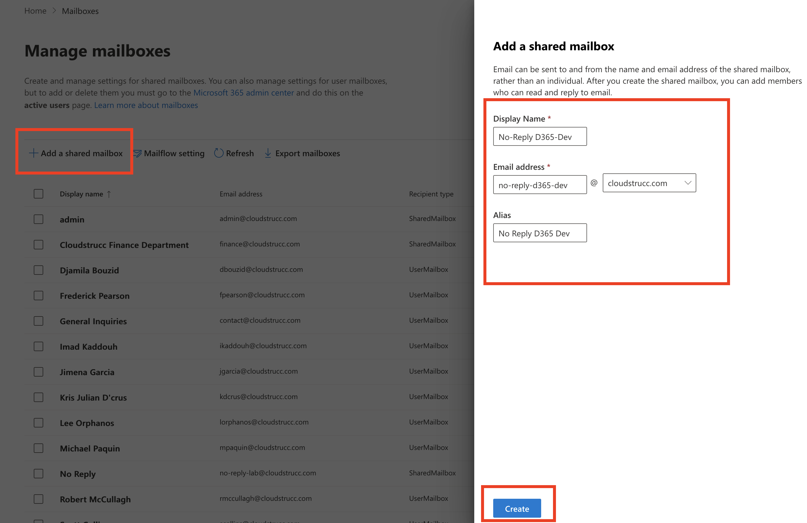
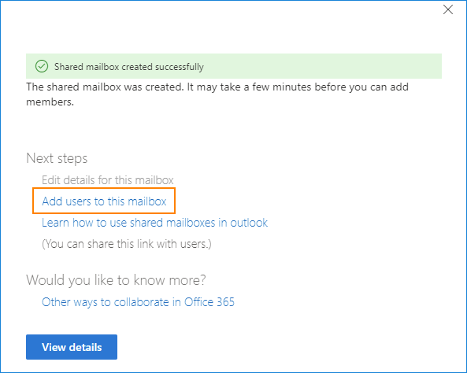
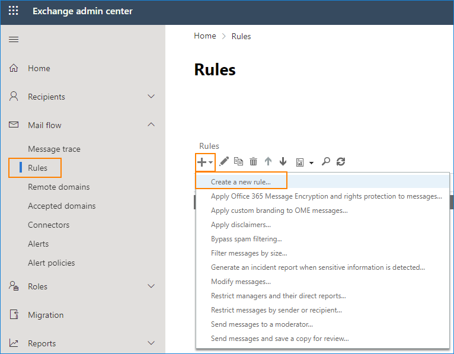
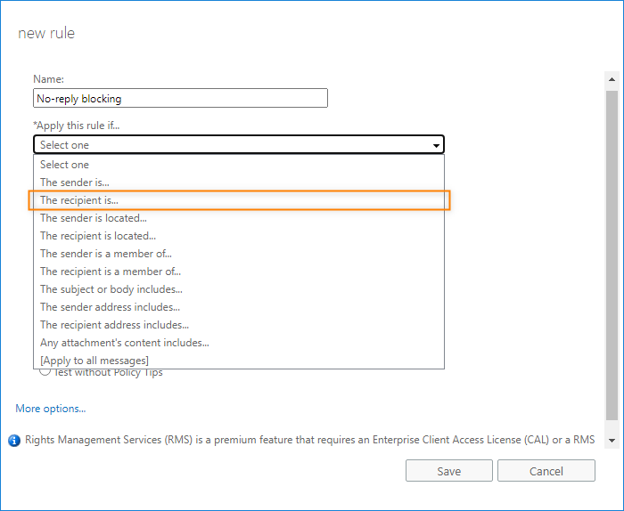
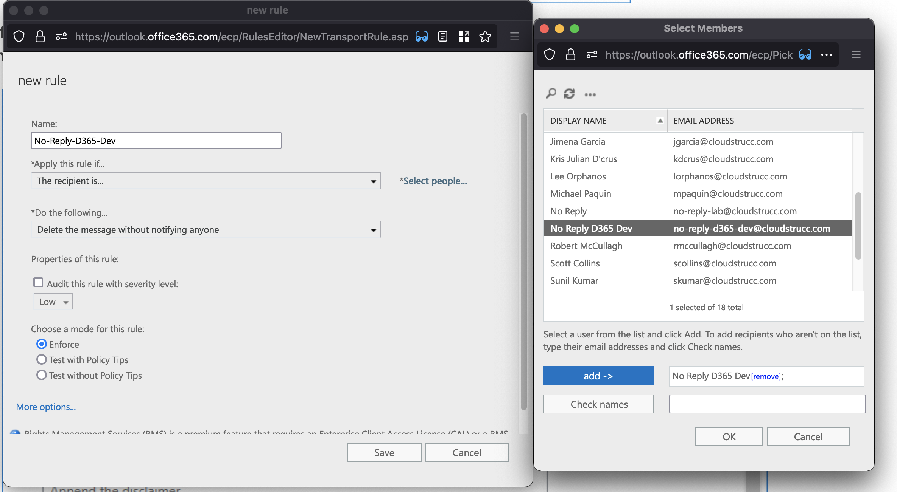
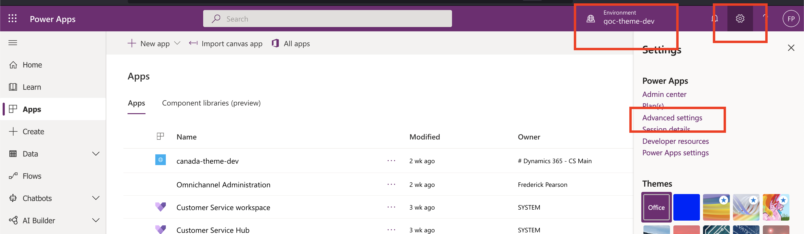
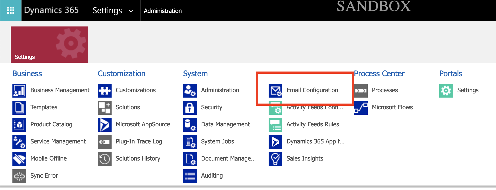
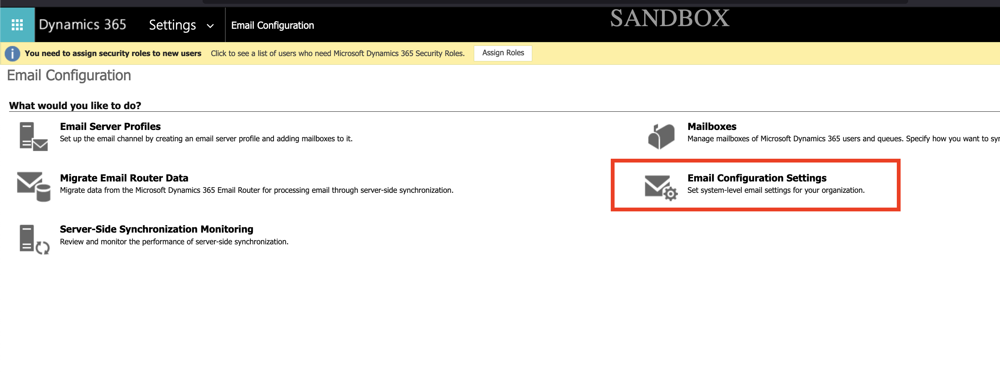
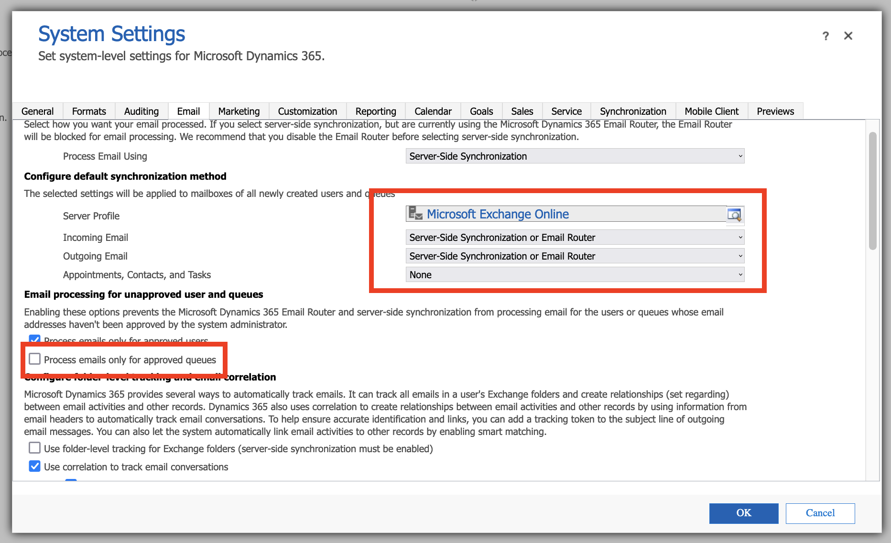

# Email - Configuration Guide

[Download PDF](./Email-Integration.pdf)

The file managemement / attachments in this implementation is primarily managed via the out of the box integration between Dynamics 365 and SharePoint. This feature is abstracted from staff and external users. The benefits of using SharePoint to store documents from the Dataverse rather than storing documents directly in the Dataverse includes:

1. Storage (File storage costs lowered)
2. SharePoint is built as a mature IM repository that goes beyond simple file storage. 
3. Users who are not CRM users (authorized users) can access documents from clients, without using CRM.
4. The integration is seamless, CRM users view all client attachments directly in the same CRM UI / form that they interact with when working on the case files.

## Pre-Requisites

- **Dataverse environment administrator including user with PowerPlatform Administrator rights and System Administrator** security role assigned / access to the environment for which positional mailboxes are being configured.
- **Global Administrator, Exchange Administrator role** of the M365 subscription hosting the organization email services (Exchange Online).

## Mailboxes to Configure

**\*For the email address domain – for development and test, when creating the shared mailbox, choose a domain that is available in cloud.**

**\*UPDATE WITH ALL THE EMAILS\***

| Display Name        | Email Address                                                               | Alias               | Permissions                  |
|---------------------|-----------------------------------------------------------------------------|---------------------|------------------------------|
| No-reply-d365-test  | [No-reply-d365-test@{domain.ca}](mailto:No-reply-d365-test@%7bdomain.ca%7d) | No-reply-d365-test  | Group: Power Platform Admins |
| No-reply-d365-uat   | [No-reply-d365-uat@{domain.ca}](mailto:No-reply-d365-uat@%7bdomain.ca%7d)   | No-reply-d365-uat   | Group: Power Platform Admins |
| Support-centre-test | Support-centre-test@{domain.ca}                                             | Support-centre-test | Group: Power Platform Admins |
| Support-centre-uat  | Support-centre-uat@{domain.ca}                                              | Support-centre-uat  | Group: Power Platform Admins |

Purpose

The PowerPlatform includes an “out of the box” integration with email as a feature for Dynamics 365 and Model Driven Apps (both considered CRM apps) within any Dataverse environment hosted in the organization’s PowerPlatform subscription. This feature allows CRM users to administer email directly within the CRM app (sending, receiving, managing calendar events etc.). Since email is integrated within the platform it can work directly with its automation features such as (but not limited to) workflows, actions, plugins and Microsoft Flows. This feature allows integrating individual mailboxes (user mailboxes) within the apps so that users can track and manage their email within the platform by associating these to records they are working on AND / OR manage mail from shared mailboxes (e.g. Positional Mailboxes) for use cases such as support centres, help desks, line of business email (e.g teams) and any other use case that warrants the usage of a shared mailbox. This guide outlines the steps required to integrate shared mailboxes in CRM and integrating these to Queues for both 2 way email and “no-reply” mailboxes (for outbound notifications).

Shared Mailbox Configuration

Go to the [Exchange Admin Centre](https://admin.exchange.microsoft.com/) and click on “Add a share mailbox” and enter the following details. Press Save once completed.

Next, add members to the mailbox. These members should include the Dynamics 365 App Administrator(s) who will be synchronizing the mailbox in the Dynamics 365 App.

**\*Skip the next steps for positional mailboxes that are not for “no-reply” or outbound only mail”**

Once added, block all incoming mail by selecting the Mail flow menu item and clicking on rules. Press the plus sign and “create a new rule”

Name the new rule e.g. No-reply blocking. In the Apply this rule if list select The recipient is.

Provide a name, select the “No Reply D365 Dev” mailbox just created under the “Apply this rule if.” Drop down menu. Select “Delete the message without notifying anyone” under the “Do the following…” drop down menu and press Save.

## Enabling Email Integration in Dynamics 365 (Queue Mailboxes)

### Pre-Requisite

- **Dataverse environment administrator including user with PowerPlatform Administrator rights and System Administrator** security role assigned / access to the environment for which positional mailboxes are being configured.
- **Global Administrator, Exchange Administrator role** of the M365 subscription hosting the organization email services (Exchange Online).

Navigate to the Dynamics 365 Advanced Settings and select Email Configuration.

Go to <https://make.powerapps.com>, select the environment that requires email integration and press the gear icon and then “Advanced Settings”.

In the email configuration menu select “Settings” and uncheck “Process emails only for approved queues”

**\* This will allow Dynamics 365 System Administrators to synchronize mailboxes independently. If you’re implementation limits the usage of email to a few positional mailboxes, configuration of positional mailboxes from Global Administrators and/or Exchange Administrators can be incorporated within the Cloud team’s operational support (SLA) process. Alternatively, and in scenarios where your organization will extensively make use of the email integration feature by synchronizing a large number of positional mailboxes across multiple environments, individuals within the organization who have been designated as “PowerPlatform Administrators” can be assigned the Exchange Administrator Role in Azure via Privileged Identity Management (PIM) as an eligible assignment that requires “Approval” so that the workload can be effectively and securely distributed among multiple members of your organization.**

Once completed, alert the Dynamics 365 Administrator that they can synchronize the positional mailboxes.
