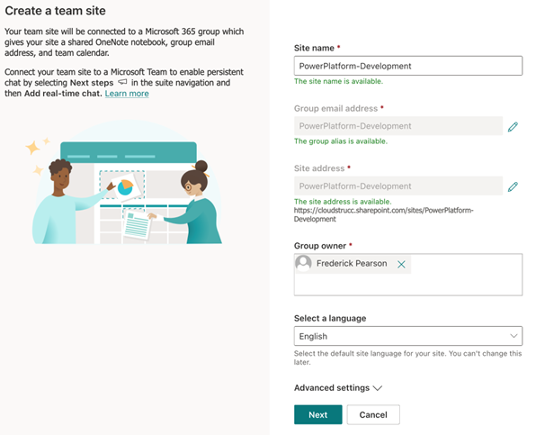
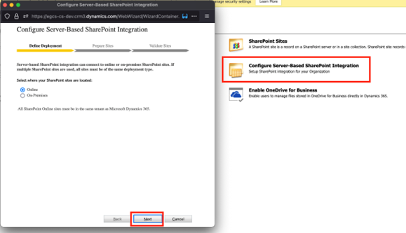
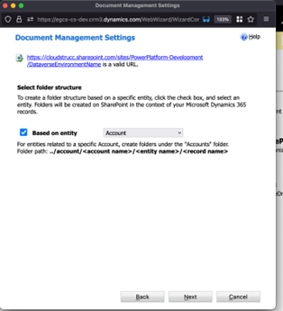
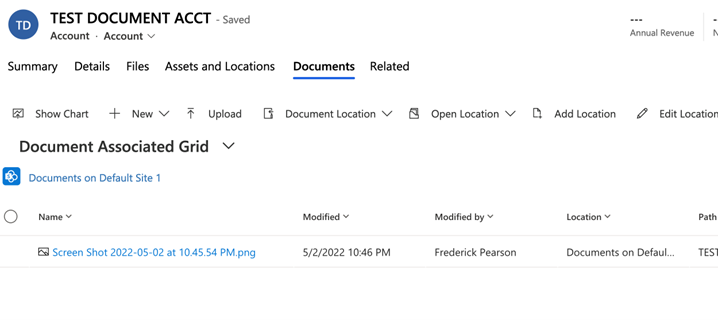
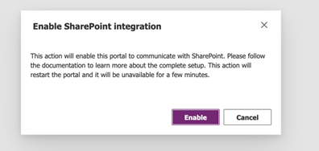
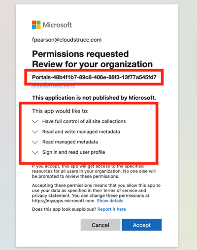
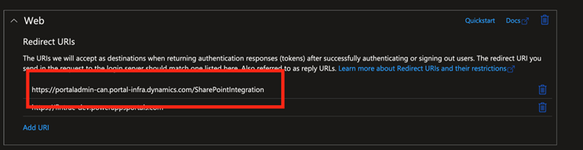

# SharePoint - Configuration & Integration Guide (CRM & Portals)

[Download PDF](./Combined.pdf)

## Pre-Requisites

* **Dataverse environment administrator including user with PowerPlatform Administrator rights and System Administrator security role assigned / access to the environment for which SharePoint integration is being configured.**

* **Global Administrator or SharePoint Administrator**

## Creating a SharePoint Site to host Subsites that will integrate with Dataverse environments

Navigate to the SharePoint Online Admin Centre and create a new Site. Ensure to set ownership rights to the PowerPlatform Service Administrator (not the Application layer / Dataverse environment administrator). This will allow the PowerPlatform Service Administrators to create additional subsites in the future for new Dataverse environments without intervention (optional).  Go to <https://admin.microsoft.com> and ensure that all admin centers are rendred (click “show all” on the left menu) and press “SharePoint”.

In the SharePoint admin centre, select Sites and Active Sites, then press “Create” and “Team Site”.

Enter the required details for the Team Site and ensure to set additional site owners, press next and finish (assigned site  owners can add members to the site in the future). **Note the site can take up to 1 hour to fully provision.**

Once the site is created provide the Site URL to the PowerPlatform administrator (owner set for the PowerPlatform-Development site) – you can click on the link in the Site list

## Creating Subsites

Once a site has been created, you or another Site owner will need to create a subsite(s) per Dataverse environment. To create a subsite, navigate to the Site Contents menu, press New and select Subsite.

Enter the site name which should match the name of the Dataverse environment (suggested convention) and the site address. Ensure to leave the “use same permissions as parent site” radio button selected.  Press Create. This process can take up to 30 minutes.

Once created provide the new Subsite’s URL to the Dataverse application administrator to set up the integration with the Dataverse environment

## Purpose

The Dataverse provides document storage out of the box using the Notes table. While this is suitable for small applications, it is often better to use an enterprise grade IM repository. Thankfully, the Dataverse provides the ability the integration to SharePoint Online sites natively. This guide provides the configuration steps to integration SharePoint Online Sites & Subsites to your Dataverse environment for both Model Driven and Portal Apps.

## SharePoint Online – Prepare Sites and Subsites for Integration with Dataverse Environments

### Preface

The recommended architecture to implement SharePoint Online integration with the Dataverse is to use Subsites. By using subsites, your organization can manage all the security and access control policies at the site level and therefore, all subsites deployed within the site will inherit these policies. Security administrators can also opt to add and or override these policies at the subsite level for specific environments with unique requirements. Additionally, it is recommended that a site is created for non productionized environments and another for production environments for those whose security requirements allow for shared infrastructure. For production environments that require a dedicated site the same steps can be followed but instead of creating a subsite, the production Dataverse environment integrating with the dedicated site will use the site URL to integrate rather than a subsite.

### Model Driven Apps (Dynamics 365 Apps) SharePoint Integration

*To complete the steps below you will need to be an Owner of the SharePoint subsite created in the previous step and System Administrator access to the Dataverse environment that requires the SharePoint integration*

### Steps to configure SharePoint Integration

Navigate to <https://make.powerapps.com> and select the environment where SharePoint integration will be configured. Once selected, click on the Gear icon and “Advanced Settings”

In the advanced settings navigate to document management.

In the Document Management Settings, click on “Configure Server-Based SharePoint Integration” and in the modal press next, enter the SharePoint Subsite URL, press next again

In the Validate Sites step, press finish, once validated. If you receive an error it is likely due to permission issues.

Next, click on “Document Management Settings” and select the tables whose records allow document attachments to be stored in SharePoint, paste in the Subsite and press next.

Select “based on entity”. This will ensure that each configured table will have a dedicated folder and within these folders, a folder for each record will be created that houses the attachments associated to the record.

Press “Finish” once completed

Now that the SharePoint Subsite is integration with this environment, you can test by navigating to any record from a table you’ve configured and you will notice a new relationship entitled “Documents”.

You can test uploading a document and verifying that the document is found in the SharePoint Subsite

## PowerApps Portal – Configure SharePoint Integration

### Pre-requisites

* Global Administrator Role
* The Dataverse environment hosting the Portal must have the SharePoint Online Server Side Integration setting activated (see previous section)

### Environments to apply this setting (non-productionized environments)

| Environment URL                                                                                                           | Type    |
|---------------------------------------------------------------------------------------------------------------------------|---------|
| <https://portaladmin-can.portal-infra.dynamics.com/?tenantProductId=086e308f-b708-4ab1-835a-987bb121c21a&lcid=1033&geo=CAN> | Dev     |
| <https://portaladmin-can.portal-infra.dynamics.com/?tenantProductId=32b2d9b8-e69b-4789-a22a-3f86feaa2de9&lcid=1033>         | Staging |
| <https://portaladmin-can.portal-infra.dynamics.com/?tenantProductId=4fcb5e8c-43f3-4760-b9bd-c813cc12b10d&lcid=1033>         | UAT     |
| <https://portaladmin-can.portal-infra.dynamics.com/?tenantProductId=3f8697b3-f8b2-4917-99d0-eef6aef28a7d&lcid=1033&geo=CAN> | CUT     |

### Steps to configure the SharePoint Intergration for PowerApps PORTALS

In the PowerApps Portals admin centre, navigate to “Set up SharePoint Integration” and click on “Enable SharePoint Integration”

Select “Enable” in the confirmation window. This will enable the portal to communicate with SharePoint. While the SharePoint integration is being enabled, the portal restarts and will be unavailable for a few minutes. A message appears when SharePoint integration is enabled.

You will be prompted to authenticate the request and attest an amendment performed to the Portals App Registration record.

Once accepted the process will update the **<u>PowerApps Portal App registration record</u>** in the background by adding the following API Permissions. You can view these changes by navigating to “App Registrations” in the Azure Portal and searching for the app registration highlighted above. You can then navigate to the App Registration’s API Permissions menu blade to view the changes.

The update will also include an additional “redirect URI” which is part of the OAUTH 2.0 specifications for authorization. This same redirect URI is registered in the SharePoint Site Configuration for OAUTH 2.0 API integration.

**This registration record has no owners beyond the Portal provisioner identity and is only leveraged for machine-to-machine flows between Portals, Dynamics 365, and SharePoint Online (for environments whose portals require integration with SharePoint Online).*

### Example integration of SharePoint upload feature in Portals

To expose an upload documents control in the Portal that points to the SharePoint document library associated to a record, the first step is to add a basic form metadata attribute to a form you are exposing to the portal. The configuration is detailed below.

### Step 1: Create a table permission

In this example, we are allowing only users who are primary contacts of an Account (Organization) to upload documents related to the organization. But as long as a table permission is created for the Document Location Table (Entity) the baseline security to allow the upload is configured. However it is recommended to scope the document management feature at the contact (user level) or organization level (e.g. for portals where you have multiple users belonging to the same organization and submitting documents on behalf of the entire organization rather than for their own application).

This example demonstrates allowing uploads only by the user and associated to their user account only

### Step 2: Basic Form Metadata

To render the document gird on a page or form, you must add a basic form metadata attribute of type subgrid. This subgrid must exist on the CRM form (and tab) that is being exposed to the portal

When creating the metadata record, select “Subgrid” and PowerApps will allow you to select the subgrid to render next to the subgrid name field. This subgrid must existing on the CRM form and must point to the “Document Location” table.

