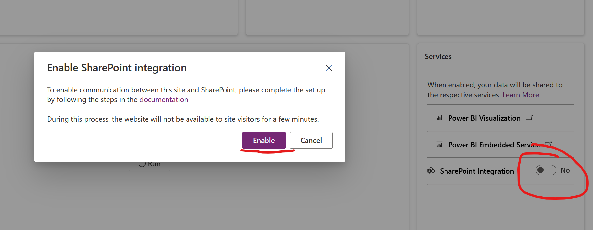
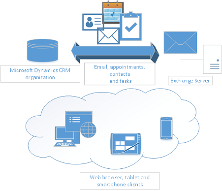
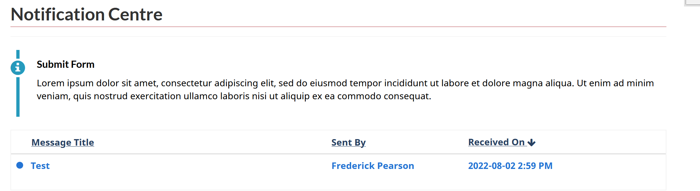
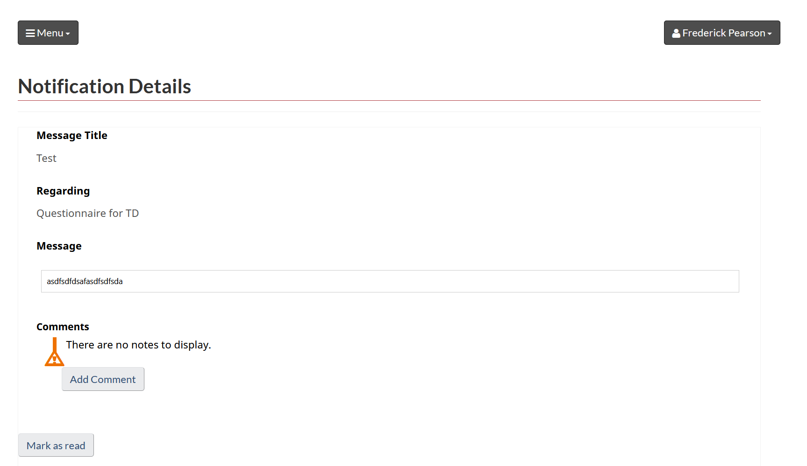
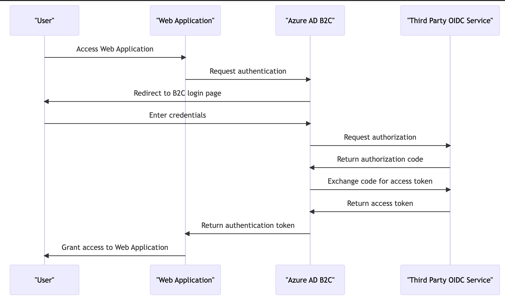

# Introduction

[Download PDF](./SDD.pdf)

The introduction section of the solution architecture document provides an overview of the purpose and scope of the document, which is to describe the architecture of the CRM case management system and its components. It also covers the technologies and platforms involved in the implementation.

- Purpose and scope of the document
- Overview of the CRM case management system and its components
- Overview of the technologies and platforms involved.

## Purpose and scope of the document

The scope of this document focuses on the Dynamics 365 Customer Service implementation in the organizations Power Platform subscription which is part of the M365 product family and is considered as a “SAAS” technology. Dynamics 365 CS is an enterprise CRM platform that the organization plans on leveraging to modernize the digital relationship with the “reporting entities” which are financial institutions across Canada that are responsible to report financial data and through various forms and mediums to {ORGANIZATION} for compliance officers to analyze to ensure compliance with the financial laws in Canada in this sector. This technology also ships with a Portal technology that integrates natively with Dynamics within the Power Platform which allows Contacts (external portal users) to submit data in a more efficient and secure manner directly to {ORGANIZATION}. Officers typically will generate reporting cycles by sector and invite all financial institutions within that sector to fill in compliance forms and attach supporting documents. This document demonstrates the implementation of this technology to meet the use this case. Moreover, {ORGANIZATION} has an API driven architecture whereby the platform can interface with read data thus aligning with the organization’s overall digital strategy and cloud adoption. By leveraging this technology, particular a SAAS technology that has been assessed by CSE/SSC/TBS as Protected B ready, the complexities associated with administering a custom implementation or infrastructure is now abstracted and thus simplifies the implementation and assures a higher level or security due to the fact that operators cannot interfere with the OS or IAAS and encryption is handled end to end both in transit and at rest using AES and RSA and falls within the realm of the organizations Active Directory policies thus ensures that only {ORGANIZATION} employees on approved devices with Federal Government CA authorization can access the platform. Moreover, the portal is also administered by Active Directory service principles only accessible by privileged user roles (app admin, GA) and external users (Contacts (external portal users)) must be invited formerly to the portal and are forced to use 2FA to access the portal.

## Overview of the Dataverse environments (CRM case management system) and its components

Before diving into the specific use case implemented using the Dynamics 365 Customer Service Module with Portals, the section will first describe what each of these technologies are to provide context and explain how the compliance management process will fit into or has been built leveraging these technologies:

## Dynamics 365 Customer Service

Dynamics 365 Customer Service is a customer relationship management (CRM) software application that enables businesses to manage and streamline their customer service operations. The platform offers a wide range of features, including case management, SLA management, business process flows, automation, and reporting capabilities.

Case management is a critical aspect of the Dynamics 365 Customer Service platform. It allows customer service agents to efficiently manage and resolve customer issues by creating cases, tracking case progress, and escalating cases as needed. The platform also includes robust SLA management features, which allow businesses to establish service level agreements with customers and track performance against those agreements. Additionally, the platform offers extensive automation capabilities, including the ability to automate routine tasks, such as email responses and case routing.

Another strength of Dynamics 365 Customer Service is its business process flows feature, which enables businesses to automate and standardize their customer service processes. With this feature, businesses can create predefined workflows that guide agents through each step of the customer service process. The platform also offers robust reporting capabilities, allowing businesses to track key performance indicators (KPIs) and gain insights into customer service operations. Overall, Dynamics 365 Customer Service is a powerful tool that can help businesses improve their customer service operations and streamline their workflows.

This technology aligns well with the compliance process at {ORGANIZATION} whereby employees are responsible to generate reporting cycles by sector which automatically trigger an invitation process and notifications to Contacts (external portal users) within that sector to fill in the data of the compliance form associated with the cycle, for example the risk questionnaire type using out of the box case management feature. Furthermore, the SLA feature is being leveraged to track the progress and timeline obligations that Contacts (external portal users) are responsible for submitting the information to {ORGANIZATION} within a given (configurable timeframe). Furthermore, the auditing feature allows {ORGANIZATION} to report and examine all activity on the case and audit logs are immutable. The platform’s business process flow and out of the box state machine (statuses) are being leveraged to track where in the process a compliance form is. For example, the process starts in draft until the employee runs a the workflow (flow) to activate the cycle which triggers the invitation process and generates all child compliance case per RE which also has its own state machine. Once this is successfully triggered the status is automatically set to in progress and only transitions to under review once all submissions have been received and triaged for accuracy. The state machine is further described in the application layer implementation details. Throughout this process however, Contacts (external portal users) and {ORGANIZATION} employees can collaborate digitally over email or virtual agent feature and all correspondence is automatically linked as an activity associated to the case. Furthermore, {ORGANIZATION} employees can return submissions to the Contacts (external portal users) to request more information and extend the timeline for submission when warranted. Most of these features come with the platform’s tooling with additional development to account for specific data elements and configuration of state machine and business process flows and rules build by the CRM developer.

## Power Pages Sites

Power Pages Sites (customer self-service type) is a low-code, self-service portal technology that integrates natively with a Dataverse environment licensed with customer service license. The platform allows {ORGANIZATION} to provide their Contacts (external portal users) with a self-service portal that enables them to access information and perform tasks such as submitting and tracking cases, updating their profile information, and accessing other data such as attachments and notifications.

One of the strengths of Power Pages is its SAAS nature, which means that businesses do not have to worry about managing infrastructure or performance. The platform is hosted on Microsoft Azure and provides automatic scaling and failover capabilities, ensuring high availability and reliability.

Portals also offers native integration with Azure B2C, which enables businesses to provide single sign-on (SSO) with 2FA to external users. This integration provides a secure and seamless authentication experience for users accessing the portal and aligns with the organizations current architecture to provide SSO and API authorization to Contacts (external portal users).

Another key feature of Portals is its RBAC (Role-Based Access Control) capabilities, which enable businesses to govern access and CRUD (Create, Read, Update, Delete) operations to tables and columns in the Dataverse. The platform provides granular control over access permissions using table permissions and column permissions coupled with web roles.

Power Pages Sites also offers advanced features such as rendering CRM forms using advanced forms and rendering lists using existing views. This allows businesses to customize the user experience and provide a seamless integration with their existing Dataverse environment.

Finally, the invite-only feature of Power Pages Sites provides an added layer of security, ensuring that only invited users can access the portal. Overall, Power Pages Sites is a powerful tool that can help businesses improve their customer service operations by providing a secure and customizable self-service portal for their customers.

Contacts (external portal users) will leverage this portal to note only submit data and documents to {ORGANIZATION} but also seek support via the omnichannel modules (chat/virtual agents/voice) and the portal has been adapted to meet the WET / WCAG 2.0 theme and compliance that is a commitment to Canadian citizens to ensure a seamless experience to any user regardless of vision impairment or other ailments making it difficult to use a web-based tool. {ORGANIZATION} has incorporated this theme in the platform and is responsible to maintain it by issuing new releases as the theme is modernized year over year. Moreover, by providing 2FA and presenting users with transparent consent on what {ORGANIZATION} is collecting and its obligations to protect the data and handle data retention and disposition rules to meet the GOC’s Protected BMM posture, users are informed each time they sign on of the terms and conditions and what to expect when interacting with the portal.

The illustration below provides the look and feel and SSO with consent into the platform (subject to change, and this is development). The purpose is to demonstrate the integration the WET theme and the SSO service integration with the PBMM consent screen:

Figure 1: Home Page

Figure 2: Azure B2C SSO Login Pages

Figure 3: Terms and Conditions (PB) Consent Page

Figure 4: Authenticated User Landing Page

The Power Pages Site setting to force the PBMM consent on login is illustrated in the table below.

## System Architecture

This section provides a high-level diagram of the system architecture and the components involved in the CRM case management system, which include Dynamics 365 Customer Professional App, Power Pages Site, SharePoint Online, Exchange Online, and Azure B2C. The section provides a detailed description of each component, including its architecture and data model, customizations and extensions, and integration with other components. Additionally, it discusses how the components integrate with each other, including data flow and synchronization, security and authentication requirements, and integration patterns and best practice. The system is implemented in the {ORGANIZATION} Power Platform subscription which is a SAAS residing in the organizations M365 subscription. The Power Platform has been configured with guardrails to adhere to IT standards which would allow the ability for {ORGANIZATION} to store and interact with Protected B data. These guardrails protect and govern this implementation and are further described in the Power Platform guardrails chapter of this chapter. However, the full platform guardrail implementation documentation is separate from this document. However, the reader should take into account that this implement operates within the confines of these guardrails. Similarly, this system operates the confines of the Azure B2C PB guardrails and the Azure and M365 baseline guardrails mandated to Federal Government Department and Agencies implementing PB workloads outside the GOC owned network devices hosted in Government owned and or operating datacenters. In this implementation our solution is comprised exclusively of Microsoft owned network assets and SAAS and PAAS offerings which is a deliberate decision to further secure this application by relying on a trusted partner whose datacenters meet and exceed the GOC standards for physical and network security and has been fully assessed by our intelligence agencies and internal IT experts. These physical and network assets are subject to random audits by impartial parties to validate adherence to the GOC’s ISO based set of network and hosted network physical requirements such as multiple checkpoints, specific security clearances/screening of staff, and safely purging of stale physical network assets such as any device hosting data such as SDD/HDD/RAM etc. Another important factor for cloud security is the integration of {ORGANIZATION}’s Active Directory to Contacts (external portal users) Active Directory using AD Connect / ADFS / WAP to ensure that our internal user data is owned by our hardware thus our conditional access policies such as the requirement to access any of the elements in our implementation must be done by an operator who’s physically accessing our network using VPN and authorize to our on premise hosted Entrust Certificate Authority. This means that Microsoft has no ability to compromise access to our systems without the same requirement. Moreover, MS cannot access our Global Admin credentials and thus cannot restore this account which is the reason why we have multiple G.As and break glass accounts. Finally, the GOC has implemented the Express Route which is a physical link between our ISP’s to the Azure Datacenters, thus extending our existing data-centers to Azure giving us more control over who and what data can traverse through between both organizations. Finally, {ORGANIZATION} is also implementing CMK and an HSM to own the encryption keys. This will also apply to the Power Platform, however {ORGANIZATION}, as of 2023, does not mean the minimum requirements (1k licenses) to activate this feature. Once the feature is available to the organization, a migration will be required however will be vital to elevate the data confidentiality and integrity guardrails by guaranteeing that even if MS is compromised the nefarious actor (even with access to the MS CA infrastructure) will not be able to decrypt the data.

## High-level diagram of the system architecture

The target state architecture aligns with {ORGANIZATION}’s perimeter services which is comprised of using Azure Gateway as a proxy to both Azure B2C and the Power Pages Site.

Figure 5: Software Architecture Target State

The current state architecture is leveraging the Microsoft default SAAS security perimeter services which is abstracted from {ORGANIZATION} and fully under the control of Microsoft’s security team. The TBS cloud usage profile allow this for PBMM because SAAS infrastructure is not accessible by GOC employees thus is less vulnerable to security threats or failure to patch security vulnerabilities quicker than the teams at Microsoft administering the platform. {ORGANIZATION} however can control the perimeter services for both B2C and Power Pages Sites by using Azure Gateway or Azure Front Door and use this to also configure a custom domain for both services.

Figure 6: Software Architecture Current State

## Technical Architecture

### Dynamics 365 Customer Professional & Enterprise

This is a series of model driven applications that are installed in each Dataverse environment that include additional features that come with this license including case management, service level agreements, customer (client) insights, omnichannel for agent (messaging and voice), additional capacity per user (.75gb per licensed user), and additional Power Automate Flow throughput. The case (incident) is the pillar of the compliance application as every type of compliance form is managed via the case table. Each type of case (which is the case subject tree) has a dedicated custom table that holds the data that clients will submit via the Power Pages Site and is linked as a N:N relationship to the case. Compliance staff will create reporting cycles using the case management feature, and select a subject such as Risk Questionnaire, and select a selector or manually choose which reporting entity(ies) the cycle is scoped for. By doing so invitations to complete the form are sent to each reporting entity associated with the cycle (the primary contact of the RE) and the SLA is activated. The SLA feature is an OOB feature available through the CS module and provides the ability for system administrators and customizations to configure date driven rules to communicate to both internal and external stakeholders’ deadlines for various actions such as submitting a compliance form, reviewing a submitting, deciding on a form’s process to transition to a new state (such as complete) and actioning incident (tickets for support). The feature provides visual cues such as green, yellow, and green dots next to records in the Model Driven App views and in portal lists shown to external users for transparency. The feature is also useful to create automated events such as sending email reminders and report on adherence to service standards providing {ORGANIZATION} with aggregate metrics to examine its own SLA standards vis a vis its internal capabilities. This feature implementation for the compliance management system will be illustrated in this document.

Figure 7: SLA's

### Power Pages Site

The Power Pages Site technology is internet facing and is on the powerappsportals.com domain by default. The security perimeter is maintained by Microsoft just like all other SAAS services and non productionized sites (e.g. dev, test, uat) are internal to {ORGANIZATION} employees only and not accessible by external users who do not belong or exist in the 139gc domain. Therefore, just like teams, and other M365 SAAS products, users who are developing and or testing the portal must be on a {ORGANIZATION} device and authorized to Active directory and entrust CA to access the portal. For the production portal, the settings of privatization are turned off and the site is made “public” and which point the anonymous page (home page) of the portal is accessible via the internet however nobody who has not been invited to use the portal and is within the Azure B2C domain can access the authenticated user pages.

This app type is provisioned within the same Dataverse environment as the D365 CS app and it’s a public facing website that is configured for invitation only. Meaning, open registration by external users to the portal is prohibited. An RE must first exist in the Azure B2C tenant, and then be sent an invitation from the D365 CS application that includes a link with embedded invitation code to redeem. Once in the portal the RE primary contact and start filling in the form and assign the form (optionally) to an authorized agent, which are contacts in the CRM that are associated to the Primary Contact’s organization (the financial institution). However, only the Primary contact has permission to submit the form to {ORGANIZATION} for review. Once submitted, the user is notified that the form is no longer editable and that a {ORGANIZATION} officer will be reviewing the submission. If the officer determines that the form is incomplete or requires clarification or more information, they have the ability to change the state of the Compliance case to “Draft” and send a “notification” activity to the primary contact, which is done via a Power Automate Flow, at which point the Primary Contact receives a generic email instructing them to log into the portal and review the notification activity where more instructions are provided by the {ORGANIZATION} employee and a direct link to the form which is now editable again for submission. This process can repeat itself until the {ORGANIZATION} employee deems the form complete and transitions the state of the compliance case from under review for ready for approval.

### SharePoint Online

This technology is the official IM repository for the entire system. Each Dataverse environment from dev through prod is linked to a SharePoint subsite that lives within a site. {ORGANIZATION} has provisioned 2 SharePoint Sites, 1 for non-production and 1 for production each hosting x number of “subsites” that point to 1 environment. For example, dev is integrated with the dev subsite in the ftnc-compliance-np site, and pre-prod and prod both have their own subsite hosted within the production SharePoint compliance site. The environment lists all the subsites associated with each environment. This setting is managed the advanced settings or admin console for Power Platform (**admin.powerplatform.onmicrosoft.com**) where a site (subsite) is synched with a Dataverse environment and each table that is configured to accept attachments will automatically create a folder within the subsite whereby each record such as a case will have its own folder holding all associated attachments. This is configured by the D365 System Administrator role.

Because this app supports Power Pages Site attachments to SharePoint, the G.A must provide consent to allow the integration of the site to the integrated SharePoint subsite to the Site’s integrated SharePoint subsite environment.

The table below lists every table that attachments are allowed:

| Table Name              |
|-------------------------|
| Incident (case)         |
| Risk Questionnaire      |
| Account (Organizations) |
| Contact                 |
| User                    |
| Notification            |
| ..                      |
| ..                      |

Table 2: Tables integrated with SharePoint.

### SharePoint Sites with X Number of Subsites Each Mapped to Non-Production Environments (e.g., Dev, Test, Staging, UAT, Sandbox) and another site that hosts the production environment

In this implementation, there are 2 SharePoint sites created – one for non-production environment integration and 1 dedicated for production environments. The table below lists each site, subsite and environment URL mapping.

| Subsite Name/URL | Type | CRM environment |
|------------------|------|-----------------|
|                  |      |                 |
|                  |      |                 |
|                  |      |                 |
|                  |      |                 |
|                  |      |                 |
|                  |      |                 |
|                  |      |                 |

Table 3: SharePoint Subsite & CRM Environment Mapping

The illustration below depicts the folder structure in SharePoint for each environment’s subsite.

Figure 8: SharePoint - Native Integration

The integration between SharePoint Online and CRM is a native configuration as both systems live within the same platform, M365. However, to configure the SharePoint integration between Power Pages Sites and SharePoint requires a Global Administrator to activate this setting and provide consent. This action will generate an API permission in the existing App Registration record that is leveraged to integrate the Portal with CRM. The illustration below depicts the new API permission created by this process.

Figure 9: Power Pages Site Admin Portal - SharePoint Integration Activation Feature

Figure 10: SharePoint API Permissions Automatically Added by Activating the Portal SharePoint Integration Feature

Activating the SharePoint Online integration between the Portal and CRM requires additional setting such as Table Permissions and basic form metadata to expose the SharePoint subgrid allowing external users to be able to upload documents. These settings are provided in the table below.

Table 4: SharePoint Table Permission Settings (review)

### Exchange Online

The compliance case management system leverages the D365 email integration feature with Exchange online by integrating 2 cloud native Shared Mailboxes with the platform. This is configured using the email server-side sync which automatically integrates with the 139gc exchange online environment and must be turned on by an exchange administrator or G.A. **However, for non-production, the system wide settings to allow D365 system administrators to synchronize mailboxes without intervention of the former privileged roles are turned off. Once server-sync is activated, the mailboxes are synchronized for each environment. Below is the list of emails synchronized by environment.**

To activate this feature, a system administrator must go to the email settings or system wide settings and configure email “server-side sync” and choose Server-Side Sync Exchange for both inbound and outbound mail. Appointments and tasks can also be synched from outlook. However, this implementation is designed to use CRM exclusively to administer email and not synchronize staff mailbox, which in this case integration using the outlook plugin would be useful.

Each mailbox is first configured in exchange as a “Shared Mailbox” Type with delegation privileges to the Power Platform-administrator group who are responsible to synchronize them to each environment. These mailboxes are of type “Cloud” thus there is no requirement for this phase to synchronize on premise exchange mailboxes (e.g., Hybrid Exchange). Finally, its important to state that a mailbox can by synched to one environment a time therefore we’ve created an outbound only and in and outbound mailbox for each environment for development and testing.

| Mailbox | Environment |
|---------|-------------|
|         |             |
|         |             |
|         |             |
|         |             |
|         |             |
|         |             |
|         |             |

Table 5: Exchange Shared Mailboxes Synched in each D365 environment.

The illustration below depicts the exchange email server-side sync architecture – note for this implementation, the synchronization only has been configured for the CRM organization – the outlook app is not being leveraged nor required as all email is administered in the model driven app.

Figure 11: Email -server-side sync

The use case for emails is listed below. These are subject to change. Secondly, this system will never, or is prohibited to send Protected B content in the emails being sent. Thus, this implementation includes a “Notification Centre” module which integrates with email, whereby an email to the person notified who is responsible to log into the portal and navigate to the notification center to view the details of the notifications. The table below demonstrates the data model for the notification center. The feature enables administrators to configure custom templates using a rich text editor and use workflows and flows to send notifications using both the do not reply email queue mailbox OR the help center email queue. When a user receives a notification, an unread badge (visual cue) is displayed, and the user can choose when to mark the notification as “read” by pressing the “Mark as Read” notification which updates the status reason of the notification item record.

Figure 12: Notification feature ERD

Figure 13: Example unread notification

Internal users can manually issue notifications in the model driven app. The process is illustrated below. Most notifications however are automated via processes and or Power Automate Flows.

### Azure B2C

Azure AD B2C (Business to Customer) is a cloud-based identity and access management solution provided by Microsoft. It enables businesses to manage customer identities and authentication in a secure, scalable, and cost-effective manner. With Azure B2C, businesses can offer their customers a seamless, personalized experience across multiple applications and platforms. Azure B2C provides features such as social identity integration, multi-factor authentication, self-service password reset, and more. It also supports industry-standard protocols such as OAuth 2.0 and OpenID Connect.

Power Pages Sites can be integrating natively with Azure B2C using app registrations. App registrations are created for each site to integrate with Azure B2C using the OIDC setting out of the box and therefore each environment is provided a client ID, Secret, and the user flow metadata (OIDC metadata) from B2C NP, and for production the B2C production tenant. B2C is an active directory tenant separate to 139gc but linked to a pay as you go subscription, the non-prod and prod subscriptions at {ORGANIZATION}. The table below lists all the client IDs by environment. The Client IDs are unique identifiers to App Registration are records generated by administrators of B2C or application developers in the B2C AD domain.

| Client ID (Registration) | Environment |
|--------------------------|-------------|
|                          |             |
|                          |             |
|                          |             |
|                          |             |

Table 6: App Registrations for Power Pages Portal SSO

The detailed integration details are further described in the implementation details and baseline configuration sections of this document.

The sequence diagram below demonstrates the user journey for authorization to B2C from Power Pages

Figure 14: B2C Journey

For this to work, Power Pages site settings must be configured with a “Client ID, Secret, Tenant ID, the User Flow, and mapped claims (email, first name and last name)” from B2C so that the portal can generate a “bearer token at runtime which is a hashed value (RSA 2056) of a JSON Web Token (JWT) containing these “claims” and the session ID and its lifespan (19 minutes as per LOA 2/PB requirements). The diagram below depicts this process.

Figure 15: B2C Technical System to System OIDC Journey

In this diagram, the Application uses the Client ID and Secret to authenticate with the B2C Tenant and obtain an Access Token. The Access Token is then used to request User Claims and make API calls. If the Access Token has expired, the Application uses the Refresh Token to request a new Access Token and then uses it to request User Claims and make API calls. The hashed JWT includes:

- Username
- App ID
- SID (session ID)

### Azure API Management (APIM)

APIM is leveraged as the API management system, or the org master and report ingest endpoints (REST). API requests are executed to the APIM perimeter by using a client ID and secret generated by an App Registration in B2C which in turn issues a bearer token for subsequent calls to the endpoints to return payloads such as the RE intuitional data, primarily the basic organization information and the various contacts associated to these institutions from the primary contact to authorized agents that will be interacting with the portal. **(RICK + TEAM INPUT REQUIRED)**

### Dynamics 365 Customer Service - Architecture and data model (OOB)

The table below lists all the tables that are used in this implementation and includes the CRUD operations including append and append to privileges by security role. The table lists all the column permission rules set by team in the system. This feature secures specific field(s) within a table that provides a more granular level of data governance. For example, only a manager can set a specific value in a column (field) in the case table.

The table lists all the relationships and their cascading rules in the system. This is important for data governance as retention and disposition rules that will govern the purging of the records will rely on the cascading rules when using the bulk delete feature whereas cascading rules that configured as “referential” will be purged using Power Automate flow as when a relationship is set to referential, the parent record that’s being deleted will not purge its child records that are referential, instead it will simply remove its reference to it or clear the lookup field value. In certain scenarios this may make sense however the cascading set to parental is key so that for example if an organization is purged, all its child contacts, cases, and related records are also purged automatically without having to configure additional flows or workflows to destroy these records. However, the account table has multiple relationship types to the contact record to track the various types of contacts in 1:N and the system only allows for 1 parental relationship type by table thus both bulk delete and Power Automate flows will be responsible to purge data.

| Table Name | Key(s) | Relationship Name | Assign | Delete | Share | Re-Parent | Delete | Merge |
|------------|--------|-------------------|--------|--------|-------|-----------|--------|-------|
|            |        |                   |        |        |       |           |        |       |
|            |        |                   |        |        |       |           |        |       |
|            |        |                   |        |        |       |           |        |       |
|            |        |                   |        |        |       |           |        |       |
|            |        |                   |        |        |       |           |        |       |
|            |        |                   |        |        |       |           |        |       |
|            |        |                   |        |        |       |           |        |       |

Table 7: D365 Table / Shema Relationship Types/Cascade Configurations

| Table Name | Create | Read | Update | Delete | Append | Append To | Team | Team’s associated security role(s) |
|------------|--------|------|--------|--------|--------|-----------|------|------------------------------------|
|            |        |      |        |        |        |           |      |                                    |
|            |        |      |        |        |        |           |      |                                    |
|            |        |      |        |        |        |           |      |                                    |
|            |        |      |        |        |        |           |      |                                    |
|            |        |      |        |        |        |           |      |                                    |
|            |        |      |        |        |        |           |      |                                    |

Table 8: Table CRUD and Append/Append to/Assign privileges by security roles/team

### Case Management & Subject Convention

A key convention in the design of this application is that every center around the case table. This means that each time {ORGANIZATION} generates a campaign, an out of the box campaign record is created of type “Reporting Cycle”. This case record has 1 or more associated case records of a particular type (or Subject) such as “Call for Proposals”. The Subject field is an OOB field that allows a system administrator/configurator to configure Case types using a tree like structure. The complete Subject tree is provided below (subject to changes over time, thus this version is based on the 2023 available compliance form types.

## Customizations and extensions

Dynamics 365 Customer Service module offers a wide range of customization and configuration features that can be tailored to fit the specific needs of a case management system for financial institutions. With Dynamics 365, users can easily customize the look and feel of the system, including the layout, branding, and navigation. The module also allows for the creation of custom fields and forms, enabling users to capture and track relevant data specific to financial regulations. Additionally, Dynamics 365 provides automated workflows and business process flows that can be customized to streamline case management processes and increase efficiency. These features, combined with a comprehensive reporting and analytics dashboard, enable financial institutions to effectively manage cases and ensure compliance with regulations.

Power Pages Sites is another powerful tool that can be utilized to enhance the case management system. Power Pages Sites provides a customizable web portal that allows external users, such as financial institutions, to submit and track the progress of adherence to financial regulations. The portal can be configured to include specific forms and fields for data capture, as well as custom branding to ensure consistency with the financial institution's branding guidelines. Additionally, Power Pages Sites allows for the integration of various third-party applications, such as document management systems or payment gateways, to streamline processes and improve the user experience. With its robust customization and configuration capabilities, Power Pages Sites can provide financial institutions with a powerful tool to effectively manage adherence to financial regulations.

This section delves into the details of the various customizations and extensions leveraged for features developed for this implementation.

### Dynamics 365 workflows

Dynamics 365 workflows are automated processes that streamline business processes and enable users to define and automate business logic. Workflows can be used to automate tasks, such as sending email notifications or creating tasks, based on specific conditions or events in the system. They can also be used to enforce business rules and help ensure data consistency. Workflows can be created and customized by users with appropriate permissions using the Workflow Designer in Dynamics 365.\\

| Name | Description | Async/Sync | Solution |
|------|-------------|------------|----------|
|      |             |            |          |
|      |             |            |          |
|      |             |            |          |

Table 9:Workflows

### Dynamics 365 actions

Dynamics 365 actions are custom methods that can be created and exposed through the system's web API. Actions can be used to encapsulate business logic and provide a simplified interface for external systems to interact with the Dynamics 365 system. Actions can be synchronous or asynchronous and can return data or perform operations on the system. They can be created and customized by developers using the Dynamics 365 SDK.

| Name | Description | Async/Sync | Solution |
|------|-------------|------------|----------|
|      |             |            |          |
|      |             |            |          |
|      |             |            |          |

Table 10: Actions

### Dynamics 365 plugins & Custom Workflow Steps

#### Plugins

Dynamics 365 plugins are custom code that can be executed in response to system events, such as creating or updating records. Plugins can be used to extend the system's functionality, automate business processes, or integrate with external systems. Plugins are written in .NET and can be registered to execute in a synchronous or asynchronous manner. They can be created and customized by developers using the Dynamics 365 SDK. Plugins are “signed” binaries generated by .NET and must be registered to CRM using the Power Platform CLI and DevOps Pipelines (sourced in GIT). The table below lists all custom plugins, their purpose and direct link to repository. Finally, plugins run within a sandbox which secures the platform from unwanted customizations from third party libraries or misconfigurations and unwanted code by forcing the use of a specific first party libraries, signed binaries using developers private key and published via Pipelines. Plugin assemblies are comprised of one of more classes that can be configured as “plugin steps” whose purpose is to run on any CRUD operation and the developer can specify which fields are allowed to be read and interacted with in code and best practice dictates to only use the tables and fields required to make a working configuration. Furthermore, developers are instructed to adhere to professional and verbose logging using the plugin trace logs and this is inspected during code reviews and test automation will calculate the % of plugin trace logs vs lines of codes and the benchmark is 20%.

#### Custom workflow steps

These are almost the same as plugins however provide more flexibility to non-developers who prefer to leverage workflows (processes) to call custom steps that are not available. For this implementation, custom workflow step libraries have been imported to help with mundane and repetitive needed features such as querying 1:N relationships for process logic and more robust email automation. No custom step library has been developed in house (yet).

| Assembly Name | Purpose | Type                              | Repository Location | Owner                                           |
|---------------|---------|-----------------------------------|---------------------|-------------------------------------------------|
|               |         | e.g. Plugin, Custom Workflow Step |                     | {ORGANIZATION}, Third Party (provide full name of lib) |
|               |         |                                   |                     |                                                 |
|               |         |                                   |                     |                                                 |
|               |         |                                   |                     |                                                 |
|               |         |                                   |                     |                                                 |
|               |         |                                   |                     |                                                 |

Table 11: Plugins

#### Power Automate (flows)

Power Automate flows (formerly known as Microsoft Flow) are cloud-based workflows that can automate business processes and integrate with other systems and services. Flows can be triggered by events in the system, such as creating or updating records, or by external services, such as receiving an email or a tweet. Flows can be used to perform a wide variety of actions, including sending notifications, creating records in other systems, and generating reports. Flows can be created and customized by users with appropriate permissions using the Power Automate Designer.

The table below outlines and describes each Flow developed for this implementation.

| Flow Name | Purpose | Trigger | Primary Table |
|-----------|---------|---------|---------------|
|           |         |         |               |
|           |         |         |               |
|           |         |         |               |
|           |         |         |               |
|           |         |         |               |

Table 12: Power Automate Flows

## Azure B2C & Integration to the Organization Master & Report Ingest APIs

B2C has been described in length in previous sections, but to elaborate at our D365 application layer and its “indirect” relationship to the portal, B2C is not only leverage for SSO into the portal but also the OAUTH 2.0 authorization provider of bearer tokens for the backend D365 Power Automate Flows. An app registration with API permissions to both the org master and report ingest APIs are dedicated to each environment (1 per environment) calling the UT1 up to ET1 and eventually prod APIM endpoints. The table below maps the Dataverse environments to each APIM REST service and their respective App Registration whose secret must rotate every 24 months for NP and 6 months for prod (optional – c/b up to the maximum of 24 months).

| Dataverse Environment | API Instance / base endpoint w/o query params or payload | App Registration’s CLIENT ID for OAUTH 2.0 token | Service for which the flow context executes (API Permissions) |
|-----------------------|----------------------------------------------------------|--------------------------------------------------|---------------------------------------------------------------|
| Dev                   | UT1                                                      |                                                  |                                                               |
| Staging               | UT1                                                      |                                                  |                                                               |
| Test                  | UT1                                                      |                                                  |                                                               |
| UAT                   | UT1 (Tbd)                                                |                                                  |                                                               |
| Sandbox               | UT1 (Tbd)                                                |                                                  |                                                               |
| Training              | UT1 (Tbd)                                                |                                                  |                                                               |
| Preprod               | ET1                                                      |                                                  |                                                               |
| Prod                  | TBD                                                      |                                                  |                                                               |

Table 13: App Registrations for Power Automate Flow REST API Calls to Org Master and Report Ingest

Power Automate performs the HTTPS request to B2C to obtain a B2C bearer token to perform the API nightly. System administrators can invoke the refresh of the API calls directly in flow but running it manually as well and a full log of all calls is available directly in the flow interface. Failures will provide a verbose stack trace of the issue. It is important to note that the flow must be associated to the Power Platform Automation service account which is a licensed user as Flows won’t support App Registrations to perform API calls. This account’s credentials are secured in our KeyVaults instance.

The following table includes the JSON payload for GET and POST requests (if applicable) and which table and column they map to in the Dataverse environment. This is available in a Swagger API definition endpoints/file below:

| Endpoints | HTTP Verb | Payload / Query Param (sender) | Payload / Query Param (receiver) - Map |
|-----------|-----------|--------------------------------|----------------------------------------|
|           |           |                                |                                        |
|           |           |                                |                                        |
|           |           |                                |                                        |
|           |           |                                |                                        |
|           |           |                                |                                        |
|           |           |                                |                                        |
|           |           |                                |                                      
Table 14: Org Master & Report Ingest Endpoints, Payload Schema, an Query Param requirements. Mapping repsonses to the Dataverse Schema

