# Solution Design Guide

[Download PDF](./SDD.pdf)

The introduction section of the solution architecture document provides an overview of the purpose and scope of the document, which is to describe the architecture of the CRM case management system and its components. It also covers the technologies and platforms involved in the implementation.

- Purpose and scope of the document
- Overview of the CRM case management system and its components
- Overview of the technologies and platforms involved.

## Purpose and scope of the document

The scope of this document focuses on the Dynamics 365 Customer Service implementation in the organizations Power Platform subscription which is part of the M365 product family and is considered as a “SAAS” technology. Dynamics 365 CS is an enterprise CRM platform that the organization plans on leveraging to modernize the digital relationship with the “reporting entities” which are financial institutions across Canada that are responsible to report financial data and through various forms and mediums to {ORGANIZATION} for compliance officers to analyze to ensure compliance with the financial laws in Canada in this sector. This technology also ships with a Portal technology that integrates natively with Dynamics within the Power Platform which allows Contacts (external portal users) to submit data in a more efficient and secure manner directly to {ORGANIZATION}. Officers typically will generate reporting cycles by sector and invite all financial institutions within that sector to fill in compliance forms and attach supporting documents. This document demonstrates the implementation of this technology to meet the use this case. Moreover, {ORGANIZATION} has an API driven architecture whereby the platform can interface with read data thus aligning with the organization’s overall digital strategy and cloud adoption. By leveraging this technology, particular a SAAS technology that has been assessed by CSE/SSC/TBS as Protected B ready, the complexities associated with administering a custom implementation or infrastructure is now abstracted and thus simplifies the implementation and assures a higher level or security due to the fact that operators cannot interfere with the OS or IAAS and encryption is handled end to end both in transit and at rest using AES and RSA and falls within the realm of the organizations Active Directory policies thus ensures that only {ORGANIZATION} employees on approved devices with Federal Government CA authorization can access the platform. Moreover, the portal is also administered by Active Directory service principles only accessible by privileged user roles (app admin, GA) and external users (Contacts (external portal users)) must be invited formerly to the portal and are forced to use 2FA to access the portal.

## Overview of the Dataverse environments (CRM case management system) and its components

Before diving into the specific use case implemented using the Dynamics 365 Customer Service Module with Portals, the section will first describe what each of these technologies are to provide context and explain how the compliance management process will fit into or has been built leveraging these technologies:

## Dynamics 365 Customer Service

Dynamics 365 Customer Service is a customer relationship management (CRM) software application that enables businesses to manage and streamline their customer service operations. The platform offers a wide range of features, including case management, SLA management, business process flows, automation, and reporting capabilities.

Case management is a critical aspect of the Dynamics 365 Customer Service platform. It allows customer service agents to efficiently manage and resolve customer issues by creating cases, tracking case progress, and escalating cases as needed. The platform also includes robust SLA management features, which allow businesses to establish service level agreements with customers and track performance against those agreements. Additionally, the platform offers extensive automation capabilities, including the ability to automate routine tasks, such as email responses and case routing.

Another strength of Dynamics 365 Customer Service is its business process flows feature, which enables businesses to automate and standardize their customer service processes. With this feature, businesses can create predefined workflows that guide agents through each step of the customer service process. The platform also offers robust reporting capabilities, allowing businesses to track key performance indicators (KPIs) and gain insights into customer service operations. Overall, Dynamics 365 Customer Service is a powerful tool that can help businesses improve their customer service operations and streamline their workflows.

This technology aligns well with the compliance process at {ORGANIZATION} whereby employees are responsible to generate reporting cycles by sector which automatically trigger an invitation process and notifications to Contacts (external portal users) within that sector to fill in the data of the compliance form associated with the cycle, for example the risk questionnaire type using out of the box case management feature. Furthermore, the SLA feature is being leveraged to track the progress and timeline obligations that Contacts (external portal users) are responsible for submitting the information to {ORGANIZATION} within a given (configurable timeframe). Furthermore, the auditing feature allows {ORGANIZATION} to report and examine all activity on the case and audit logs are immutable. The platform’s business process flow and out of the box state machine (statuses) are being leveraged to track where in the process a compliance form is. For example, the process starts in draft until the employee runs a the workflow (flow) to activate the cycle which triggers the invitation process and generates all child compliance case per RE which also has its own state machine. Once this is successfully triggered the status is automatically set to in progress and only transitions to under review once all submissions have been received and triaged for accuracy. The state machine is further described in the application layer implementation details. Throughout this process however, Contacts (external portal users) and {ORGANIZATION} employees can collaborate digitally over email or virtual agent feature and all correspondence is automatically linked as an activity associated to the case. Furthermore, {ORGANIZATION} employees can return submissions to the Contacts (external portal users) to request more information and extend the timeline for submission when warranted. Most of these features come with the platform’s tooling with additional development to account for specific data elements and configuration of state machine and business process flows and rules build by the CRM developer.

## Power Pages Sites

Power Pages Sites (customer self-service type) is a low-code, self-service portal technology that integrates natively with a Dataverse environment licensed with customer service license. The platform allows {ORGANIZATION} to provide their Contacts (external portal users) with a self-service portal that enables them to access information and perform tasks such as submitting and tracking cases, updating their profile information, and accessing other data such as attachments and notifications.

One of the strengths of Power Pages is its SAAS nature, which means that businesses do not have to worry about managing infrastructure or performance. The platform is hosted on Microsoft Azure and provides automatic scaling and failover capabilities, ensuring high availability and reliability.

Portals also offers native integration with Azure B2C, which enables businesses to provide single sign-on (SSO) with 2FA to external users. This integration provides a secure and seamless authentication experience for users accessing the portal and aligns with the organizations current architecture to provide SSO and API authorization to Contacts (external portal users).

Another key feature of Portals is its RBAC (Role-Based Access Control) capabilities, which enable businesses to govern access and CRUD (Create, Read, Update, Delete) operations to tables and columns in the Dataverse. The platform provides granular control over access permissions using table permissions and column permissions coupled with web roles.

Power Pages Sites also offers advanced features such as rendering CRM forms using advanced forms and rendering lists using existing views. This allows businesses to customize the user experience and provide a seamless integration with their existing Dataverse environment.

Finally, the invite-only feature of Power Pages Sites provides an added layer of security, ensuring that only invited users can access the portal. Overall, Power Pages Sites is a powerful tool that can help businesses improve their customer service operations by providing a secure and customizable self-service portal for their customers.

Contacts (external portal users) will leverage this portal to note only submit data and documents to {ORGANIZATION} but also seek support via the omnichannel modules (chat/virtual agents/voice) and the portal has been adapted to meet the WET / WCAG 2.0 theme and compliance that is a commitment to Canadian citizens to ensure a seamless experience to any user regardless of vision impairment or other ailments making it difficult to use a web-based tool. {ORGANIZATION} has incorporated this theme in the platform and is responsible to maintain it by issuing new releases as the theme is modernized year over year. Moreover, by providing 2FA and presenting users with transparent consent on what {ORGANIZATION} is collecting and its obligations to protect the data and handle data retention and disposition rules to meet the GOC’s Protected BMM posture, users are informed each time they sign on of the terms and conditions and what to expect when interacting with the portal.

The illustration below provides the look and feel and SSO with consent into the platform (subject to change, and this is development). The purpose is to demonstrate the integration the WET theme and the SSO service integration with the PBMM consent screen:

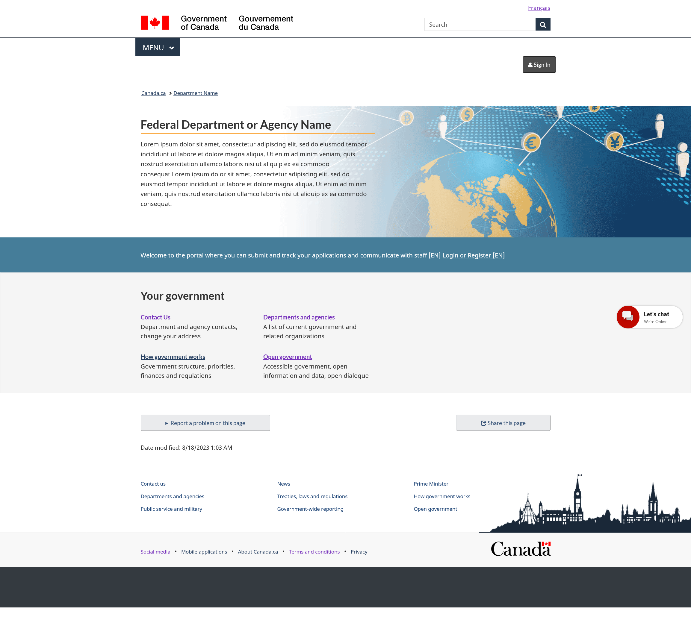

Figure 1: Home Page

Figure 2: Azure B2C SSO Login Pages

Figure 3: Terms and Conditions (PB) Consent Page

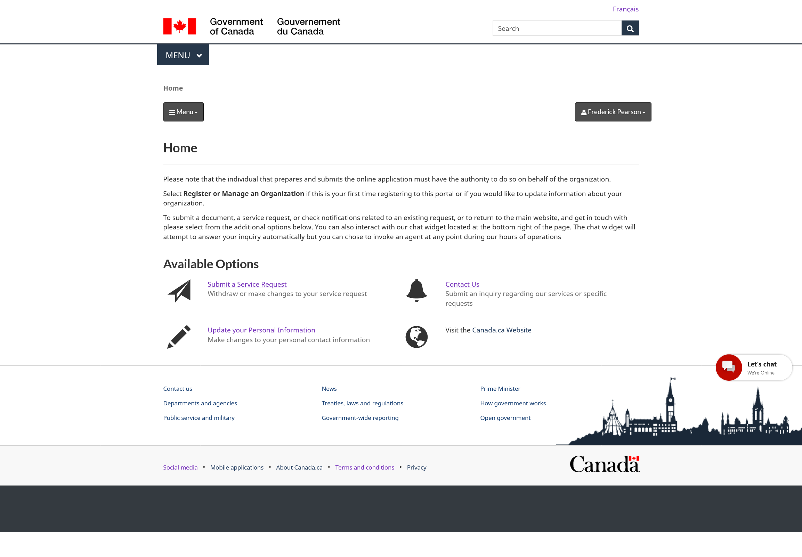

Figure 4: Authenticated User Landing Page

The Power Pages Site setting to force the PBMM consent on login is illustrated in the table below.

## System Architecture

This section provides a high-level diagram of the system architecture and the components involved in the CRM case management system, which include Dynamics 365 Customer Professional App, Power Pages Site, SharePoint Online, Exchange Online, and Azure B2C. The section provides a detailed description of each component, including its architecture and data model, customizations and extensions, and integration with other components. Additionally, it discusses how the components integrate with each other, including data flow and synchronization, security and authentication requirements, and integration patterns and best practice. The system is implemented in the {ORGANIZATION} Power Platform subscription which is a SAAS residing in the organizations M365 subscription. The Power Platform has been configured with guardrails to adhere to IT standards which would allow the ability for {ORGANIZATION} to store and interact with Protected B data. These guardrails protect and govern this implementation and are further described in the Power Platform guardrails chapter of this chapter. However, the full platform guardrail implementation documentation is separate from this document. However, the reader should take into account that this implement operates within the confines of these guardrails. Similarly, this system operates the confines of the Azure B2C PB guardrails and the Azure and M365 baseline guardrails mandated to Federal Government Department and Agencies implementing PB workloads outside the GOC owned network devices hosted in Government owned and or operating datacenters. In this implementation our solution is comprised exclusively of Microsoft owned network assets and SAAS and PAAS offerings which is a deliberate decision to further secure this application by relying on a trusted partner whose datacenters meet and exceed the GOC standards for physical and network security and has been fully assessed by our intelligence agencies and internal IT experts. These physical and network assets are subject to random audits by impartial parties to validate adherence to the GOC’s ISO based set of network and hosted network physical requirements such as multiple checkpoints, specific security clearances/screening of staff, and safely purging of stale physical network assets such as any device hosting data such as SDD/HDD/RAM etc. Another important factor for cloud security is the integration of {ORGANIZATION}’s Active Directory to Contacts (external portal users) Active Directory using AD Connect / ADFS / WAP to ensure that our internal user data is owned by our hardware thus our conditional access policies such as the requirement to access any of the elements in our implementation must be done by an operator who’s physically accessing our network using VPN and authorize to our on premise hosted Entrust Certificate Authority. This means that Microsoft has no ability to compromise access to our systems without the same requirement. Moreover, MS cannot access our Global Admin credentials and thus cannot restore this account which is the reason why we have multiple G.As and break glass accounts. Finally, the GOC has implemented the Express Route which is a physical link between our ISP’s to the Azure Datacenters, thus extending our existing data-centers to Azure giving us more control over who and what data can traverse through between both organizations. Finally, {ORGANIZATION} is also implementing CMK and an HSM to own the encryption keys. This will also apply to the Power Platform, however {ORGANIZATION}, as of 2023, does not mean the minimum requirements (1k licenses) to activate this feature. Once the feature is available to the organization, a migration will be required however will be vital to elevate the data confidentiality and integrity guardrails by guaranteeing that even if MS is compromised the nefarious actor (even with access to the MS CA infrastructure) will not be able to decrypt the data.

## High-level diagram of the system architecture

The target state architecture aligns with {ORGANIZATION}’s perimeter services which is comprised of using Azure Gateway as a proxy to both Azure B2C and the Power Pages Site.

Figure 5: Software Architecture Target State

The current state architecture is leveraging the Microsoft default SAAS security perimeter services which is abstracted from {ORGANIZATION} and fully under the control of Microsoft’s security team. The TBS cloud usage profile allow this for PBMM because SAAS infrastructure is not accessible by GOC employees thus is less vulnerable to security threats or failure to patch security vulnerabilities quicker than the teams at Microsoft administering the platform. {ORGANIZATION} however can control the perimeter services for both B2C and Power Pages Sites by using Azure Gateway or Azure Front Door and use this to also configure a custom domain for both services.

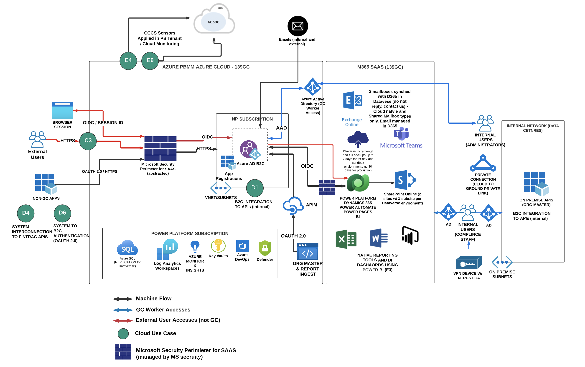

Figure 6: Software Architecture Current State

## Technical Architecture

### Dynamics 365 Customer Professional & Enterprise

This is a series of model driven applications that are installed in each Dataverse environment that include additional features that come with this license including case management, service level agreements, customer (client) insights, omnichannel for agent (messaging and voice), additional capacity per user (.75gb per licensed user), and additional Power Automate Flow throughput. The case (incident) is the pillar of the compliance application as every type of compliance form is managed via the case table. Each type of case (which is the case subject tree) has a dedicated custom table that holds the data that clients will submit via the Power Pages Site and is linked as a N:N relationship to the case. Compliance staff will create reporting cycles using the case management feature, and select a subject such as Risk Questionnaire, and select a selector or manually choose which reporting entity(ies) the cycle is scoped for. By doing so invitations to complete the form are sent to each reporting entity associated with the cycle (the primary contact of the RE) and the SLA is activated. The SLA feature is an OOB feature available through the CS module and provides the ability for system administrators and customizations to configure date driven rules to communicate to both internal and external stakeholders’ deadlines for various actions such as submitting a compliance form, reviewing a submitting, deciding on a form’s process to transition to a new state (such as complete) and actioning incident (tickets for support). The feature provides visual cues such as green, yellow, and green dots next to records in the Model Driven App views and in portal lists shown to external users for transparency. The feature is also useful to create automated events such as sending email reminders and report on adherence to service standards providing {ORGANIZATION} with aggregate metrics to examine its own SLA standards vis a vis its internal capabilities. This feature implementation for the compliance management system will be illustrated in this document.

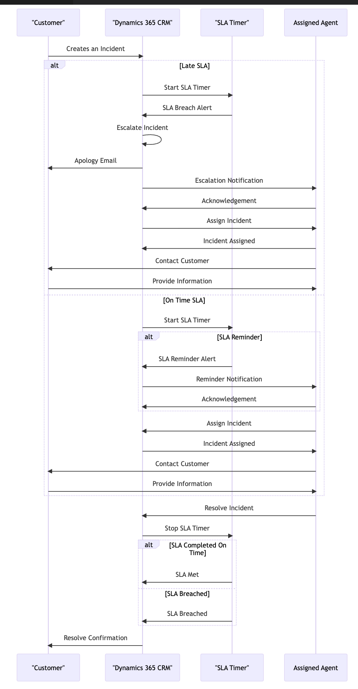

Figure 7: SLA's

### Power Pages Site

The Power Pages Site technology is internet facing and is on the powerappsportals.com domain by default. The security perimeter is maintained by Microsoft just like all other SAAS services and non productionized sites (e.g. dev, test, uat) are internal to {ORGANIZATION} employees only and not accessible by external users who do not belong or exist in the 139gc domain. Therefore, just like teams, and other M365 SAAS products, users who are developing and or testing the portal must be on a {ORGANIZATION} device and authorized to Active directory and entrust CA to access the portal. For the production portal, the settings of privatization are turned off and the site is made “public” and which point the anonymous page (home page) of the portal is accessible via the internet however nobody who has not been invited to use the portal and is within the Azure B2C domain can access the authenticated user pages.

This app type is provisioned within the same Dataverse environment as the D365 CS app and it’s a public facing website that is configured for invitation only. Meaning, open registration by external users to the portal is prohibited. An RE must first exist in the Azure B2C tenant, and then be sent an invitation from the D365 CS application that includes a link with embedded invitation code to redeem. Once in the portal the RE primary contact and start filling in the form and assign the form (optionally) to an authorized agent, which are contacts in the CRM that are associated to the Primary Contact’s organization (the financial institution). However, only the Primary contact has permission to submit the form to {ORGANIZATION} for review. Once submitted, the user is notified that the form is no longer editable and that a {ORGANIZATION} officer will be reviewing the submission. If the officer determines that the form is incomplete or requires clarification or more information, they have the ability to change the state of the Compliance case to “Draft” and send a “notification” activity to the primary contact, which is done via a Power Automate Flow, at which point the Primary Contact receives a generic email instructing them to log into the portal and review the notification activity where more instructions are provided by the {ORGANIZATION} employee and a direct link to the form which is now editable again for submission. This process can repeat itself until the {ORGANIZATION} employee deems the form complete and transitions the state of the compliance case from under review for ready for approval.

### SharePoint Online

This technology is the official IM repository for the entire system. Each Dataverse environment from dev through prod is linked to a SharePoint subsite that lives within a site. {ORGANIZATION} has provisioned 2 SharePoint Sites, 1 for non-production and 1 for production each hosting x number of “subsites” that point to 1 environment. For example, dev is integrated with the dev subsite in the ftnc-compliance-np site, and pre-prod and prod both have their own subsite hosted within the production SharePoint compliance site. The environment lists all the subsites associated with each environment. This setting is managed the advanced settings or admin console for Power Platform (**admin.powerplatform.onmicrosoft.com**) where a site (subsite) is synched with a Dataverse environment and each table that is configured to accept attachments will automatically create a folder within the subsite whereby each record such as a case will have its own folder holding all associated attachments. This is configured by the D365 System Administrator role.

Because this app supports Power Pages Site attachments to SharePoint, the G.A must provide consent to allow the integration of the site to the integrated SharePoint subsite to the Site’s integrated SharePoint subsite environment.

The table below lists every table that attachments are allowed:

| Table Name              |
|-------------------------|
| Incident (case)         |
| Risk Questionnaire      |
| Account (Organizations) |
| Contact                 |
| User                    |
| Notification            |
| ..                      |
| ..                      |

Table 2: Tables integrated with SharePoint.

### SharePoint Sites with X Number of Subsites Each Mapped to Non-Production Environments (e.g., Dev, Test, Staging, UAT, Sandbox) and another site that hosts the production environment

In this implementation, there are 2 SharePoint sites created – one for non-production environment integration and 1 dedicated for production environments. The table below lists each site, subsite and environment URL mapping.

| Subsite Name/URL | Type | CRM environment |
|------------------|------|-----------------|
|                  |      |                 |
|                  |      |                 |
|                  |      |                 |
|                  |      |                 |
|                  |      |                 |
|                  |      |                 |
|                  |      |                 |

Table 3: SharePoint Subsite & CRM Environment Mapping

The illustration below depicts the folder structure in SharePoint for each environment’s subsite.

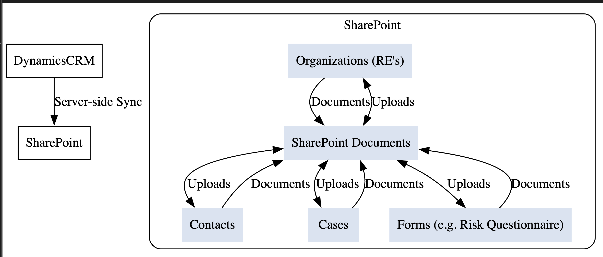

Figure 8: SharePoint - Native Integration

The integration between SharePoint Online and CRM is a native configuration as both systems live within the same platform, M365. However, to configure the SharePoint integration between Power Pages Sites and SharePoint requires a Global Administrator to activate this setting and provide consent. This action will generate an API permission in the existing App Registration record that is leveraged to integrate the Portal with CRM. The illustration below depicts the new API permission created by this process.

Figure 9: Power Pages Site Admin Portal - SharePoint Integration Activation Feature

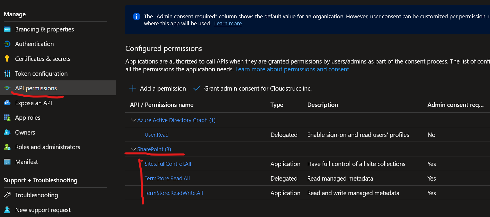

Figure 10: SharePoint API Permissions Automatically Added by Activating the Portal SharePoint Integration Feature

Activating the SharePoint Online integration between the Portal and CRM requires additional setting such as Table Permissions and basic form metadata to expose the SharePoint subgrid allowing external users to be able to upload documents. These settings are provided in the table below.

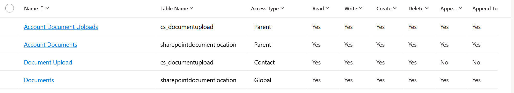

Table 4: SharePoint Table Permission Settings (review)

### Exchange Online

The compliance case management system leverages the D365 email integration feature with Exchange online by integrating 2 cloud native Shared Mailboxes with the platform. This is configured using the email server-side sync which automatically integrates with the 139gc exchange online environment and must be turned on by an exchange administrator or G.A. **However, for non-production, the system wide settings to allow D365 system administrators to synchronize mailboxes without intervention of the former privileged roles are turned off. Once server-sync is activated, the mailboxes are synchronized for each environment. Below is the list of emails synchronized by environment.**

To activate this feature, a system administrator must go to the email settings or system wide settings and configure email “server-side sync” and choose Server-Side Sync Exchange for both inbound and outbound mail. Appointments and tasks can also be synched from outlook. However, this implementation is designed to use CRM exclusively to administer email and not synchronize staff mailbox, which in this case integration using the outlook plugin would be useful.

Each mailbox is first configured in exchange as a “Shared Mailbox” Type with delegation privileges to the Power Platform-administrator group who are responsible to synchronize them to each environment. These mailboxes are of type “Cloud” thus there is no requirement for this phase to synchronize on premise exchange mailboxes (e.g., Hybrid Exchange). Finally, its important to state that a mailbox can by synched to one environment a time therefore we’ve created an outbound only and in and outbound mailbox for each environment for development and testing.

| Mailbox | Environment |
|---------|-------------|
|         |             |
|         |             |
|         |             |
|         |             |
|         |             |
|         |             |
|         |             |

Table 5: Exchange Shared Mailboxes Synched in each D365 environment.

The illustration below depicts the exchange email server-side sync architecture – note for this implementation, the synchronization only has been configured for the CRM organization – the outlook app is not being leveraged nor required as all email is administered in the model driven app.

Figure 11: Email -server-side sync

The use case for emails is listed below. These are subject to change. Secondly, this system will never, or is prohibited to send Protected B content in the emails being sent. Thus, this implementation includes a “Notification Centre” module which integrates with email, whereby an email to the person notified who is responsible to log into the portal and navigate to the notification center to view the details of the notifications. The table below demonstrates the data model for the notification center. The feature enables administrators to configure custom templates using a rich text editor and use workflows and flows to send notifications using both the do not reply email queue mailbox OR the help center email queue. When a user receives a notification, an unread badge (visual cue) is displayed, and the user can choose when to mark the notification as “read” by pressing the “Mark as Read” notification which updates the status reason of the notification item record.

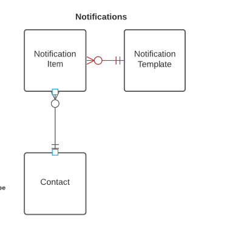

Figure 12: Notification feature ERD

Figure 13: Example unread notification

Internal users can manually issue notifications in the model driven app. The process is illustrated below. Most notifications however are automated via processes and or Power Automate Flows.

### Azure B2C

Azure AD B2C (Business to Customer) is a cloud-based identity and access management solution provided by Microsoft. It enables businesses to manage customer identities and authentication in a secure, scalable, and cost-effective manner. With Azure B2C, businesses can offer their customers a seamless, personalized experience across multiple applications and platforms. Azure B2C provides features such as social identity integration, multi-factor authentication, self-service password reset, and more. It also supports industry-standard protocols such as OAuth 2.0 and OpenID Connect.

Power Pages Sites can be integrating natively with Azure B2C using app registrations. App registrations are created for each site to integrate with Azure B2C using the OIDC setting out of the box and therefore each environment is provided a client ID, Secret, and the user flow metadata (OIDC metadata) from B2C NP, and for production the B2C production tenant. B2C is an active directory tenant separate to 139gc but linked to a pay as you go subscription, the non-prod and prod subscriptions at {ORGANIZATION}. The table below lists all the client IDs by environment. The Client IDs are unique identifiers to App Registration are records generated by administrators of B2C or application developers in the B2C AD domain.

| Client ID (Registration) | Environment |
|--------------------------|-------------|
|                          |             |
|                          |             |
|                          |             |
|                          |             |

Table 6: App Registrations for Power Pages Portal SSO

The detailed integration details are further described in the implementation details and baseline configuration sections of this document.

The sequence diagram below demonstrates the user journey for authorization to B2C from Power Pages

Figure 14: B2C Journey

For this to work, Power Pages site settings must be configured with a “Client ID, Secret, Tenant ID, the User Flow, and mapped claims (email, first name and last name)” from B2C so that the portal can generate a “bearer token at runtime which is a hashed value (RSA 2056) of a JSON Web Token (JWT) containing these “claims” and the session ID and its lifespan (19 minutes as per LOA 2/PB requirements). The diagram below depicts this process.

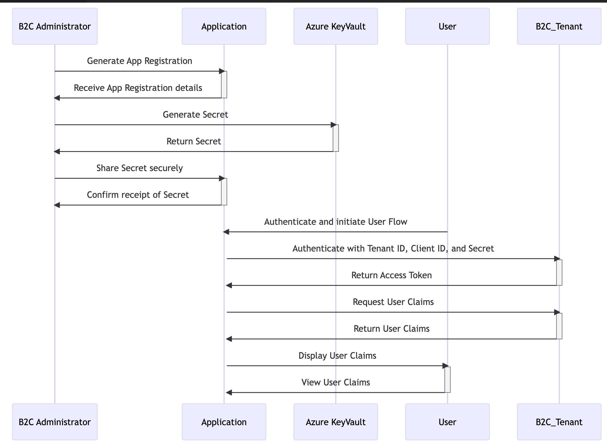

Figure 15: B2C Technical System to System OIDC Journey

In this diagram, the Application uses the Client ID and Secret to authenticate with the B2C Tenant and obtain an Access Token. The Access Token is then used to request User Claims and make API calls. If the Access Token has expired, the Application uses the Refresh Token to request a new Access Token and then uses it to request User Claims and make API calls. The hashed JWT includes:

- Username
- App ID
- SID (session ID)

### Azure API Management (APIM)

APIM is leveraged as the API management system, or the org master and report ingest endpoints (REST). API requests are executed to the APIM perimeter by using a client ID and secret generated by an App Registration in B2C which in turn issues a bearer token for subsequent calls to the endpoints to return payloads such as the RE intuitional data, primarily the basic organization information and the various contacts associated to these institutions from the primary contact to authorized agents that will be interacting with the portal. **(RICK + TEAM INPUT REQUIRED)**

### Dynamics 365 Customer Service - Architecture and data model (OOB)

The table below lists all the tables that are used in this implementation and includes the CRUD operations including append and append to privileges by security role. The table lists all the column permission rules set by team in the system. This feature secures specific field(s) within a table that provides a more granular level of data governance. For example, only a manager can set a specific value in a column (field) in the case table.

The table lists all the relationships and their cascading rules in the system. This is important for data governance as retention and disposition rules that will govern the purging of the records will rely on the cascading rules when using the bulk delete feature whereas cascading rules that configured as “referential” will be purged using Power Automate flow as when a relationship is set to referential, the parent record that’s being deleted will not purge its child records that are referential, instead it will simply remove its reference to it or clear the lookup field value. In certain scenarios this may make sense however the cascading set to parental is key so that for example if an organization is purged, all its child contacts, cases, and related records are also purged automatically without having to configure additional flows or workflows to destroy these records. However, the account table has multiple relationship types to the contact record to track the various types of contacts in 1:N and the system only allows for 1 parental relationship type by table thus both bulk delete and Power Automate flows will be responsible to purge data.

| Table Name | Key(s) | Relationship Name | Assign | Delete | Share | Re-Parent | Delete | Merge |
|------------|--------|-------------------|--------|--------|-------|-----------|--------|-------|
|            |        |                   |        |        |       |           |        |       |
|            |        |                   |        |        |       |           |        |       |
|            |        |                   |        |        |       |           |        |       |
|            |        |                   |        |        |       |           |        |       |
|            |        |                   |        |        |       |           |        |       |
|            |        |                   |        |        |       |           |        |       |
|            |        |                   |        |        |       |           |        |       |

Table 7: D365 Table / Shema Relationship Types/Cascade Configurations

| Table Name | Create | Read | Update | Delete | Append | Append To | Team | Team’s associated security role(s) |
|------------|--------|------|--------|--------|--------|-----------|------|------------------------------------|
|            |        |      |        |        |        |           |      |                                    |
|            |        |      |        |        |        |           |      |                                    |
|            |        |      |        |        |        |           |      |                                    |
|            |        |      |        |        |        |           |      |                                    |
|            |        |      |        |        |        |           |      |                                    |
|            |        |      |        |        |        |           |      |                                    |

Table 8: Table CRUD and Append/Append to/Assign privileges by security roles/team

### Case Management & Subject Convention

A key convention in the design of this application is that every center around the case table. This means that each time {ORGANIZATION} generates a campaign, an out of the box campaign record is created of type “Reporting Cycle”. This case record has 1 or more associated case records of a particular type (or Subject) such as “Call for Proposals”. The Subject field is an OOB field that allows a system administrator/configurator to configure Case types using a tree like structure. The complete Subject tree is provided below (subject to changes over time, thus this version is based on the 2023 available compliance form types.

## Customizations and extensions

Dynamics 365 Customer Service module offers a wide range of customization and configuration features that can be tailored to fit the specific needs of a case management system for financial institutions. With Dynamics 365, users can easily customize the look and feel of the system, including the layout, branding, and navigation. The module also allows for the creation of custom fields and forms, enabling users to capture and track relevant data specific to financial regulations. Additionally, Dynamics 365 provides automated workflows and business process flows that can be customized to streamline case management processes and increase efficiency. These features, combined with a comprehensive reporting and analytics dashboard, enable financial institutions to effectively manage cases and ensure compliance with regulations.

Power Pages Sites is another powerful tool that can be utilized to enhance the case management system. Power Pages Sites provides a customizable web portal that allows external users, such as financial institutions, to submit and track the progress of adherence to financial regulations. The portal can be configured to include specific forms and fields for data capture, as well as custom branding to ensure consistency with the financial institution's branding guidelines. Additionally, Power Pages Sites allows for the integration of various third-party applications, such as document management systems or payment gateways, to streamline processes and improve the user experience. With its robust customization and configuration capabilities, Power Pages Sites can provide financial institutions with a powerful tool to effectively manage adherence to financial regulations.

This section delves into the details of the various customizations and extensions leveraged for features developed for this implementation.

### Dynamics 365 workflows

Dynamics 365 workflows are automated processes that streamline business processes and enable users to define and automate business logic. Workflows can be used to automate tasks, such as sending email notifications or creating tasks, based on specific conditions or events in the system. They can also be used to enforce business rules and help ensure data consistency. Workflows can be created and customized by users with appropriate permissions using the Workflow Designer in Dynamics 365.\\

| Name | Description | Async/Sync | Solution |
|------|-------------|------------|----------|
|      |             |            |          |
|      |             |            |          |
|      |             |            |          |

Table 9:Workflows

### Dynamics 365 actions

Dynamics 365 actions are custom methods that can be created and exposed through the system's web API. Actions can be used to encapsulate business logic and provide a simplified interface for external systems to interact with the Dynamics 365 system. Actions can be synchronous or asynchronous and can return data or perform operations on the system. They can be created and customized by developers using the Dynamics 365 SDK.

| Name | Description | Async/Sync | Solution |
|------|-------------|------------|----------|
|      |             |            |          |
|      |             |            |          |
|      |             |            |          |

Table 10: Actions

### Dynamics 365 plugins & Custom Workflow Steps

#### Plugins

Dynamics 365 plugins are custom code that can be executed in response to system events, such as creating or updating records. Plugins can be used to extend the system's functionality, automate business processes, or integrate with external systems. Plugins are written in .NET and can be registered to execute in a synchronous or asynchronous manner. They can be created and customized by developers using the Dynamics 365 SDK. Plugins are “signed” binaries generated by .NET and must be registered to CRM using the Power Platform CLI and DevOps Pipelines (sourced in GIT). The table below lists all custom plugins, their purpose and direct link to repository. Finally, plugins run within a sandbox which secures the platform from unwanted customizations from third party libraries or misconfigurations and unwanted code by forcing the use of a specific first party libraries, signed binaries using developers private key and published via Pipelines. Plugin assemblies are comprised of one of more classes that can be configured as “plugin steps” whose purpose is to run on any CRUD operation and the developer can specify which fields are allowed to be read and interacted with in code and best practice dictates to only use the tables and fields required to make a working configuration. Furthermore, developers are instructed to adhere to professional and verbose logging using the plugin trace logs and this is inspected during code reviews and test automation will calculate the % of plugin trace logs vs lines of codes and the benchmark is 20%.

#### Custom workflow steps

These are almost the same as plugins however provide more flexibility to non-developers who prefer to leverage workflows (processes) to call custom steps that are not available. For this implementation, custom workflow step libraries have been imported to help with mundane and repetitive needed features such as querying 1:N relationships for process logic and more robust email automation. No custom step library has been developed in house (yet).

| Assembly Name | Purpose | Type                              | Repository Location | Owner                                           |
|---------------|---------|-----------------------------------|---------------------|-------------------------------------------------|
|               |         | e.g. Plugin, Custom Workflow Step |                     | {ORGANIZATION}, Third Party (provide full name of lib) |
|               |         |                                   |                     |                                                 |
|               |         |                                   |                     |                                                 |
|               |         |                                   |                     |                                                 |
|               |         |                                   |                     |                                                 |
|               |         |                                   |                     |                                                 |

Table 11: Plugins

#### Power Automate (flows)

Power Automate flows (formerly known as Microsoft Flow) are cloud-based workflows that can automate business processes and integrate with other systems and services. Flows can be triggered by events in the system, such as creating or updating records, or by external services, such as receiving an email or a tweet. Flows can be used to perform a wide variety of actions, including sending notifications, creating records in other systems, and generating reports. Flows can be created and customized by users with appropriate permissions using the Power Automate Designer.

The table below outlines and describes each Flow developed for this implementation.

| Flow Name | Purpose | Trigger | Primary Table |
|-----------|---------|---------|---------------|
|           |         |         |               |
|           |         |         |               |
|           |         |         |               |
|           |         |         |               |
|           |         |         |               |

Table 12: Power Automate Flows

## Azure B2C & Integration to the Organization Master & Report Ingest APIs

B2C has been described in length in previous sections, but to elaborate at our D365 application layer and its “indirect” relationship to the portal, B2C is not only leverage for SSO into the portal but also the OAUTH 2.0 authorization provider of bearer tokens for the backend D365 Power Automate Flows. An app registration with API permissions to both the org master and report ingest APIs are dedicated to each environment (1 per environment) calling the UT1 up to ET1 and eventually prod APIM endpoints. The table below maps the Dataverse environments to each APIM REST service and their respective App Registration whose secret must rotate every 24 months for NP and 6 months for prod (optional – c/b up to the maximum of 24 months).

| Dataverse Environment | API Instance / base endpoint w/o query params or payload | App Registration’s CLIENT ID for OAUTH 2.0 token | Service for which the flow context executes (API Permissions) |
|-----------------------|----------------------------------------------------------|--------------------------------------------------|---------------------------------------------------------------|
| Dev                   | UT1                                                      |                                                  |                                                               |
| Staging               | UT1                                                      |                                                  |                                                               |
| Test                  | UT1                                                      |                                                  |                                                               |
| UAT                   | UT1 (Tbd)                                                |                                                  |                                                               |
| Sandbox               | UT1 (Tbd)                                                |                                                  |                                                               |
| Training              | UT1 (Tbd)                                                |                                                  |                                                               |
| Preprod               | ET1                                                      |                                                  |                                                               |
| Prod                  | TBD                                                      |                                                  |                                                               |

Table 13: App Registrations for Power Automate Flow REST API Calls

Power Automate performs the HTTPS request to B2C to obtain a B2C bearer token to perform the API nightly. System administrators can invoke the refresh of the API calls directly in flow but running it manually as well and a full log of all calls is available directly in the flow interface. Failures will provide a verbose stack trace of the issue. It is important to note that the flow must be associated to the Power Platform Automation service account which is a licensed user as Flows won’t support App Registrations to perform API calls. This account’s credentials are secured in our KeyVaults instance.

### Handling downtime

In the event the API(s) are not accessible for which ever reason, our CRM implementation supports data imports using excel and the SDK thus this section describes what developers (or persona responsible to monitory/sync the data is required to do in this scenario.

## Business Rules

Dynamics 365 Business Rules are a feature that enables users to define and enforce custom logic within the system without requiring any code. Business Rules can be used to enforce data validation, automate field calculations, and control the visibility and behavior of form elements based on specific conditions. Business Rules can be configured at both the entity and form level, allowing users to create rules that apply to specific entities or forms within the system.

Business Rules are executed in the context of the current user invoking some functionality in Dynamics 365 that triggers one or more of these rules. When a user performs an action, such as creating or updating a record, the system evaluates the associated Business Rules and executes any actions that are defined in those rules. The sequence of execution for Business Rules is determined by the order in which they are defined within the system.

Business Rules can be used in conjunction with other Dynamics 365 features, such as workflows, Power Automate flows, and web API calls. Workflows and flows can be configured to trigger based on specific conditions or events and can include actions that invoke Business Rules as part of their execution. Web API calls can also be used to execute Business Rules programmatically.

Overall, Dynamics 365 Business Rules provide a flexible and powerful way for users to enforce custom business logic within the system, without requiring any code or development expertise. By combining Business Rules with other Dynamics 365 features, users can create complex, automated processes that help streamline their business operations and improve efficiency.

The table below lists all the business rules and what level they’ve configured at. It is important to note that form level business rules execute at run time on the client, whereas entity level configured business rules run on the server thus are more reliable as when using API calls, workflows and other automation we want to ensure that business rules are ran. Form level business rules are useful for immediate feedback when populating forms, however entity level will do the same. The only valid scenario that form level business rules are relevant if there is a client-side rule that needs to be implemented and doesn’t need to be interpreted or governed service / targets a specific form.

| Table | Business Rule | Level |
|-------|---------------|-------|
|       |               |       |
|       |               |       |
|       |               |       |
|       |               |       |
|       |               |       |
|       |               |       |
|       |               |       |
|       |               |       |

Table 15: Business rules by Table

## Azure AAD Groups / Teams & environment integrations

In the summer of 2022, the wave 2 general available release of the D365 update included support for full integration of AAD groups to D365 Teams and unlike its previous implementation now supports full CRUD. This means that {ORGANIZATION} can administer RBAC directly in AD which is best practice for access control across the organization. The way its designed in system is that we have an AAD group (M365 type) for each team in CRM and that team is mapped to 1 or more security roles. This means that when a user is onboarded to {ORGANIZATION} to requires access to the compliance case management system, the typical request to IT to have the user added as a member to an AAD Group(s) will automatically replicate to CRM thus giving the user automatic access based on their persona governed by the CRM team’s associated security role. Therefore, no one will have privileged access and user administration privileges in the CRM reducing risk of human error and potential security threats by providing a user with a security role that they should not be allowed to be associated it. Furthermore, the security posture is further optimized by automatically revoking access to CRM if the user leaves {ORGANIZATION} and is removed from AD or the AAD group. If a user is promoted into a new role, they would be added to the AAD group associated with the higher-level CRM team and thus inherit the additional security parameters associated with the role tied to the team. The overall strategy is to leverage 1 RBAC at the organization level rather than app level in terms of access. The table below lists the AAD Groups assigned to its respective CRM team and the security role(s) associated to the team. In certain edge cases, a system administrator may need to troubleshoot an issue in production thus an AAD group for system administrator has been created and mapped to each environment (minus dev which this doesn’t apply) to troubleshoot issues. However since this is a privileged role in the CRM, it is recommended that the group is configured in Azures privileged identity management system (PIM) so that we can control the time and force the user to provide a quick justification for why they need to obtain sys admin in an environment that is not development (e.g. sometimes post deployments, we need to manually activate a workflow, or a model driven app change, this is a rare occurrence and due to a faulty deployment but still needs to be done especially in production to avoid bugs).

| AAD M365 Group Team/GUID | CRM Team | Security Role(s) / Field Level Permission Profile(s)  |
|--------------------------|----------|-------------------------------------------------------|
|                          |          |                                                       |
|                          |          |                                                       |
|                          |          |                                                       |
|                          |          |                                                       |
|                          |          |                                                       |

Table 16: AAD Group Mapping to CRM Team

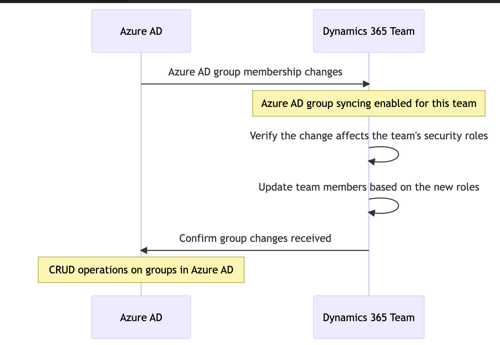

Figure 17: Azure AD Group/RBAC integration with CRM

### Environment groups

AAD groups are also applied at the environment level. This means that each environment user provisioning is restricted to users who are members of these groups. This also doesn’t mean that they automatically get access, this is done via team AAD group integration however, this is best practice to ensure that the entire directory is not available for security role assignment without using the Organization.

The table below lists the security groups associated with each CRM organization. Also included is the security group that has the licensing tied to it – which means each user who requires case management and or customer service licensing (same licensing) will inherit these. Once in that group, they must be added to the environment group and the group(s) for RBAC in the environment(s) they access.

| Team Name | Type | Environment |
|-----------|------|-------------|
|           |      |             |
|           |      |             |
|           |      |             |
|           |      |             |
|           |      |             |
|           |      |             |
|           |      |             |

## Power Pages Site (customer self-service) System Configurations & Integrations

This section outlines the site settings configured for each portal. Site settings and settings are the key configurations and integration. It is important to note that all non-production portals are “private” and therefore available only to internal users and protected by Azure AD. The public site is available on the internet and has a Canada.ca DNS CNAME entry configured (described in this section).

| Setting Name | Value | Description |
|--------------|-------|-------------|
|              |       |             |
|              |       |             |
|              |       |             |
|              |       |             |
|              |       |             |
|              |       |             |
|              |       |             |

Table 17: Portal Settings

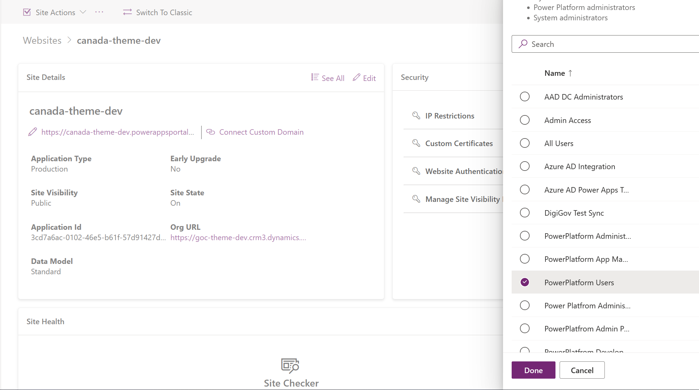

Figure 18: Privatization of Portal Site by Azure AD Group (applicable to non production sites)a

### Diagnostics (Azure Storage)

The Power Apps platform allows for the storage of diagnostic data in an Azure Storage account. This feature enables the collection and analysis of diagnostic data for Power Apps. This data can include app telemetry, usage data, and error logs. The storage account is also leveraged to host a static website of this implementation’s technical and business documentation using the Microsoft DocFX framework, which is the same technical documentation framework leveraged by Microsoft documentation and is part of the leading technical documentation frameworks that is also corporately backed (and open sourced) which aligns with TBS cloud usage guidelines.

To implement this feature, the following steps were taken (applies to all environments including production):

1. Creation of an Azure Storage account: An Azure Storage account was created using the Azure portal.
2. Acquisition of connection string: The connection string for the Azure Storage account was obtained. This connection string was in the format of "DefaultEndpointsProtocol=https;AccountName=\<your_storage_account_name\>;AccountKey=\<your_storage_account_key\>;EndpointSuffix=core.windows.net".
3. Configuration of diagnostic settings: Diagnostic settings were configured for the Power Apps environment by navigating to the Power Page Site, selecting the relevant environment, and choosing "Diagnostics" from the left-hand navigation menu.
4. Selection of Azure Storage as destination: In the diagnostic settings, Azure Storage was selected as the destination for the diagnostic data.
5. Provision of connection string: The connection string obtained in step 2 was provided.
6. Selection of data types: The types of data to be collected and stored in the Azure Storage account were selected.
7. Saving of settings: The diagnostic settings were saved.

Upon implementation, Power Apps began storing diagnostic data in the Azure Storage account. This data can be analyzed using Azure services such as Azure Monitor, Azure Log Analytics, and Azure Data Explorer. Overall, this integration provides a means to collect and analyze diagnostic data, thereby aiding in the identification and resolution of issues that may arise within the Power Apps environment. For example, if the portal has poor performance or integration between B2C or SharePoint is problematic, examining the diagnostic logs provides a more verbose exception trace. The logs are organized by date, and each date has a dedicated folder with x number of log files to analyze. Diagnostic logs are retained for 30 days and in this implementation, logs are used by developers only to help with troubleshooting, the storage accounts are not being monitored by a SIEM or sent to a log analytics workspace. **Finally, the storage account blob containers are set to private (no anonymous usage) and are restricted to VPN traffic and Active Directory user thus inherits the access policies of the organization.**

The table below lists each storage connection by environment.

| Storage Connection | Storage Account / Subscription | Environment |
|--------------------|--------------------------------|-------------|
|                    |                                |             |
|                    |                                |             |
|                    |                                |             |
|                    |                                |             |
|                    |                                |             |
|                    |                                |             |
|                    |                                |             |

## SharePoint Online

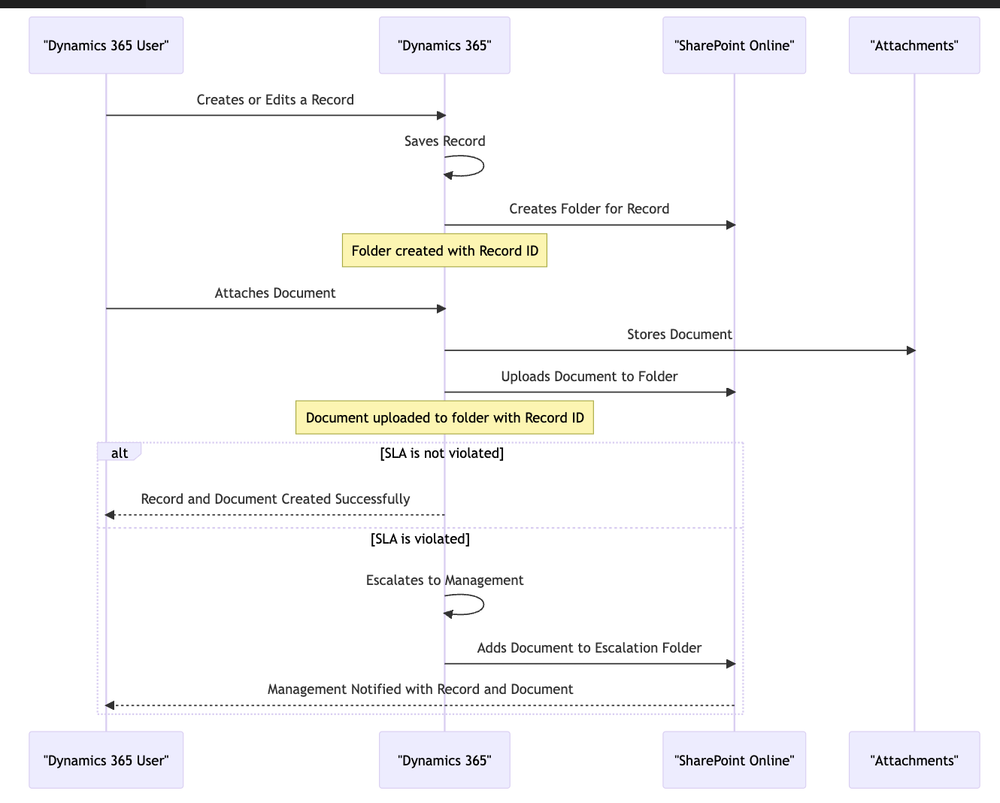

Figure 19: SharePoint document journey/Integration with CRM

## Exchange Online & notification center

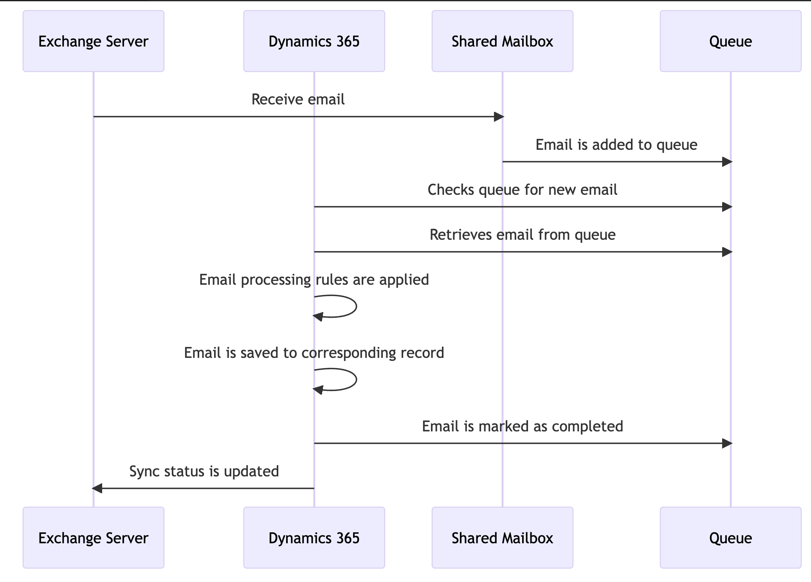

Figure 20: Emails & Notifications

### Architecture and integration with Dynamics 365

#### Server-side integration

The portal integrates with CRM tables using a combination of table permissions to allow developers to configure which tables are allowed to be exposed to the portal. These table permissions are described futher in this document. Once table permissions are configured, the developer uses “Liquid” which is the HTML templating language used to code web templates to expose data from the configured tables to the UI. When a portal is created in a Dataverse environment, the engine creates an “App Registration” record in Azure AD which acts as the primary service account for server-to-server communication between the portal and the integrated Dataverse environment.

The table below lists all the App Registration records for each portal generated for each downstream environment up to production.

| App Registration ID | Environment |
|---------------------|-------------|
|                     |             |
|                     |             |
|                     |             |
|                     |             |
|                     |             |
|                     |             |
|                     |             |

Table 18: App Registration for each Portal

#### Data flow and synchronization

Power Pages Sites are external-facing websites built on top of the Dataverse platform, which is a cloud-based data storage and management platform provided by Microsoft. These portals allow users to interact with the data stored in Dataverse without requiring them to have direct access to the underlying database.

The data flow between Power Pages Sites and the Dataverse backend follows a specific pattern. Here is a step-by-step breakdown of how the data flows to and from Power Pages Sites and the Dataverse backend:

- User Interaction: Users interact with the Power Page Site using a web browser or mobile app. They can access various types of data, such as customer records, invoices, or service tickets.
- Portal Website: The Power Page Site website is hosted on Microsoft's cloud infrastructure, and it acts as a front-end interface for users to interact with the data stored in the Dataverse backend.
- Authentication: Users are authenticated before they can access the portal. They can either authenticate using their Microsoft account or a custom authentication mechanism provided by the portal.
- Portal Pages: Users navigate through the portal's web pages to access and interact with the data they require. Each page consists of web components such as forms, lists, and charts.
- Data Requests: When a user requests data, the portal sends a request to the Dataverse backend. The request includes information about the data the user wants to access or modify.
- Dataverse: The Dataverse backend processes the data request and retrieves the relevant data from the database. The data is returned to the portal in a JSON format.
- Data Display: The portal displays the data returned by the Dataverse backend in the web components of the portal page.
- User Actions: Users can take actions on the displayed data, such as updating customer records or creating new service tickets. When the user performs an action, the portal sends a request to the Dataverse backend to update the database.
- Dataverse Updates: The Dataverse backend processes the user action request and updates the database with the new data.
- Confirmation: The portal confirms to the user that the action was completed successfully.
- Data Sync: In case of offline access, the Power Pages Sites support data synchronization, where changes made to the data in the portal are synced back to the Dataverse backend once the connection is re-established.

In summary, the data flow between Power Pages Sites and the Dataverse backend involves users interacting with the portal's web pages, and the portal making requests to the Dataverse backend to retrieve or update data. The Dataverse backend processes these requests and sends the requested data back to the portal for display. Users can take actions on the displayed data, and the portal sends requests to the Dataverse backend to update the database accordingly.

The illustration below describes the integration of the portal and the integrated CRM environment.

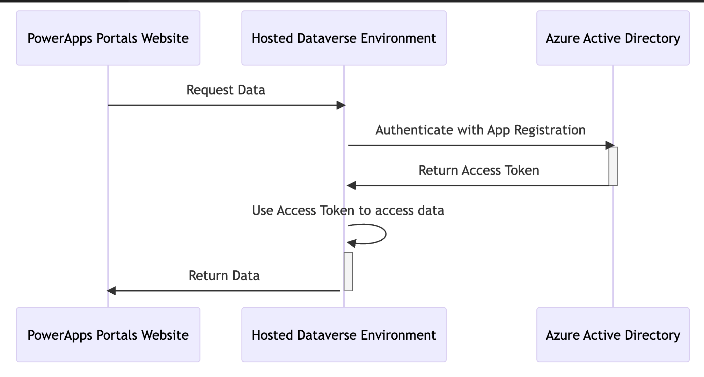

Figure 21: Portal’s integration with Dynamics (OOB)

#### Client-side integration

For more dynamic functionality, developers can use JavaScript to perform CRUD operations to Dataverse tables. However, a convention has been applied to our implementation that this will be leveraged for read operations only. To configure a table to be read using the web API (and JavaScript), beyond the table permissions, the following site settings must be configured for each table and fields the developer wants available for JavaScript.

In the diagram below, the "Dataverse Portal" is represented as node A, the WebAPI configured in site settings is represented as node B, and the Dataverse is represented as node C. The arrow indicates the flow of data between the Dataverse Portal and the WebAPI, which is used to read and write data to the Dataverse.

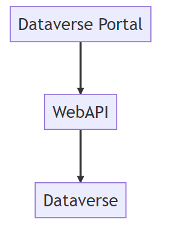

Figure 22: WebAPI Flow Diagram

For our initial implementation, this feature is being used for the Notification center. The table below demonstrates the site settings used for exposing the notification center to JavaScript.

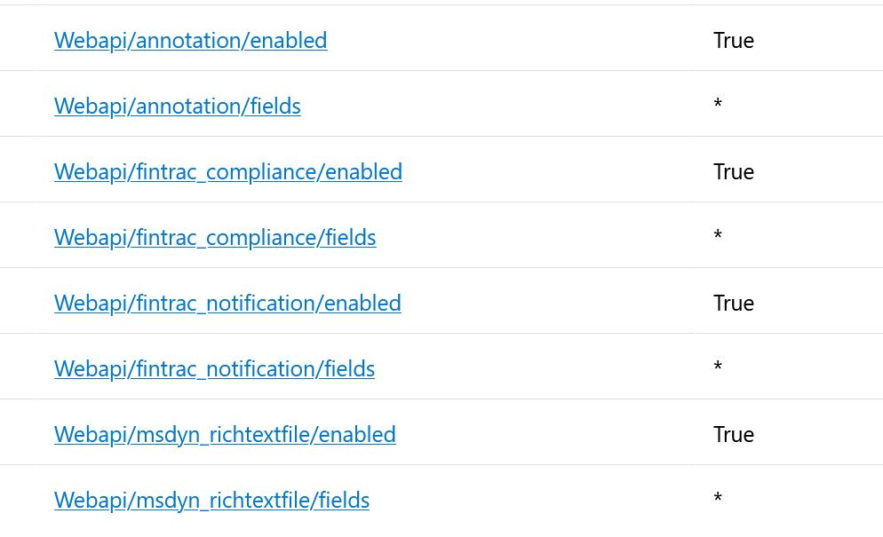

Table 19: WebAPI Settings for Notification Centre

*This feature is further described in the next section.*

### Portal notifications

Portal notifications are available to any user who receives notifications generated by the notification center that contains protected information rather than receiving the information via email. The email will notify the user to login to their account to view the notification.

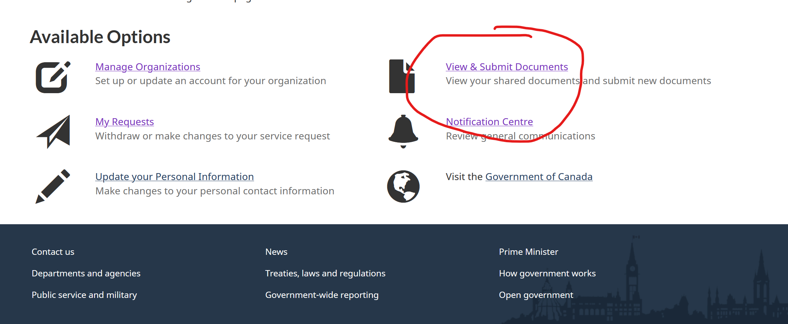

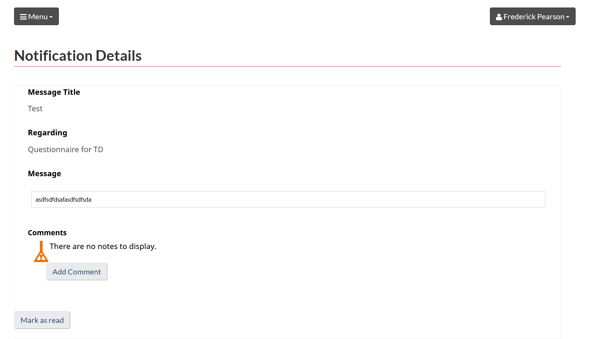

Figure 23: Notification Centre Feature Screen Captures

It is important to note that external users have the freedom to choose when they mark a notification item as read which will automatically update the status reason of the notification item.

Another key feature of the notification center is the ability for both internal and external users to communicate via a comment thread. The comment thread is captured also as an activity called “Portal Comment” and provides the flexibility for communicating through the notification center and avoid sharing protected information via email.

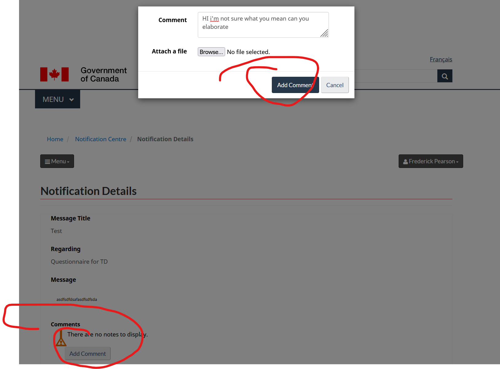

Figure 24: Portal - Notification Center Comments

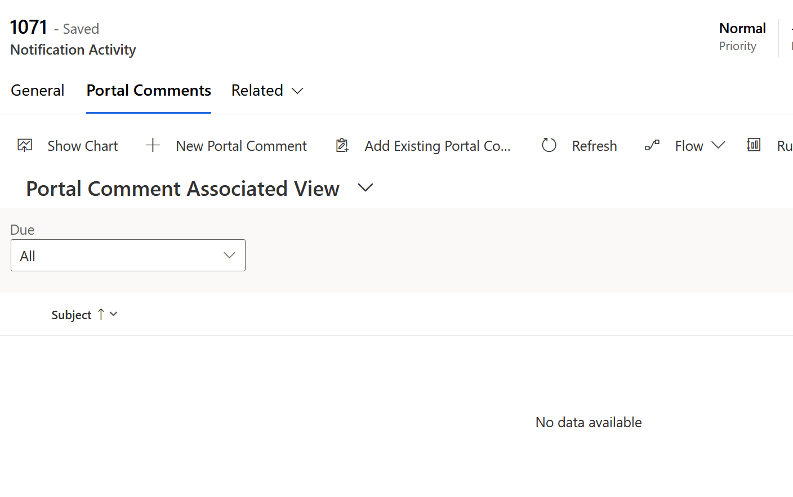

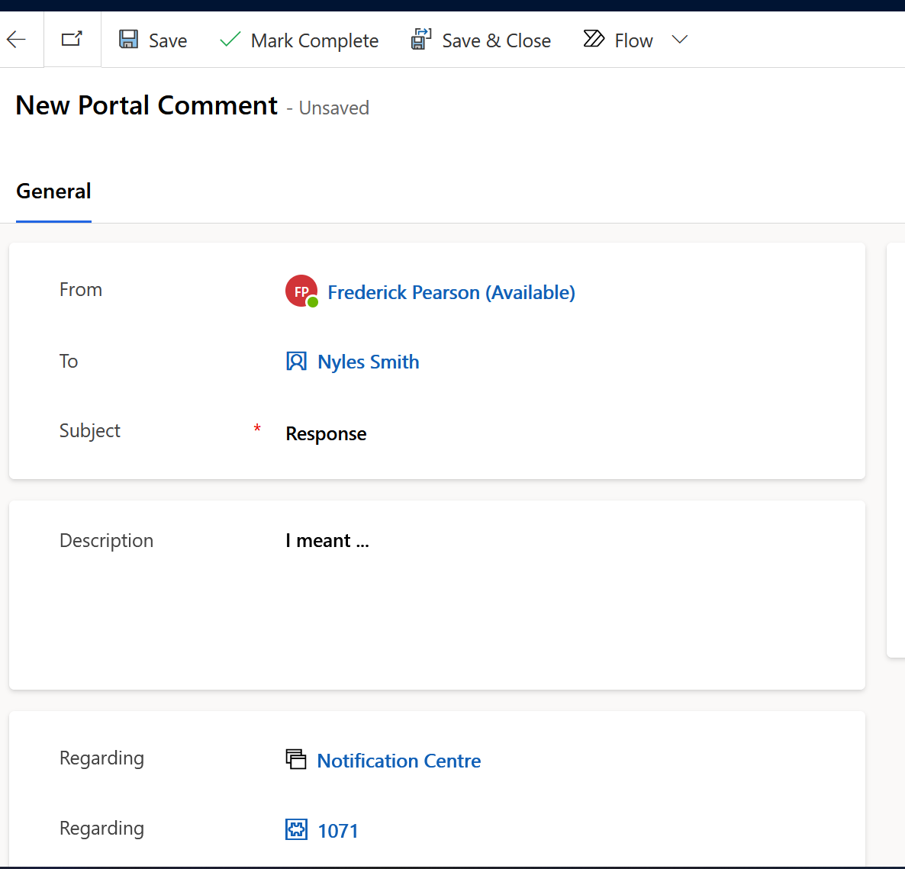

Figure 25: Internal Portal Comment Response

The data model behind the notification center is simple, it includes a templating system, a notification item and a direct link to a contact record which is the user of the portal.

Figure 26: Notifications ERD

Most portal notifications are sent using processes and or flows (listed in table below) thus are automated. However internal users can create manual notifications using the model driven app. The illustrations below demonstrate the process of creating notification items. Finally notifications are configured as “activity” entities thus are treated as activities in CRM such as emails and tasks and therefore are polymorphic and can be linked to any other activity record, in particular for this implementation, case files, contacts and organizations (Reporting Entities).

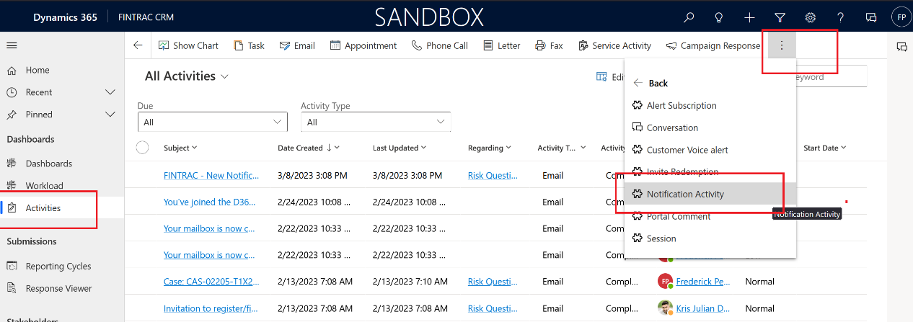

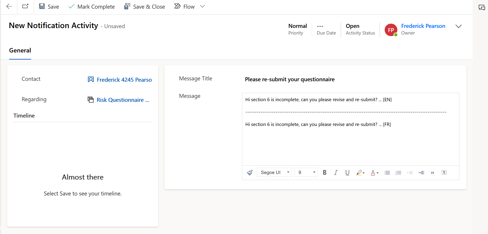

Figure 27: Creating a manual notification item from model driven app

Once saved, an email is sent to the recipient with a link to the portal notification centre advising them to sign in to view the notification details.

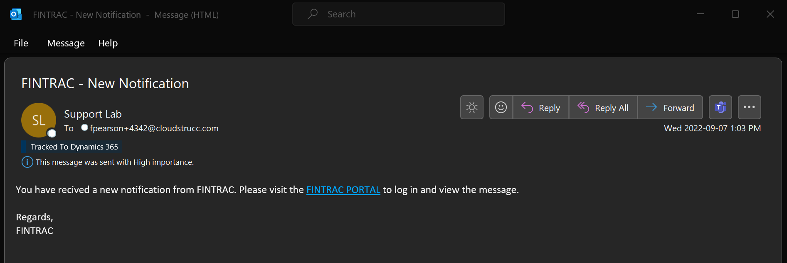

Figure 28: Example notification item email notification

## Data Architecture, CRM & Portal Design Conventions

The Data Architecture section covers the data model and schema design for the CRM case management system, including entities, fields, and relationships, naming conventions and standards, processes and automations for data management, workflows and business process flows, Power Automate Flows, and business rules and validation. Additionally, it discusses validation rules and custom scripts, the business rules engine, and custom actions.

### CRM & Portal Design Conventions

This section describes the design conventions applied to the portal implementation. By applying conventions developers have a simple reference source to minimize the interpretation of how to implement features.

### Naming conventions and standards for Portal Artifacts

The system is maximizing the usage of the D365 customer service & case management licensing feature which comes with features such as enterprise ISO standard case management features such as SLA timers, alerts, integrations with the organizations primary RBAC system (AD), client insights, email integration and robust monitoring and immutability for auditing of a case management lifecycle. In addition, the {ORGANIZATION} specific requirements not only has been adapted to fit within this feature set, but the build has a series of conventions that must be followed when designing the system when it comes to creating tables, fields, relationships from naming conventions and configurations.

The next sections describe these conventions and developers must follow these and the DevOps CI/CD will automatically test against any violations of these conventions to ensure that the system is healthy, maintainable and knowledge transfer is implied:

| Feature name                       | Description | Convention (naming) | Convention (configuration) |
|------------------------------------|-------------|---------------------|----------------------------|
| Auto-numbering (Case)              |             |                     |                            |
| Auto-numbering (Related Case Form) |             |                     |                            |
|                                    |             |                     |                            |
|                                    |             |                     |                            |
|                                    |             |                     |                            |
|                                    |             |                     |                            |
|                                    |             |                     |                            |

Table 20: Portal conventions

### Dataverse (CRM) Tables, columns, and relationships

The data architecture implementation has been standardized to leverage and customize the case management feature of the platform. This means that that the “Case (Incident)” table / feature set is the focal point for every type of compliance form process. Each compliance form type is captured as a Subject which is a case artifact that ships with the customer service module. Furthermore, each subject that is “external facing” such as the “Risk Questionnaire” is linked to a Portal Wizard Form which in turn leverages the out of the box Power Pages web link set / web links & basic forms with a custom framework built around it to meet the WET Canada.ca framework standards, accessibility requirements and overall usability and ease of configuration.

A compliance case of type “reporting cycle” is what governs the overall process of inviting reporting entities to submit compliance forms. A reporting cycle has several types including “financial institutions and sector specific” (full list in table below) which allows for dynamic assignment of organizations to a reporting cycle (1 or more) – for example, by choosing sector specific the reporting cycle is automatically populated with all active organizations in that sector, by choosing financial institutions, the case creator can select 1 or more Contacts (external portal users) regardless of sector.

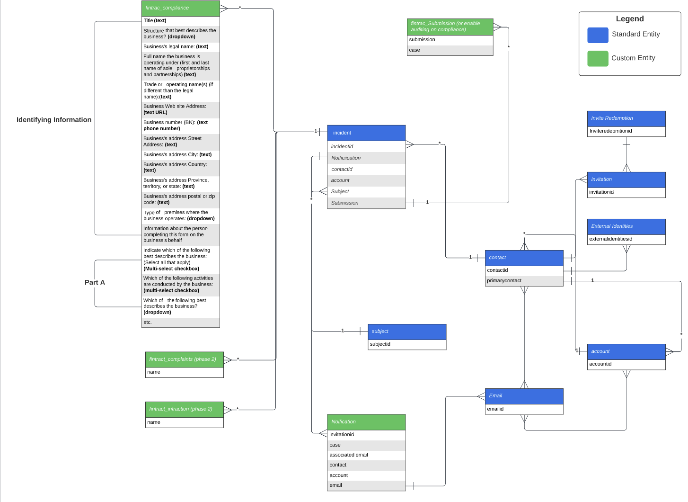

Figure 29: Logical ERD - Case Management Process. & Integration with Compliance forms (convention)

### Solutioning (patches) & Managed vs. Unmanaged

A primary solution entitled {ORGANIZATION} is created with all assets from table, fields, custom controls, forms, plugins, flows etc. Developers provision patches off this solution each sprint to perform their duties. They use the UI or CLI with VS Code to make changes to their patches and once tested Development they run the CI pipeline to issue a release to staging to validate a successful deployment of their feature. This pipeline will test best practices and other tests described further in this document. Solutions and patches are “unmanaged” in development and “managed” everywhere else. Managed means that configurators cannot make changes to the system without upgrading (re-deploying) a new version of a solution thus guarding against misalignment between configurations between environments. The diagram below depicts how an unmanaged patch or solution is exported as managed and moved downstream using our pipeline.

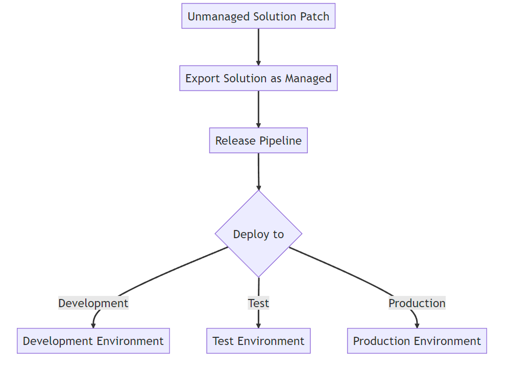

Figure 30: Unmanaged/Managed Solution Deployments

This flow chart represents the process of exporting an unmanaged Dynamics 365 solution patch as a managed solution, and then releasing it through a DevOps release pipeline.

The process starts with an unmanaged solution patch, which is then exported as a managed solution using the Dynamics 365 solution export tool. The managed solution is then added to a DevOps release pipeline, which includes several stages such as development, test, and production.

When the solution is deployed to each environment, it is tested to ensure that it works correctly and does not cause any issues. Once the solution has been successfully deployed to the development environment, it can be promoted to the test environment for further testing.

Finally, when the solution has been thoroughly tested and validated, it can be promoted to the production environment for release to end users. The entire process is managed through the DevOps release pipeline, which ensures that the solution is deployed consistently and reliably across all environments.

Best practice dictates that the solutions are deployed not only as managed but the setting to “upgrade” the solution is flagged in the pipeline to ensure that that any components that no longer exist is in the new version but present in the previous version are removed from the system. The pipeline also handles staging the upgrade which allows for the pipeline to deploy reference data or remove data prior to deletion of the previous version. The three types of deployment options for managed solutions are described below:

- **Upgrade** This is the default option and upgrades your solution to the latest version and rolls up all previous patches in one step. Any components associated to the previous solution version that are not in the newer solution version will be deleted. This option will ensure that your resulting configuration state is consistent with the importing solution including removal of components that are no longer part of the solution.
- **Stage for Upgrade** This option upgrades your solution to the higher version but defers the deletion of the previous version and any related patches until you apply a solution upgrade later. This option should only be selected if you want to have both the old and new solutions installed in the system concurrently so that you can do some data migration before you complete the solution upgrade. Applying the upgrade will delete the old solution and any components that are not included in the new solution.
- **Update** This option replaces your solution with this version. Components that are not in the newer solution won't be deleted and will remain in the system. Be aware that the source and destination environment may differ if components were deleted in the source environment. This option has the best performance by typically finishing in less time than the upgrade methods.

### Web Pages/Page Templates/Web Templates

#### Web pages

Web pages in Power Page Sites are the fundamental building blocks of the portal site. They define the content, layout, and functionality of the pages that are displayed to end-users. Each web page is associated with a specific entity or set of entities and can contain a variety of components such as forms, lists, charts, and web files.

#### Page templates

Page templates define the layout and structure of web pages in Power Page Sites. They provide a standardized framework that can be used to create consistent and reusable pages across the portal site. Each page template is associated with a specific entity or set of entities and can contain a variety of pre-configured components and placeholders that can be filled with content when the web page is created.

#### Web templates

Web templates in Power Page Sites define the overall layout and design of the portal site. They provide a high-level view of the portal, including the navigation menu, header, footer, and other site-wide elements. Web templates can be used to create a consistent and professional-looking portal site that is easy to navigate and use.

When a user requests a web page, the following steps are typically taken:

- The user's request is sent to the portal server, which checks to see if the user is authenticated and authorized to access the requested page.
- If the user is authorized, the portal server retrieves the appropriate web page and any associated page templates.
- The page template is applied to the web page, which provides the overall layout and structure for the page.
- Any placeholders or components in the page template are filled with the appropriate content, such as fields from the entity record or custom code.
- The completed web page is then rendered and sent back to the user's browser for display.

Overall, web pages, page templates, and web templates are critical components of Power Pages Site for this implementation as it enables developers to create and manage our wizard forms and other pages relevant to compliance, it’s basically the foundational of the framework.

The table below lists all the web pages, associated page and web templates in this implementation along with its naming conventions.

|   |   |   |
|---|---|---|
|   |   |   |
|   |   |   |
|   |   |   |
|   |   |   |
|   |   |   |
|   |   |   |
|   |   |   |

Table 21: Web Pages & Templates

### Content Snippets

The content snippet feature in Power Page Sites allows developers and content creators to create reusable blocks of content that can be easily added to web pages and templates. These content snippets can include text, images, links, and other types of content that are frequently used across multiple pages or sections of a site.

One important aspect of content snippets in Power Page Sites is that they can be made editable for static content. This means that content creators can modify the content of a content snippet without having to modify the underlying web page or template. This is especially useful for static content that is used across multiple pages, such as a company address or copyright notice.

From a translation perspective, the content snippet feature is extremely important. It allows content creators to create a single version of a piece of content, such as a button label or a heading, and then translate that content into multiple languages using the portal's translation feature. This eliminates the need to duplicate content for each language, which can be time-consuming and error prone. For this implementation, we support both French and English content, thus a content snippet of the same name but different language selection is created to automatically generate the content in the user’s language of choice. This can save time and reduce the risk of errors in the translation process.

This tool allows developers and content creators to create reusable blocks of content that can be easily added to web pages and templates. By making content snippets editable for static content, content creators can modify the content of a content snippet without having to modify the underlying web page or template. And from a translation perspective, content snippets can greatly simplify the translation process by allowing translators to focus on translating only the text that needs to be translated, rather than translating an entire web page or template.

The table below lists all content snippets used in this implementation along with its naming convention.

|   |   |   |
|---|---|---|
|   |   |   |
|   |   |   |
|   |   |   |
|   |   |   |
|   |   |   |
|   |   |   |
|   |   |   |

Table 22: Content Snippets

### Site Markers

The Site Markers feature in Power Pages is a tool that allows users to easily create visual markers on their website pages. These markers can be used to highlight important areas of the page or draw attention to specific elements, such as calls-to-action or anchor (URL) tag reuse (most important).

Benefits of using Site Markers include:

- Increased Engagement: Site markers can help grab the attention of visitors and encourage them to interact with the page.
- Improved User Experience: By highlighting key elements on the page, site markers can help users quickly find the information they are looking for.
- Enhanced Branding: Site markers can be customized to match a website's color scheme or design, helping to reinforce brand identity.
- Better Analytics: Site markers can be used to track user behavior and engagement on specific areas of the page, providing valuable insights for optimization.
- Use of variable feature to point to site marker liquid object rather than a direct hard coded URL. Therefore, in the event of a URL change, the developer can update the Site Marker webpage / URL and wherever the marker is referenced in the application, it will be updated with the new URL.

One of the main benefits of using Site Markers is that they can be leveraged for re-usability and inheritance, which can greatly enhance the developer experience. Instead of hard-coding URLs in anchor tags, developers can reference a Site Marker, which can be updated globally across the website.

For example, our footer has a series of Site Markers for Canada.ca and {ORGANIZATION} links that appears at the bottom of every page. Rather than hard coding the URL in every anchor tag on the website, the developer can reference the Site Marker for the footer. If one or more of the footer URL changes or the URL(s) needs to be updated, the developer can simply update the Site Marker, and every anchor tag that references that Site Marker will automatically be updated as well.

This not only saves time and effort for developers, but also helps ensure consistency and accuracy across the website. Additionally, if the website is ever redesigned or updated, the Site Markers can be easily updated to reflect the changes, without having to manually update every individual anchor tag on the website.

In summary, the re-usability aspect of the Site Markers feature in Power Pages allows developers to leverage inheritance and reference markers rather than hard-coding URLs in anchor tags. This can save time and effort, ensure consistency and accuracy, and enhance the developer experience overall.

Overall, Site Markers can be a valuable tool for improving the developer experience by creating URL objects thus levering inheritance and avoid the pitfalls of having to update URL’s manually across multiple pages, increasing engagement, and driving conversions to the compliance portal. In this implementation, we make usage of site markers for inheritance exclusively.

The table below lists all the site markers used in this implementation. This includes also the naming convention that needs to be applied to the marker name.

| Site Marker Name | URL | Web Template/Web Page |
|------------------|-----|-----------------------|
|                  |     |                       |
|                  |     |                       |
|                  |     |                       |
|                  |     |                       |
|                  |     |                       |
|                  |     |                       |
|                  |     |                       |

Table 23: Site Markers

### Web Roles

Power Page Sites, web roles are used to control access to specific areas and features of a portal site. A web role is a collection of permissions that are assigned to a user or group of users, allowing them to perform specific actions or access specific areas of the site.

There are several types of web roles in Power Page Sites, including:

- Parent web role: This type of web role is typically used to control access to the entire portal site. Users with a parent web role have full access to all areas and features of the site.
- Global web role: This type of web role is used to control access to specific areas of the site that are common to all portal pages. Users with a global web role have access to all portal pages, but only to the areas and features that are covered by the global web role.
- Contact web role: This type of web role is used to control access to areas of the site that are specific to a contact record in Dynamics 365. For example, a contact web role might be used to control access to a contact's personal information or account history.
- Self-web role: This type of web role is used to control access to a user's own data and profile information. Users with a self-web role have access to their own data and profile information, but not to the data and profile information of other users.

Web roles are assigned to users or groups of users using security roles in Dynamics 365. Once a user has been assigned a web role, they will be able to access the areas of the site and perform the actions that are covered by that role.

In summary, web roles in Power Page Sites are used to control access to specific areas and features of a portal site. There are several types of web roles, including parent, global, contact, and self-roles, each with its own set of permissions and access controls. Web roles are assigned to users or groups of users using security roles in Dynamics 365. Note that out of the box, an administrator web role is available and used by developers to perform development tasks and testing. This role is never assigned to any user who hasn’t been approved. This list is tracked as a JSON object in the test folder in the pipeline and if a user who is not approved is discovered in the delta the release is rejected.

The table below lists all web roles in this solution.

|   |   |
|---|---|
|   |   |
|   |   |
|   |   |
|   |   |
|   |   |
|   |   |

Table 24: Web Roles

### Translations

Translations in Dynamics 365 and Power Page Sites allow you to create multilingual versions of your application or portal. This means that you can translate your user interface, forms, and other components into different languages to support users who speak different languages.

In Dynamics 365, translations are managed using a translation file. This file is essentially a spreadsheet that contains all the labels, messages, and other text that appears in your application. You can export the translation file to Excel, translate the text into your desired languages, and then import the translated file back into Dynamics 365.

Power Page Sites also support translations and use a similar process to Dynamics 365. When you create a portal, you can specify the languages that you want to support. You can then export the translation file for your portal and translate the text into your desired languages using Excel. Once you have completed the translations, you can import the translated file back into your portal.

In both Dynamics 365 and Power Page Sites, translations can be applied to various components, including forms, views, and fields. You can also use translations to localize your application or portal for different regions or countries, by translating region-specific terms or phrases.

To make it easier to manage translations in Power Page Sites, you can use the Content Snippet feature. Content snippets are blocks of text that can be reused throughout your portal, such as for page headers or footer text. When you create a content snippet, you can specify which languages it should be available in. This allows you to create translated versions of your content snippets, which can be used throughout your portal.

In summary, translations in Dynamics 365 and Power Page Sites allow you to create multilingual versions of your application or portal. Translations are managed using a translation file, which can be exported, translated, and imported back into your application or portal. Content snippets can be used to manage translations more efficiently in Power Page Sites.

### Table and column permissions

The table and column permission feature of Power Pages site allows you to control access to specific tables and columns in your application. This feature is used to restrict access to certain sensitive data in this implementation to ensure that only certain users can view or modify certain data.

The way the table and column permissions in Power Pages site were set up is done in the "Security" section of the application's settings. From there, the "Table and Column Permissions" option has been configured.

Once selected, a list of all the tables in the application is displayed for selection. Developers then selected the tables to set permissions for and choose which web roles should have access to these tables.

Similarly, the column-level permissions for each table, which allows to control which web roles can view or modify specific columns within that table has been configured. This is like field level permissions in CRM whereby you can configure security at the field level instead of just at the table level. For example, there are certain fields on the case file that can only be available to certain CRM teams and web roles.

By setting up table and column permissions in Power Pages site, we ensure that only authorized users have access to the data they need to perform their job functions, while also protecting sensitive data from unauthorized access.

Finally, there are different types of permissions such as parent/child, self, contact and global permission types. For example, the case and form table permissions are set up as “parent” to the “Contact” table permission to ensure that only the currently logged in user can view the cases assigned to them rather than having access to all cases in the system. The same applies to notifications and contact specific data.

The table below outlines both the table and column permissions configured in this implementation by web role.

| Table Permission Name | Table | Type | Parent (if applicable) | Web Role |
|-----------------------|-------|------|------------------------|----------|
|                       |       |      |                        |          |
|                       |       |      |                        |          |
|                       |       |      |                        |          |
|                       |       |      |                        |          |
|                       |       |      |                        |          |
|                       |       |      |                        |          |
|                       |       |      |                        |          |

Figure 31: Table Permissions

| Column Permission Name | Field | Type | Web Role |
|------------------------|-------|------|----------|
|                        |       |      |          |
|                        |       |      |          |
|                        |       |      |          |
|                        |       |      |          |

Table 25: Column Permissions

### When and when not to use client-side scripting for portals

The convention and rule of thumb for applying the ability to use JavaScript (client-side scripting) on the portal is for optimizing the user experience by providing immediate feedback to the user without having to reload the page or redirect. This is the only use case whereby this feature can be leveraged – we do not allow create, update, and delete operations using client-side scripting. The reason is primarily for security – the way browsers work is that it will download the entire HTML, CSS and JavaScript files on the page and users have access to this code and can interact with it using most browser’s developer tools. This means that if we allowed write operations to the portal via JavaScript we may risk attacks such as a user with an active session, auto creating unlimited amounts of records (however the security perimeter would guard against this) or perhaps try and circumvent validation rules on the forms thus despite this feature being well designed and built with security features that make it difficult to perform nefarious actions, we made the conscious choice of not exposing this feature beyond read operations as there are no risks associated with this. The reason for this is that table and column permissions will persist to the WebAPI (so client-side scripting) and therefore is a user attempts to leverage JavaScript to perform read operations, they will be limited to reading their own data that is governed by the permissions feature.

### Wizard Forms

Due to some of the limitations associated with the “advanced forms” feature of Power Pages Sites, this implementation leverages basic forms with a series of custom web templates that render a wizard form using a combination of web link sets, web links and basic forms. This means that a user will first create a web page that is associated to a basic form of type insert which will serve as a parent to all sections of the wizard. This is because the user will first be presented with either a consent screen (which is a webpage with an insert form) and upon submit is redirected to the first step of the wizard which is another web page associated with a basic form of type “edit” that uses the GUID generated by the insert step and appended to the query string of the browser path. Each step of the wizard is a child of the parent insert form web page. Once this is all configured, the user will then create a “web link set” that will be equivalently named to the parent web page and the links created in the web link set will point to each child web page of the insert form web page in the desired order. Finally, the child pages (wizard steps) must use the wizard form step page template for the wizard to render correctly.

The illustration below depicts an example web link set which is a wizard.

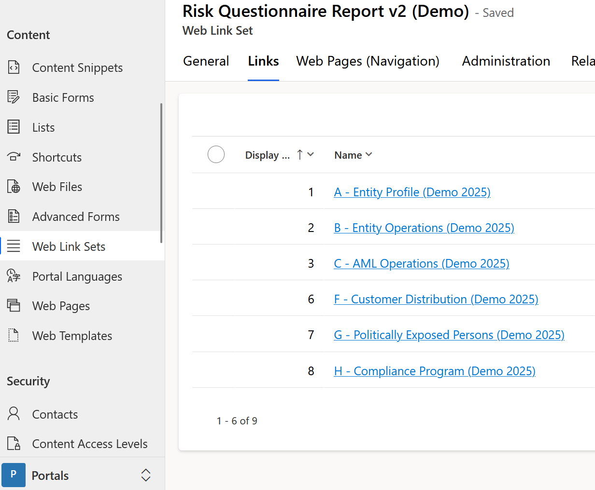

Table 26: Wizard example (web link set)

Figure 32: Parent Page (Wizard Insert Page)

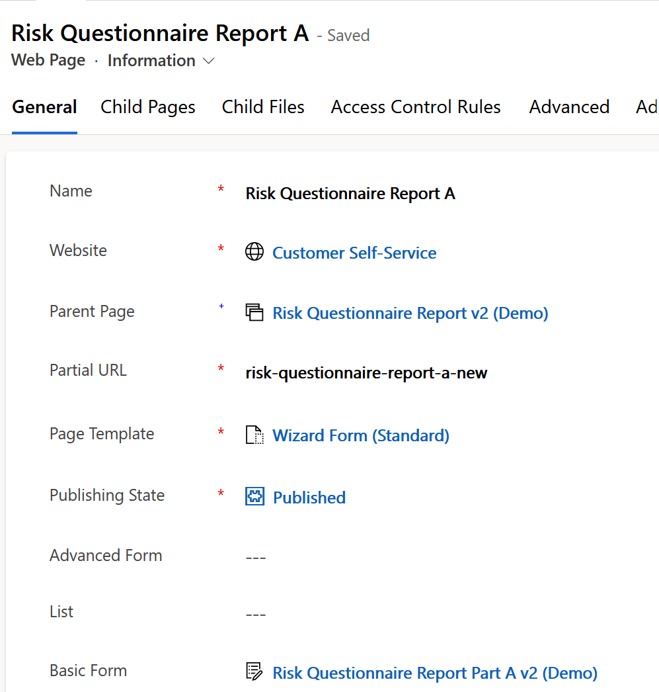

Figure 33: Wizard Step (child page)

Table 27: Wizard Forms

### Versioning forms

Each year, or periodically, {ORGANIZATION} may issue a new version of a form. The requirement however states that retention of the previous form and its data remains intact. Therefore staff will be required to clone (save and copy) the existing form to change, make the changes, clone (save and copy) the existing portal wizard and configure new web pages (optional) and basic form record to point to the new form. The sequence diagram below depicts this. Furthermore, a step-by-step guide of how to do this is also illustrated (and subject to change below)

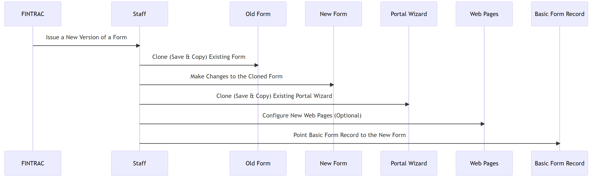

### Basic Form Metadata

The Power Pages Basic Form feature is a tool for creating and customizing forms on a website or landing page. With this feature, users can create forms with a variety of field types, including text fields, drop-down menus, and checkboxes, and customize the form's appearance to match the design of their website.

The Basic Form feature includes a drag-and-drop interface that makes it easy to add and arrange form fields, and users can preview the form as they build it. The feature also allows for the creation of multi-page forms, where users can split longer forms into smaller sections for easier completion by the user.

Additionally, the Power Pages Basic Form feature includes options for configuring form submission settings, such as email notifications and confirmation messages for users. The feature also allows users to set up integrations with third-party tools like email marketing software or customer relationship management (CRM) platforms.

Overall, the Power Pages Basic Form feature provides a comprehensive solution for creating and managing forms on a website or landing page, with customizable fields, design options, and integration capabilities.

This feature is also pivotable to the wizard form, each form step has a web page that is associated with a basic form. The table below lists all basic forms in the system. The name includes the convention.

| Basic form name | Table | Webpage |
|-----------------|-------|---------|
|                 |       |         |
|                 |       |         |
|                 |       |         |
|                 |       |         |
|                 |       |         |
|                 |       |         |
|                 |       |         |

Table 28: Basic Forms

### Libraries: Plugins and custom workflow extensions (DRY & Namespace)

Plugins and custom workflow steps are required for more complex functionality that are either inefficient to create in flows or processes or impossible to implement using these features. This is comprised of C\# class libraries that are signed by developers for security and run within a sandbox thus cannot interact with third party libraries or security reasons. In this implementation, the table below lists all the class libraries leveraged in this implementation and the namespace (convention). This implementation uses a third party custom workflow step library that is open source to help with mundane behavior that would take weeks to develop and test and these are listed in this table as well.

| Class library name | Type | Managed/Unmanaged |
|--------------------|------|-------------------|
|                    |      |                   |
|                    |      |                   |
|                    |      |                   |
|                    |      |                   |
|                    |      |                   |
|                    |      |                   |
|                    |      |                   |

Table 29: Class Libraries

### Email templates

The Email Template feature in Dynamics 365 is a tool that enables users to create and customize email templates for various purposes, such as marketing campaigns, customer communication, and sales outreach. The feature allows users to create a template with a pre-defined layout and content, which can then be reused for future emails.

The Email Template feature includes a drag-and-drop interface that makes it easy to add images, text, and other elements to the email. Users can also use placeholders to dynamically populate email content with data from Dynamics 365 records, such as the recipient's name or company information.

Additionally, the Email Template feature allows users to configure email settings such as sender information, subject lines, and delivery options. Users can also preview the email template before sending it, to ensure that it looks and functions as intended.

The Email Template feature also includes capabilities for tracking email engagement and performance, such as open rates and click-through rates. Users can use this data to refine their email content and improve the effectiveness of their outreach efforts.

Overall, the Email Template feature in Dynamics 365 provides a comprehensive solution for creating, customizing, and sending emails, with powerful design and tracking capabilities that can help improve engagement and drive results.

This feature is used in this implementation for sending notification emails to recipients and invitations to register to the portal.

### Workflow (processes)

Processes are already listed in this document; however the convention is simple:

- Always use async processes unless the process throws a run time validation
- Create a process for Create and Update and using the naming convention: Create-Update-{name of table}

### CRM Form design

Forms should always have its parent record anchor in the header, the status reason, and modified on at the minimum. Secondly, forms that are being published to the portal must have 1 column layout. Third, the related menu should never display relationships with the same name. This means you need to edit the form to edit the relationship names on the form itself.

### PCF Controls and Third-Party Libraries

PCF Controls are framework driven controls that are official first party open-source tools that enhance user experience in CRM and now has support for portals as well. In this implementation, PCF controls are unnecessary. However, the following third-party libraries are being used to enhance the developer experience when creating processes:

| Library Name | GIT URL |
|--------------|---------|
|              |         |
|              |         |
|              |         |

### When and when not to use the CLI

The Power Platform CLI is a key pillar of the release pipelines however developers can leverage the CLI when cloning the GIT repository and working within their own developer environment. Thus, when using VSCode to develop instead of the interface, use the CLI to publish your changes. Never use the CLI to deploy changes to other environments beyond your own development local clone such as registering plugins and making changes to portals and the solution in dev only. Deployments are restricted to DevOps only thus refrain from deploying to downstream environments using the SDK, only the pipeline.

### Reference Data

Reference data should be generated by the SDK and the schema file must be committed to the Data/Schema folder in the GIT repository. When running the pipeline, make sure to include the full time including the extension of the schema file (xml) in the artifact variable. The pipeline will handle the export and import to target (and generate the artifact for downstream releases).

Secondly, we have a reference-data.xml file in the Data/Schema folder that will be used to host every table and field that is used for reference data to move across environments. It is preferable for developers to edit this file. However, for quick testing in staging follow the process described in the previous section. User Interface Design

This section covers the user interface design principles and best practices, including usability and user experience guidelines, design patterns and templates, navigation and menu structure, site map and navigation controls, dashboards and reports, forms, views, and dashboards, customization options and considerations, interactive and responsive design, accessibility and localization requirements, and accessibility guidelines and standards.

## User interface design principles and best practices

This section describes and outlines the user interface conventions for this implementation. This includes a combination of both industry best practices and best practices that have been devised for this specific implementation.

### Model Driven Apps (CRM backend)

These apps are accessible by {ORGANIZATION} employees. In the initial phase, we have a convention whereby there are two applications targeted to and based on the personas (team membership & security role assignments) of CRM users. The first application is targeted to transactional work comprised of views, forms, and automation such as flows, web resources, and processes designed to interact with data submitted from financial institutions. The second application is targeted to configurators responsible for configuration and development of features that are inherited by the transactional application and the portal application. There is a third important application entitled “Portal Management” which includes every portal configuration artifact however, the {ORGANIZATION} Administration application is designed to include the same artifacts and exclude features or records that are not being leveraged by this application to simplify the configurators and developers’ experience and target just the artifacts leveraged by this application. Finally, its important to note that developers of the platform can implement a third type of application entitled “Canvas Apps” whose purpose is to create a completely customized user interface / experience whereas Model Driven Apps have a more specific set of controls and tailored/specific user interface artifacts which simplifies development and configuration and provides a “low code” experience. In summary, the interfaces in this system have been built using both Power Pages Sites (website application) and Model Driven Apps but future implementations can include Canvas Apps and perhaps other types as the platform continues to mature over the years.

#### Navigation and menu structure

The navigation should be tailored to be as efficient as possible for the employee to know what needs to be actioned next. This means that the site map, which is the term that describes the menu system, should prominently display a dashboard of relevant data tailored to the users’ persona. A series of dashboards have been developed, one for each “security role” in the system, and users can choose which dashboard to set as ‘default’ when they first open the application. Users also can create their own dashboards (personal). The table below lists the dashboards created for each persona and provides a screen capture of how it looks. Users should be able to interact with the dashboard efficiently, which means – if the user is responsible for reviewing newly submitted forms, they should see a table with clickable links to applications who’ve they’ve been assigned to work on. A manager or coordinator dashboard would list records that have yet to be assigned and other views such as forms that have been assigned but have yet to change status or might be approaching or have surpassed the service standards (configured in the SLA feature) for actioning a record.

The other menus accessible on the same site map should include the activities in the system (so emails, tasks, cases etc.), list of organizations, lists of contacts who belong to these organizations, lists of cases and views of each type of form implemented in the system. Finally, each user will have both a team and personal view of their queue of work, which, despite this data being available in the dashboard, provides a richer set of data columns and features such as actioning multiple files at ones using Flows and processes and re-assign one or more records to other queues (e.g. for escalations).

{ORGANIZATION} application

| Menu Item (in order) | Section | Purpose |
|----------------------|---------|---------|
|                      |         |         |
|                      |         |         |
|                      |         |         |
|                      |         |         |
|                      |         |         |
|                      |         |         |
|                      |         |         |

Table 30: {ORGANIZATION} Model Driven App Menu Structure (Convention)

{ORGANIZATION} Administrator Application

Unlike the {ORGANIZATION} application, the administrator app is designed to lists menu items in order of importance or frequency of the menu item’s artifacts’ purpose. For example, reference data menu items, are designed to create records that the transactional application or portal application will see and utilize in drop down menus such as countries, case types, provinces, notification templates, email templates etc. The full list is provided below.

| Menu Item (in order) | Section | Purpose |
|----------------------|---------|---------|
|                      |         |         |
|                      |         |         |
|                      |         |         |
|                      |         |         |
|                      |         |         |
|                      |         |         |
|                      |         |         |

Table 31: {ORGANIZATION} Administrator Model Driven App Menu Structure (Convention)

#### Forms & views

After adherence to the site map (menu structure) the artifacts within each menu such as views and forms also have a set of conventions primary aimed to show the user relevant information prominently and provide ease of use when it comes to interacting with the records for which the user is responsible to action. When a user navigates to any menu item, they are immediately presented with a view, unless the menu item is targeted to a dashboard record. User’s can interact with data directly within these views by selecting one or more records and pressing a “flow” or “process” or a button in the “ribbon” which is a utility that lives at the top of each view horizontally that presents the user with various buttons and drop-down menus to export reports, data, import data, open the view directly in excel online to make changes in bulk etc. For more complex work and review of data, the user clicks on a view record and are presented with a form. Thus, it is important that guidelines are followed to ensure that both of these artifacts have a consistent user experience across the system so that users get used to the interface quickly and issue feature requests for future releases based on a consistent and repeatable user experience rather than an experience whereby each menu item presents views in a different manner and when clicking on records, forms are organized differently. Moreover, efficiency is a key factor in these conventions, and this really means that what we present to the user should be organized in a way that makes the interaction with the system as efficient and quickly as possible to not only provide them with a better experience but also resulting in higher efficiencies which translates ultimately down to the client (the financial institutions who will be getting faster response times and more efficient reviews etc.).

The list below describes the conventions for forms.

| Convention Title | Purpose | Example |
|------------------|---------|---------|
|                  |         |         |
|                  |         |         |
|                  |         |         |
|                  |         |         |
|                  |         |         |

Table 32: {ORGANIZATION} Model Driven App Form Design Conventions

The list below describes the conventions for views.

| Convention Title | Purpose | Example |
|------------------|---------|---------|
|                  |         |         |
|                  |         |         |
|                  |         |         |
|                  |         |         |
|                  |         |         |

Table 33: {ORGANIZATION} Model Driven App Views Design Conventions

#### Customization options and considerations

In this implementation, we stress the importance of using out of the box tooling as much as possible. In only very rare cases, should a developer bring in third party libraries to enhance usability unless well supported by the community behind it or is a first party (MS supported) library. By introducing the usage of third party libraries and or controls, the more technical debt is added to the system thus adding more complexity and potential maintenance and run time exception problems in the future due to things such as depreciations not being addressed by the third party library or running into the risk of over-complicating the system just to simplify a feature for the sake of convenience. There are legitimate user experience enhancements that do require the usage of third-party libraries or web resources (custom HTML/JS resources) which are listed below. Also listed below are conventions used when customizations outside the standard OOB tooling provides is implemented.

| Library Name | Purpose |
|--------------|---------|
|              |         |
|              |         |
|              |         |
|              |         |
|              |         |
|              |         |
|              |         |

Table 34: Third/First Party Library/Controls Usage/Conventions

| Convention Title | Purpose | Example |
|------------------|---------|---------|
|                  |         |         |
|                  |         |         |
|                  |         |         |
|                  |         |         |
|                  |         |         |

Table 35: Conventions when developing Class Libraries and Web Resources

### Portals (Power Pages Site)

The website for this application adheres to WCAG regulations that are facilitated by the implementation of the Canada.ca WET framework implementation in the portal. This CSS/JS framework supports screen readers and other tools used by folks with an impairment in using a traditional keyboard and mouse or trackpad. This framework has been fully implemented on this web site and affects everything from tables shown to users, buttons, forms, links, and navigation. In addition to addressing accessibility, web usability and industry norms are followed so that users who interact with the portal are experiencing a familiar user experience in comparison to other frequently visited web sites with the exception of heavy usage of JavaScript as this will often violate accessibility guidelines. JavaScript is being used in the portal in many areas but our convention is to ensure that for accessibility and security reasons, JavaScript is leveraged for read operations only and rarely used for writing or purging data using the web API. Exceptions to these rules are described in the following sections.

#### Interactive and responsive design

#### Accessibility and localization requirements

#### Accessibility guidelines and standards

#### Multilingual and cultural considerations

## Integration Architecture

The Integration Architecture section covers integration patterns and principles, including API-based integration and connector-based integration, and the APIs and connectors used for integration, such as Dynamics 365 Web API, Microsoft Graph API, and Power Automate Connectors. Additionally, it covers data synchronization and replication, integration scenarios and patterns, data mapping and transformation, and security and authentication requirements for integration, such as OAuth and Azure AD authentication and authorization and permissions management. Integration patterns and principles.

- API-based integration
- Connector-based integration
- APIs and connectors used for integration.
- Dynamics 365 Web API
- Microsoft Graph API
- Power Automate Connectors
- Data synchronization and replication
- Integration scenarios and patterns
- Data mapping and transformation
- Security and authentication requirements for integration
- OAuth and Azure AD authentication
- Authorization and permissions management

## Security and Access Control

The Security and Access Control section covers role-based access control (RBAC) design, user roles and permissions, hierarchical security models, Azure Active Directory integration with Dynamics 365 teams, user and group synchronization, user provisioning and de-provisioning, permissions and privileges management, security roles and profiles, privileges and access levels, authentication and authorization requirements, password policies and security standards, multi-factor authentication, and data protection and compliance considerations, such as data encryption and protection, GDPR, and data privacy regulations.

### Hierarchical security model (business units / teams)

### Azure Active Directory integration with Dynamics 365 teams (user provisioning)

Azure Active Directory (Azure AD) groups can be integrated with Dynamics 365 teams to enable centralized role-based access control (RBAC) management across Dynamics 365 applications. RBAC is a security model that assigns permissions to users based on their roles within an organization. By using Azure AD groups to manage RBAC in Dynamics 365 teams, organizations can benefit from a centralized and efficient approach to managing user access to Dynamics 365 applications.

Contacts (external portal users) a step-by-step explanation of how Azure AD groups integrate with Dynamics 365 teams:

- Create an Azure AD group: To begin, create an Azure AD group that will be used to manage access to Dynamics 365 teams. This group should include all of the users who require access to Dynamics 365 applications.
- Assign roles to the Azure AD group: Next, assign one or more roles to the Azure AD group that correspond to the access levels required by users.
- Add the Azure AD group to Dynamics 365 teams: Once the Azure AD group has been created and roles have been assigned, it can be added to Dynamics 365 teams. This will automatically assign the appropriate roles to all the users in the Azure AD group.
- Manage RBAC through Azure AD group membership: From this point on, RBAC can be managed centrally by managing Azure AD group membership. If a user requires access to additional Dynamics 365 applications, simply add them to the appropriate Azure AD group and assign the corresponding roles.

By leveraging this feature, organizations can benefit from several advantages:

- Centralized management: By using Azure AD groups to manage RBAC in Dynamics 365 teams, organizations can benefit from centralized management of user access across multiple Dynamics 365 applications.
- Simplified administration: By managing RBAC through Azure AD group membership, administrators can more easily add or remove users from roles as needed, without having to manage individual user accounts.
- Increased security: By using Azure AD groups to manage RBAC, organizations can benefit from the security features of Azure AD, including multi-factor authentication, conditional access policies, and more.
- Increased efficiency: By centralizing RBAC management, organizations can streamline the process of managing user access across multiple Dynamics 365 applications, reducing the time and effort required for administration.

In summary, Azure AD groups can be integrated with Dynamics 365 teams to enable centralized RBAC management across multiple Dynamics 365 applications. This approach provides several benefits, including centralized management, simplified administration, increased security, and increased efficiency. In the following section, the implementation of this feature is described in detail for this implementation. The goal is to leverage Active Directory to manage the RBAC of the system rather than relying solely on the application layer thus avoiding pitfalls such as stale users or users who are not assigned to the right team and permissions.

### User and group synchronization & User provisioning and de-provisioning

The table below lists the teams, their associated security roles, and the associated Azure AD group. By adding the user to the Azure AD group, they automatically are added as members to its associated team and inherits the teams’ permissions. This applies to also removing a user from an Azure AD group and adding them to another group. Users who are disabled in AD or purged also have their access revoked from CRM.

| Team | Security Role(s) | AAD Group |
|------|------------------|-----------|
|      |                  |           |
|      |                  |           |
|      |                  |           |
|      |                  |           |

Table 36: Teams & AD Groups

Figure 34: D365 Team Integration with AD Group (repetitive)

### Azure KeyVaults for storing certificates, secrets, and keys

### Encryption and decryption

### Logging and monitoring

A log analytics workspace has been provisioned in the nonproduction and production Azure subscriptions hosting the azure workloads that support the Power Platform. In this implementation, the Power Platform logs (Portal and CRM) are sent to the workspace, so are the B2C & SharePoint logs. These workspaces are scanned by the CCCS sensors and logs sent to the GOC SOC.

The log analytics workspace locations are listed below.

| Subscription Name | Workspace Name |
|-------------------|----------------|
|                   |                |
|                   |                |

### File and data storage

Files (unstructured data) is mostly stored in SharePoint. This includes form related attachments and attachments to various case files, accounts, contacts, and forms. Diagnostic logs, which are files as well (JSON format) are stored in Azure Storage accounts located in the Power Platform Azure supporting subscriptions. The Dataverse also stores “web files” which are files such as CSS, JS, and images to support portal asset rendering.

### Azure Gateway as a proxy perimeter to the portal

{ORGANIZATION} has implemented SCED thus a physical connection to the Canadian Azure Data Centres using express route. Therefore, the portal (pre-prod and production) is proxied through this service allowing {ORGANIZATION} to control the perimeter services via a series of assigned IP’s controlled by SSC and governed by the F5 firewall. This is an unconventional but working solution as Power Page Sites provides native support to Azure Front Door as a CDN / Proxy service however {ORGANIZATION} has no plans to implement front door.

### Network security and perimeter protection

Microsoft 365 provides several network security perimeter services to its staff who use the Power Platform, including Power Apps, Power Automate, and Power BI. These services are designed to help ensure that customer data and applications are protected against security threats, both within and outside the Microsoft 365 environment. This is why SAAS is outside of the scope of SCED as GOC operators have no access to the perimeter or infrastructure hosting M365 (so the Power Platform).6

Some of the key network security perimeter services provided by Microsoft 365 include:

- Azure Active Directory (Azure AD) - This service provides authentication and access management for Power Platform applications, allowing staff to control who can access their data and applications, and what they can do with them.
- Data Loss Prevention (DLP) - DLP policies can be configured to help prevent data loss or leakage from Power Platform applications, by monitoring and controlling access to sensitive data. By default, a global DLP has been applied to the Power Platform tenant to block all third party and first party connectors to services outside of the Microsoft ecosystem.
- Conditional Access - This feature allows staff to set policies that control access to Power Platform applications based on a range of factors, including user location, device type, and more.
- Network security groups - These are firewall rules that can be used to control inbound and outbound network traffic to and from Power Platform applications, helping to prevent unauthorized access and data exfiltration.
- Azure Private Link - This service allows staff to securely access their Power Platform applications over a private network connection, rather than over the public internet.

In addition to these network security perimeter services, Microsoft 365 also provides protection for public Power Pages sites created using Power Apps. Specifically, Power Pages sites are protected by Azure Front Door, which provides security and scalability for web applications. Azure Front Door provides several security features, such as SSL termination, DDoS protection, and bot protection, to protect against common web-based attacks.

Overall, Microsoft 365 provides a comprehensive set of network security perimeter services to its staff who use the Power Platform, helping to ensure that customer data and applications are protected against security threats both within and outside the Microsoft 365 environment.

### Data Loss Prevention

The Data Loss Prevention (DLP) feature in the Power Platform allows administrators to control the flow of sensitive data across various Power Platform services, such as Power Apps, Power Automate, and Power BI. With DLP policies, you can restrict the use of sensitive data in the Power Platform, ensuring that only authorized users have access to it.

DLP policies can be applied to specific data types, such as credit card numbers, social security numbers, or other custom data types. You can define the actions that should be taken when a user attempts to share or use data that matches the defined policies, such as blocking access, notifying an administrator, or prompting the user to provide a justification for accessing the data.

However, it's important to note that the DLP feature has some limitations, especially when targeting out-of-the-box (OOB) flow connectors. OOB flow connectors are pre-built connectors that come with the Power Platform and allow users to connect to various services such as SharePoint, Dynamics 365, or Microsoft Teams.

When you apply DLP policies to the Power Platform, it's essential to understand that DLP settings should still be configured tenant-wide in Azure. This means that if you apply DLP policies to specific data types in the Power Platform, it won't necessarily prevent users from sharing or using that data in other Microsoft services outside the Power Platform. Therefore, it's recommended that you configure your DLP policies in Azure to ensure that sensitive data is protected across all Microsoft services, including the Power Platform.

In summary, the DLP feature in the Power Platform provides a useful tool for controlling the flow of sensitive data within the Power Platform. However, it's important to understand its limitations when targeting OOB flow connectors, and to configure DLP settings tenant-wide in Azure to ensure complete protection of sensitive data across all Microsoft services.

For this implementation, we’ve created a DLP policy exemption to allow D365 to communicate with the organization master API since the Global DLP policy on the tenant prevents usage of the HTTP connector which is what needs to be leverages for perform API calls. The DLP settings are managed by the cloud operation folks and when a new connector is required for a Power Automate Flow such as for example integrating with a third party system such as workday, SAP, or any other app which may have already a pre-built connector in the marketplace, the operator can create a DLP policy for the environment that requires this, while following the usual security measures of adherence to ITSG PBMM security guardrails / controls.

### Traffic management and load balancing

Due to the nature of the system being a SAAS technology – traffic management and load balancing is abstracted by Microsoft 365. Therefore, {ORGANIZATION} does not need to configure these features. If the applications are behaving slowly, it is typically due to mis configurations such as to many synchronous processes running which is a violation of our conventions and easy to identify by viewing the process logs. If the performance issues are difficult to identify, a ticket can be opened with Microsoft to help identify and resolve the issue.

### Azure KeyVaults for Certificates, Secrets, and Keys

An Azure KeyVaults instance has been provisioned for both nonproduction and production Subscriptions that host the Azure Workloads that support the Power Platform. In these KeyVaults is where we store the application App Registration secrets, TLS certificates, private IP addresses and other sensitive information such as DevOps library variable groups. Access to the KeyVaults is constrained to subscription contributors only thus developers do not have access to view this information, they must request temporary access to access a key, secret or certificate if needed for their development work. The table below lists the secret names stored in KeyVaults (not values).

| KeyVault Artifact Name | Purpose | Subscription |
|------------------------|---------|--------------|
|                        |         |              |
|                        |         |              |
|                        |         |              |
|                        |         |              |
|                        |         |              |
|                        |         |              |
|                        |         |              |

Table 37: Azure KeyVault Artifacts

KeyVaults are especially useful to protect our pipeline variable secrets. The diagram below depicts how this connection works, how variable groups connect to KeyVaults to obtain the data required to issue deployments.

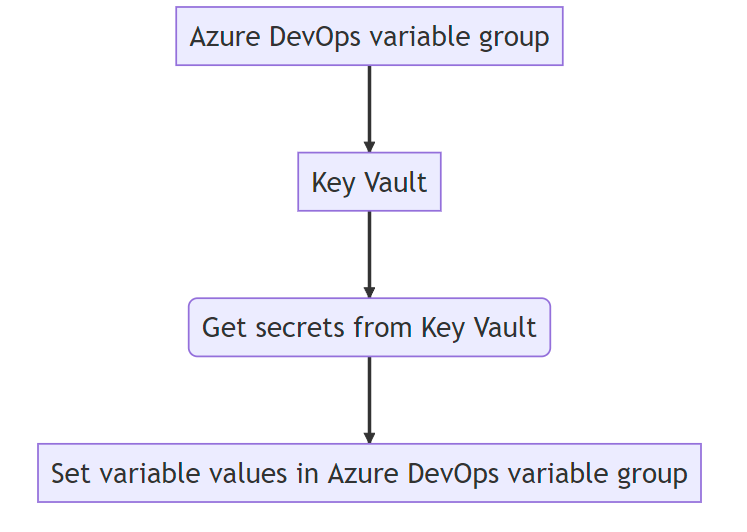

Figure 35: DevOps Variable Group integration with KeyVaults

In this flow chart, the Azure DevOps variable group (represented by the node A) is integrated with a Key Vault (represented by the node B). The flow starts with the variable group, which needs to retrieve secrets from the Key Vault to set the values of its variables. This is done by getting secrets from the Key Vault (represented by the node C), which are then used to set the variable values in the Azure DevOps variable group (represented by the node D).

Overall, this flow chart illustrates the basic steps involved in integrating Azure DevOps variable groups with a Key Vault to store and reference their values.

## Azure DevOps (GIT & CI/CD)

Azure DevOps is a powerful platform that can be utilized to automate the deployment of Dynamics 365 solutions, reference data, and portals (PowerApps) using the Power Platform CLI and marketplace helpers. The Power Platform CLI is a command-line interface tool that allows developers to manage and automate the deployment of Power Platform resources, while marketplace helpers are pre-built scripts that automate common deployment scenarios. By integrating these tools into Azure DevOps pipelines, developers can easily deploy and test Dynamics 365 solutions, reference data, and portals with a few simple commands.

In addition to simplifying the deployment process, utilizing Azure DevOps pipelines for deployment offers several benefits over manual deployments in Dynamics. Firstly, it allows for greater control and visibility over the deployment process, as developers can easily track changes and errors in the deployment pipeline. This ensures that any issues are identified and resolved quickly, reducing the risk of errors or misconfigurations in downstream environments. Furthermore, by automating the deployment process, developers can save time and reduce the risk of human error, allowing them to focus on other important tasks.

With the implementation's strict policy to only allow system administrator privileges to developers in a developer environment, using Azure DevOps pipelines to deploy to a staging environment ensures that only approved changes are promoted to downstream environments. The pipeline outputs errors and misconfigurations from the assets the developer is trying to deploy, ensuring that only valid and functioning changes are deployed to downstream environments. This approach ensures a controlled and consistent deployment process, reducing the risk of errors and minimizing downtime. Once successfully deployed to staging, a release manager can issue the release of the artifacts generated from the successful release to staging (build) to other downstream environments such as QA, UAT, PREPROD, and PROD, ensuring that the deployment process is repeatable and scalable.

This section discusses various design paradigms for the application layer, including schema, naming conventions, processes (automations), business rules, Power Automate Flows, and Role-Based Access Control. It also covers the APIs and connectors used for integration.

### Developer main tools CLI

Developer tooling required for this implementation is primarily the CLI extension in VSCode. \\

Ensure the following tooling is installed using these commands.

\> **pac tool list**

ToolName Installed Version Nuget Status

CMT No N/A 9.1.0.80 not yet installed; 'pac tool CMT' will install on first launch

PD No N/A 9.1.0.104 not yet installed; 'pac tool PD' will install on first launch

PRT Yes 9.1.0.155 9.1.0.155 ok

Follow the same procedure to download and launch the CMT and PD tools. If a tool is already installed, the pac tool \<toolname\> command will simply launch the latest installed version of the tool.

You need to periodically update these tools using the following commands

\> pac tool list

ToolName Installed Version Nuget Status

CMT No N/A 9.1.0.80 not yet installed; 'pac tool CMT' will install on first launch

PD No N/A 9.1.0.104 not yet installed; 'pac tool PD' will install on first launch

PRT Yes 9.1.0.155 9.1.0.155 ok

\> pac solution pack help

Help:

Package solution components on local filesystem into solution.zip (SolutionPackager)

Commands:

Usage: pac solution pack --zipfile [--folder] [--packagetype] [--log] [--errorlevel] [--singleComponent] [--allowDelete] [--allowWrite] [--clobber] [--map] [--sourceLoc] [--localize] [--useLcid] [--useUnmanagedFileForMissingManaged] [--disablePluginRemap] [--processCanvasApps]

\--zipfile The full path to the solution ZIP file (alias: -z)

\--folder The path to the root folder on the local filesystem. When unpacking/extractins, this will be written to, when packing this will be read from. (alias: -f)

\--packagetype When unpacking/extracting, use to specify dual Managed and Unmanaged operation. When packing, use to specify Managed or Unmanaged from a previous unpack 'Both'. Can be: 'Unmanaged', 'Managed' or 'Both'; default: 'Unmanaged' (alias: -p)

\--log The path to the log file. (alias: -l)

\--errorlevel Minimum logging level for log output [Verbose\|Info\|Warning\|Error\|Off]; default: Info (alias: -e)

\--singleComponent Only perform action on a single component type [WebResource\|Plugin\|Workflow\|None]; default: None. (alias: -sc)

\--allowDelete Dictates if delete operations may occur; default: false. (alias: -ad)

\--allowWrite Dictates if write operations may occur; default: false. (alias: -aw)

\--clobber Enables that files marked read-only can be deleted or overwritten; default: false. (alias: -c)

\--map The full path to a mapping xml file from which to read component folders to pack. (alias: -m)

\--sourceLoc Generates a template resource file. Valid only on Extract. Possible Values are auto or an LCID/ISO code of the language you wish to export. When Present, this will extract the string resources from the given locale as a neutral .resx. If auto or just the long or short form of the switch is specified the base locale for the solution will be used. (alias: -src)

\--localize Extract or merge all string resources into .resx files. (alias: -loc)

\--useLcid Use LCID's (1033) rather than ISO codes (en-US) for language files. (alias: -lcid)

\--useUnmanagedFileForMissingManaged Use the same XML source file when packaging for Managed and only Unmanaged XML file is found; applies to AppModuleSiteMap, AppModuleMap, FormXml files (alias: -same)

\--disablePluginRemap Disabled plug-in fully qualified type name remapping. default: false (alias: -dpm)

You can use the Table definition browser to view information for all the tables your Dataverse environment. The Table definition browser is a managed solution you can download here: [Microsoft Downloads: MetadataBrowser_3_0_0_5_managed.zip](https://download.microsoft.com/download/8/E/3/8E3279FE-7915-48FE-A68B-ACAFB86DA69C/MetadataBrowser_3_0_0_5_managed.zip)

After you download the solution, you must import it to be able to use it.

- Sign into Power Apps.
- In the left navigation pane, select Solutions, and then select Import on the command bar.
- On the Import a solution page, select Browse to locate the solution file (.zip) you downloaded, and select it.
- Select Next. Information about the solution is displayed.
- Select Import, and then finish the import process.

After you import the solution successfully, locate the app by selecting **Apps** in the left navigation pane; the app is listed as **Metadata Tools**.

On opening the app, Entities is the default view that lets you view all the tables.

Entitles view.

You can perform the following actions:

View Entity Details: Select a table to view using the Entity Metadata view.

Edit Entity: Open the selected form in the default organization, if the table supports this.

Text Search: Perform a text search to filter displayed tables using the following table properties: SchemaName, LogicalName, DisplayName, ObjectTypeCode, or MetadataId.

Filter Entities: Set simple criteria to view a sub-set of tables. All criteria are evaluated using AND logic.

Filter Properties: Filter the properties displayed for any selected table. There are nearly 100 properties in the list. Use this to select just the ones you are interested in.

Entity Metadata view

Select Entity Metadata to inspect individual tables.

Metadata view.

You can perform the following actions for a single table:

- Entity: Select the table from the drop-down list that you want to view.
- Properties: View all the properties for the table and filter the properties displayed.
- Edit Entity: Open the selected table edit form in the default organization if the table supports this.
- Filter Properties: Filter the properties displayed for any selected table. There are nearly 100 properties in the list. Use this to select just the ones you are interested in.
- Attributes: View the table columns in a master/detail view. With this view you can:
- Edit Attribute: Open the selected attribute form in the default organization if the attribute supports this.
- Text Search: Perform a text search to filter displayed columns using the following attribute properties: SchemaName, LogicalName, DisplayName, or MetadataId.
- Filter Attributes: Filter columns by any attribute property values.
- Filter Properties: Filter the properties displayed for the selected attribute.

Keys: If alternate keys are enabled for a table, you can examine how they are configured.

- Relationships: View the three types of table relationships: One-To-Many, Many-To-One, and Many-To-Many. With these views you can:
- Edit Relationship: Open the selected relationship form in the default organization if the relationship supports this.
- Text Search: Perform a text search to filter displayed relationships using values relevant to the type of relationship.
- Filter Properties: Filter the relationship by any relationship property value.
- Privileges: View table privileges. With this view you can:
- Filter the displayed privilege using the PrivilegeId.

Tables are defined by table definitions. By defining or changing the table definitions, you can control the capabilities of a table. To view the table definitions for your environment, use the metadata browser. [Download the table definitions browser](https://download.microsoft.com/download/8/E/3/8E3279FE-7915-48FE-A68B-ACAFB86DA69C/MetadataBrowser_3_0_0_5_managed.zip).

More information: [Browse table definitions for your environment](https://learn.microsoft.com/en-us/power-apps/developer/data-platform/browse-your-metadata)

This topic is about how to work with tables programmatically. To work with tables in [Power Apps](https://make.powerapps.com) See [Tables in Dataverse](https://learn.microsoft.com/en-us/power-apps/maker/data-platform/entity-overview).

Tables can be created using either the organization service or the Web API. The following information can be applied to both.

- With the organization service you will use the [EntityMetadata](https://learn.microsoft.com/en-us/dotnet/api/microsoft.xrm.sdk.metadata.entitymetadata) class. More information: [Create a custom table using code](https://learn.microsoft.com/en-us/power-apps/developer/data-platform/org-service/create-custom-entity) and [Retrieve, update, and delete tables](https://learn.microsoft.com/en-us/power-apps/developer/data-platform/org-service/metadata-retrieve-update-delete-entities)
- With the Web API you will use the [EntityMetadata](https://learn.microsoft.com/en-us/power-apps/developer/data-platform/webapi/reference/entitymetadata) EntityType. More information : [Create and update table definitions using the Web API](https://learn.microsoft.com/en-us/power-apps/developer/data-platform/webapi/create-update-entity-definitions-using-web-api).

### Table definitions operations

How you work with table definitions depends on which service you use.

Since the Web API is a RESTful endpoint, it uses a different way to create, retrieve, update, and delete table definitions. Use POST, GET, PUT, and DELETE HTTP verbs to work with table definitions entity types. More information : [Create and update table definitions using the Web API](https://learn.microsoft.com/en-us/power-apps/developer/data-platform/webapi/create-update-entity-definitions-using-web-api).

One exception to this is the [RetrieveMetadataChanges Function](https://learn.microsoft.com/en-us/power-apps/developer/data-platform/webapi/reference/retrievemetadatachanges) provides a way to compose table definitions query and track changes over time.

If working with Organization Service, use [RetrieveMetadataChangesRequest](https://learn.microsoft.com/en-us/dotnet/api/microsoft.xrm.sdk.messages.retrievemetadatachangesrequest) class. This class contains the data that is needed to retrieve a collection of table definitions records that satisfy the specified criteria. The [RetrieveMetadataChangesResponse](https://learn.microsoft.com/en-us/dotnet/api/microsoft.xrm.sdk.messages.retrievemetadatachangesresponse) returns a timestamp value that can be used with this request at a later time to return information about how table definitions has changed since the last request.

| **Message**                                                                                                                                                                                                                                                                                                                                                                                                                                                                | **Web API**                                                                                                                                       | **SDK Assembly**                                                                                                                         |
|----------------------------------------------------------------------------------------------------------------------------------------------------------------------------------------------------------------------------------------------------------------------------------------------------------------------------------------------------------------------------------------------------------------------------------------------------------------------------|---------------------------------------------------------------------------------------------------------------------------------------------------|------------------------------------------------------------------------------------------------------------------------------------------|
| CreateEntity                                                                                                                                                                                                                                                                                                                                                                                                                                                               | Use a POST request to send data to create a table.                                                                                                | [CreateEntityRequest](https://learn.microsoft.com/en-us/dotnet/api/microsoft.xrm.sdk.messages.createentityrequest)                       |
| DeleteEntity                                                                                                                                                                                                                                                                                                                                                                                                                                                               | Use a DELETE request to delete a table.                                                                                                           | [DeleteEntityRequest](https://learn.microsoft.com/en-us/dotnet/api/microsoft.xrm.sdk.messages.deleteentityrequest)                       |
| RetrieveAllEntities                                                                                                                                                                                                                                                                                                                                                                                                                                                        | Use GET request to retrieve table data.                                                                                                           | [RetrieveAllEntitiesRequest](https://learn.microsoft.com/en-us/dotnet/api/microsoft.xrm.sdk.messages.retrieveallentitiesrequest)         |
| RetrieveEntity                                                                                                                                                                                                                                                                                                                                                                                                                                                             | [RetrieveEntity Function](https://learn.microsoft.com/en-us/power-apps/developer/data-platform/webapi/reference/retrieveentity)                   | [RetrieveEntityRequest](https://learn.microsoft.com/en-us/dotnet/api/microsoft.xrm.sdk.messages.retrieveentityrequest)                   |
| UpdateEntity                                                                                                                                                                                                                                                                                                                                                                                                                                                               | Use a PUT request to update a table.                                                                                                              | [UpdateEntityRequest](https://learn.microsoft.com/en-us/dotnet/api/microsoft.xrm.sdk.messages.updateentityrequest)                       |
| RetrieveMetadataChanges Used together with objects in the [Microsoft.Xrm.Sdk.Metadata.Query](https://learn.microsoft.com/en-us/dotnet/api/microsoft.xrm.sdk.metadata.query) namespace to create a query to efficiently retrieve and detect changes to specific table definitions. More information: [Retrieve and detect changes to table definitions](https://learn.microsoft.com/en-us/power-apps/developer/data-platform/org-service/metadata-retrieve-detect-changes). | [RetrieveMetadataChanges Function](https://learn.microsoft.com/en-us/power-apps/developer/data-platform/webapi/reference/retrievemetadatachanges) | [RetrieveMetadataChangesRequest](https://learn.microsoft.com/en-us/dotnet/api/microsoft.xrm.sdk.messages.retrievemetadatachangesrequest) |

### Options available when you create a custom table

The following lists the options that are available when you create a custom table. You can only set these properties when you create a custom table.

| **Option**                    | **Description**                                                                                                                                                                                                                                                                                                                                                                                                                                                                                                                                                                                                                                                                                                                                                                                                                                                                                                                                                                                                                                                                                                                                                                                                              |
|-------------------------------|------------------------------------------------------------------------------------------------------------------------------------------------------------------------------------------------------------------------------------------------------------------------------------------------------------------------------------------------------------------------------------------------------------------------------------------------------------------------------------------------------------------------------------------------------------------------------------------------------------------------------------------------------------------------------------------------------------------------------------------------------------------------------------------------------------------------------------------------------------------------------------------------------------------------------------------------------------------------------------------------------------------------------------------------------------------------------------------------------------------------------------------------------------------------------------------------------------------------------|
| **Create as custom activity** | You can create a table that is an activity by setting the IsActivity property when using the organization service or Web API respectively. For more information, see [Custom Activities in Dynamics 365](https://learn.microsoft.com/en-us/power-apps/developer/data-platform/custom-activities).                                                                                                                                                                                                                                                                                                                                                                                                                                                                                                                                                                                                                                                                                                                                                                                                                                                                                                                            |
| **Table Names**               | There are two types of names, and both must have a customization prefix:  LogicalName: Name that is the version of the table name that is set in all lowercase letters.  SchemaName: Name that will be used to create the database tables. This name can be mixed case. The casing that you use sets the name of the object generated for programming with strong types or when you use the REST endpoint.  **Note**: If the logical name differs from the schema name, the schema name will override the value that you set for the logical name.  When a table is created in the application in the context of a specific solution, the customization prefix used is the one set for the Publisher of the solution. When a table is created programmatically, you can set the customization prefix to a string that is between two and eight characters in length, all alphanumeric characters and it must start with a letter. It cannot start with “mscrm”. The best practice is to use the customization prefix defined by the publisher that the solution is associated with, but this is not a requirement. An underscore character must be included between the customization prefix and the logical or schema name. |
| **Ownership**                 | Use the OwnershipType property to set this. Use the [OwnershipTypes](https://learn.microsoft.com/en-us/dotnet/api/microsoft.xrm.sdk.metadata.ownershiptypes) enumeration or [OwnershipTypes](https://learn.microsoft.com/en-us/power-apps/developer/data-platform/webapi/reference/ownershiptypes) EnumType to set the type of table ownership. The only valid values for custom tables are OrgOwned or UserOwned. For more information, see [Table Ownership](https://learn.microsoft.com/en-us/dynamics365/customer-engagement/developer/introduction-entities#EntityOwnership).                                                                                                                                                                                                                                                                                                                                                                                                                                                                                                                                                                                                                                           |
| **Primary Column**            | With the Organization service, use [CreateEntityRequest](https://learn.microsoft.com/en-us/dotnet/api/microsoft.xrm.sdk.messages.createentityrequest).[PrimaryAttribute](https://learn.microsoft.com/en-us/dotnet/api/microsoft.xrm.sdk.messages.createentityrequest.primaryattribute#microsoft-xrm-sdk-messages-createentityrequest-primaryattribute) property to set this.  With the Web API the JSON defining the table must include one [StringAttributeMetadata](https://learn.microsoft.com/en-us/power-apps/developer/data-platform/webapi/reference/stringattributemetadata) with the IsPrimaryName property set to true.  In both cases string column must be formatted as Text. The value of this column is what is shown in a lookup for any related tables. Therefore, the value of the column should represent a name for the record.                                                                                                                                                                                                                                                                                                                                                                           |

## Enable table capabilities

The following lists table capabilities. You can set these capabilities when you create a table or you can enable them later. Once enabled, these capabilities cannot be disabled.

| **Capability**             | **Description**                                                                                                                                                                                                                                                                                                                                                                                                                                                                                                                                                                                                                                        |
|----------------------------|--------------------------------------------------------------------------------------------------------------------------------------------------------------------------------------------------------------------------------------------------------------------------------------------------------------------------------------------------------------------------------------------------------------------------------------------------------------------------------------------------------------------------------------------------------------------------------------------------------------------------------------------------------|
| **Business Process flows** | Set IsBusinessProcessEnabled to true in order to enable the table for business process flows.                                                                                                                                                                                                                                                                                                                                                                                                                                                                                                                                                          |
| **Notes**                  | To create a relationship with the Annotation table and enable the inclusion of a **Notes** area in the form. By including **Notes**, you can also add attachments to records.   With the Organization service, use the [CreateEntityRequest](https://learn.microsoft.com/en-us/dotnet/api/microsoft.xrm.sdk.messages.createentityrequest) or [UpdateEntityRequest](https://learn.microsoft.com/en-us/dotnet/api/microsoft.xrm.sdk.messages.updateentityrequest) HasNotes property   With the Web API set the [EntityMetadata](https://learn.microsoft.com/en-us/power-apps/developer/data-platform/webapi/reference/entitymetadata).HasNotes property. |
| **Activities**             | To create a relationship with the ActivityPointer table so that all the activity type tables can be associated with this table.  With the Organization service use the [CreateEntityRequest](https://learn.microsoft.com/en-us/dotnet/api/microsoft.xrm.sdk.messages.createentityrequest) or [UpdateEntityRequest](https://learn.microsoft.com/en-us/dotnet/api/microsoft.xrm.sdk.messages.updateentityrequest) HasActivities property.   With the Web API, set the [EntityMetadata](https://learn.microsoft.com/en-us/power-apps/developer/data-platform/webapi/reference/entitymetadata).HasActivities property.                                     |
| **Connections**            | To enable creating connection records to associate this table with other connection tables set the IsConnectionsEnabled.Value property value to true.                                                                                                                                                                                                                                                                                                                                                                                                                                                                                                  |
| **Queues**                 | Use the IsValidForQueue property to add support for queues. When you enable this option, you can also set the AutoRouteToOwnerQueue property to automatically move records to the owner’s default queue when a record of this type is created or assigned.                                                                                                                                                                                                                                                                                                                                                                                             |
| **E-mail**                 | Set the IsActivityParty property so that you can send e-mail to an e-mail address in this type of record.                                                                                                                                                                                                                                                                                                                                                                                                                                                                                                                                              |

### Editable table properties

The following lists table properties that you can edit. Unless a managed property disallows these options, you can update them at any time.

| **Property**                             | **Description**                                                                                                                                                                                                                                                                                                                                                                                                                                                                                                       |
|------------------------------------------|-----------------------------------------------------------------------------------------------------------------------------------------------------------------------------------------------------------------------------------------------------------------------------------------------------------------------------------------------------------------------------------------------------------------------------------------------------------------------------------------------------------------------|
| **Allow Quick Create**                   | Use IsQuickCreateEnabled to enable quick create forms for the table. Before you can use quick create forms you must first create and publish a quick create form. **Note**: Activity tables do not support quick create forms.                                                                                                                                                                                                                                                                                        |
| **Access Teams**                         | Use AutoCreateAccessTeams to enable the table for access teams. See [About collaborating with team templates](https://learn.microsoft.com/en-us/power-platform/admin/about-team-templates) for more information.                                                                                                                                                                                                                                                                                                      |
| **Primary Image**                        | If a table has an image column you can enable or disable displaying that image in the application using PrimaryImageAttribute. For more information see [Image columns](https://learn.microsoft.com/en-us/power-apps/developer/data-platform/image-attributes)                                                                                                                                                                                                                                                        |
| **Change display text**                  | The managed property IsRenameable prevents the display name from being changed in the application. You can still programmatically change the labels by updating the DisplayName and DisplayCollectionName properties.                                                                                                                                                                                                                                                                                                 |
| **Edit the table Description**           | The managed property IsRenameable prevents the table description from being changed in the application. You can still programmatically change the labels by updating the Description property.                                                                                                                                                                                                                                                                                                                        |
| **Enable for use while offline**         | Use IsAvailableOffline to enable or disable the ability of Dynamics 365 for Microsoft Office Outlook with Offline Access users to take data for this table offline.                                                                                                                                                                                                                                                                                                                                                   |
| **Enable the Outlook Reading Pane**      | **Note**:  The IsReadingPaneEnabled property is for internal use only.  To enable or disable the ability of Office Outlook users to view data for this table, use the Outlook reading pane. You must set this property in the application.                                                                                                                                                                                                                                                                            |
| **Enable Mail Merge**                    | Use IsMailMergeEnabled to enable or disable the ability to generate Office Word merged documents that use data from this table.                                                                                                                                                                                                                                                                                                                                                                                       |
| **Enable Duplicate Detection**           | Use IsDuplicateDetectionEnabled to enable or disable duplicate detection for the table. For more information, see [Detect duplicate data using code](https://learn.microsoft.com/en-us/power-apps/developer/data-platform/detect-duplicate-data-with-code)                                                                                                                                                                                                                                                            |
| **Enable SharePoint Integration**        | Use IsDocumentManagementEnabled to enable or disable SharePoint server integration for the table. For more information, see [Enable SharePoint document management for specific entities](https://learn.microsoft.com/en-us/power-platform/admin/enable-sharepoint-document-management-specific-entities).                                                                                                                                                                                                            |
| **Enable Dynamics 365 for phones**       | Use IsVisibleInMobile to enable or disable the ability of Dynamics 365 for phones users to see data for this table.                                                                                                                                                                                                                                                                                                                                                                                                   |
| **Dynamics 365 for tablets**             | Use IsVisibleInMobileClient to enable or disable the ability of Dynamics 365 for tablets users to see data for this table.  If the table is available for Dynamics 365 for tablets you can use IsReadOnlyInMobileClient to specify that the data for the record is read-only.                                                                                                                                                                                                                                         |
| **Enable Auditing**                      | Use IsAuditEnabled to enable or disable auditing for the table. For more information, see [Configure table and columns for Auditing](https://learn.microsoft.com/en-us/power-apps/developer/data-platform/auditing/configure#configure-tables-and-columns).                                                                                                                                                                                                                                                           |
| **Change areas that display the table**  | You can control where table grids appear in the application Navigation Pane. This is controlled by the SiteMap.                                                                                                                                                                                                                                                                                                                                                                                                       |
| **Add or Remove Columns**                | As long as the managed property CanCreateAttributes.Value allows for creating columns, you can add columns to the table. For more information, see [Column definitions](https://learn.microsoft.com/en-us/power-apps/developer/data-platform/entity-attribute-metadata).                                                                                                                                                                                                                                              |
| **Add or Remove Views**                  | As long as the managed property CanCreateViews.Value allows for creating views, you can use the SavedQuery table to create views for a table.                                                                                                                                                                                                                                                                                                                                                                         |
| **Add or Remove Charts**                 | As long as the managed property CanCreateCharts.Value allows for creating charts and the IsEnabledForCharts table property is true, you can use the [SavedQueryVisualization table](https://learn.microsoft.com/en-us/power-apps/developer/data-platform/reference/entities/savedqueryvisualization) to create charts for a table. For more information, see [View data with visualizations (charts)](https://learn.microsoft.com/en-us/power-apps/developer/model-driven-apps/view-data-with-visualizations-charts). |
| **Add or Remove table relationships**    | There are several managed properties that control the types of relationships that you can create for a table. For more information, see [Table relationship definitions](https://learn.microsoft.com/en-us/power-apps/developer/data-platform/entity-relationship-metadata).                                                                                                                                                                                                                                          |
| **Change Icons**                         | You can change the icons used for custom tables. For more information, see [Change model-driven app custom table icons](https://learn.microsoft.com/en-us/power-apps/maker/model-driven-apps/change-custom-entity-icons)                                                                                                                                                                                                                                                                                              |
| **Can Change Hierarchical Relationship** | CanChangeHierarchicalRelationship.Value controls whether the hierarchical state of relationships included in your managed solutions can be changed.                                                                                                                                                                                                                                                                                                                                                                   |

### Messages supported by custom tables

Custom tables support the same base messages as system tables. The set of messages available depends on whether the custom table is user-owned, or organization owned. User-owned tables support sharing, so messages such as GrantAccess, ModifyAccess, and RevokeAccess are available.

## Best practices and guidance when using Microsoft Dataverse

Microsoft Dataverse provides an extensible framework that will allow developers to build highly customized and tailored experiences. While customizing, extending, or integrating with Dataverse, a developer should be aware of the established guidance and best practices.

Within this section you will learn about the issues we have identified, their impact, and guidance to resolve those issues. We will explain the background about why things should be done in a certain way and avoid potential problems in the future. This can benefit the usability, supportability, and performance of your environment. The guidance documentation supports the existing information within the Developer and Administration guides.

### Targeted customization types

The documentation targets the following customization types:

- Custom workflow activities and plug-ins
- Working with Dataverse data
- Integrations extending Dataverse.

### Sections

Each guidance article includes most or all the following sections:

- Title - description of the guidance
- Category - one or more areas impacted by not following the guidance.
- Impact potential - the level of risk (high, medium, or low) of affecting the environment by not following the guidance.
- Symptoms - possible indications that the guidance has not been followed.
- Guidance - recommendations that may also include examples.
- Problematic patterns - description or examples of not following the guidance.
- Additional information - supporting details for a more extensive view.
- See also - references to learn more about something mentioned in the article.

### Categories

Each guidance article is classified with one or more of the following categories:

- Usage – improper usage of a particular API, pattern, or configuration
- Design – design flaws in a customization
- Performance – customization or pattern that may produce a negative effect on performance in areas such as memory management, CPU utilization, network traffic, or user experience.
- Security – potential vulnerabilities in a customization that could be exploited in a runtime environment.
- Upgrade Readiness - customization or pattern that may increase risk of having an unsuccessful version upgrade.
- Online Migration - customization or pattern that may increase risk of having an unsuccessful online migration.
- Maintainability – customization that unnecessarily increases the amount of developer effort required to make changes, the frequency of required changes, or the chance of introducing regressions.
- Supportability – customization or pattern that falls outside the boundaries of published supportability statements, including usage of removed APIs or implementation of forbidden techniques.

## Release Pipeline

The release pipeline for this project is implemented in Azure DevOps. Is comprised of not only automated release pipelines but our repository of requirements and version control using a GIT repository. There are two key pillars of the pipeline, one being the frequently executed from entitled “{ORGANIZATION}-CI” (CI=Continuous integration) and the second being the actual releases to all downstream environments up to production. The CI pipeline gives flexibility to developers to release at a staging environment at will to test their builds and store their artifacts into a release. Come time for a deployment to UAT and beyond, developers can choose any CI release and issue the release to the desired environment where tech leads are responsible for approving. This process is visualized below in both diagrams, one describing the GIT repository process and the second the release pipeline.

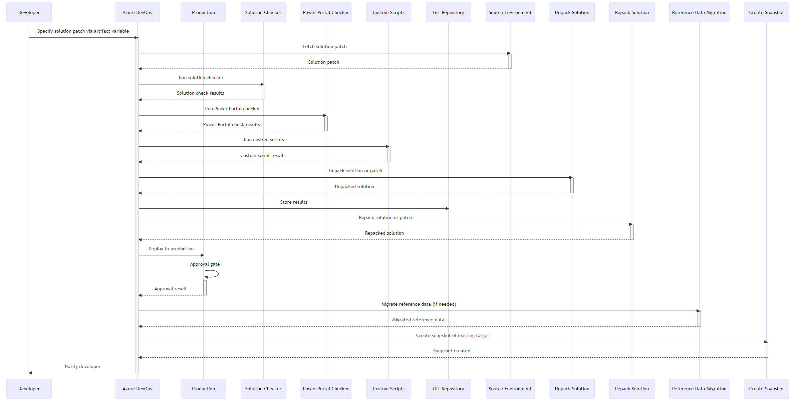

Figure 36: Release Pipeline - releases (CI)

In this diagram, the following pillars are key to each step to the pipeline:

1. Source Environment: The environment from which the Developer-specified solution patch is fetched.
2. Unpack Solution: A step in the pipeline that unpacks the solution or patch.
3. Repack Solution: A step in the pipeline that repacks the solution or patch as a zip file.
4. Reference Data Migration: A step in the pipeline that migrates reference data, if needed.
5. Create Snapshot: A step in the pipeline that creates a manual snapshot of the existing target.

Here's a description of the latest pipeline:

- The Developer specifies the solution patch via an artifact variable.
- Azure DevOps fetches the solution patch from the Source Environment.
- Azure DevOps runs the Solution Checker, Power Portal Checker, and Custom Scripts.
- Azure DevOps unpacks the solution or patch.
- Azure DevOps stores the results in the GIT Repository associated with the project.
- Azure DevOps repacks the solution or patch as a zip file and manages it for deployment to the target.
- Azure DevOps deploys the solution or patch to Production, subject to an Approval Gate.
- Production reviews the changes and either approves or rejects them.
- If the Developer has specified that reference data needs to be migrated, Azure DevOps migrates the reference data.
- Azure DevOps creates a manual snapshot of the existing target.
- Azure DevOps notifies the Developer of the Approval result.

**Once a successful build is ready to de deployed to downstream environments up to production, the developer will issue a release directly from the successful pipeline execution. This process is further illustrated below.**

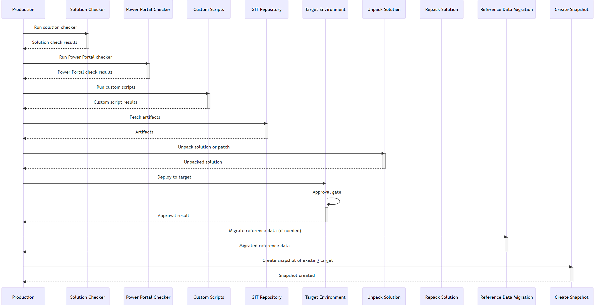

Figure 37: Deployment to Downstream Environments (CD)

### Build and Test Automation

The process of building solutions for this implementation involves creating a master solution entitled “{ORGANIZATION}” and developers will provision patches off this solution to perform their work. Once they’ve made their development and configuration changes inside their patch, they are required to deploy this to a staging environment using the {ORGANIZATION}-CI pipeline to test their work. If successful, they can issue the release from the pipeline release’s generated artifacts. This applies to both solution patches and portal changes. For class libraries which are C\# .net framework based, the need to commit their code to the repository and register their plugin or custom workflow step using the “plugin registration” tool available in the CLI using the following command: *pac tool prt*

This will launch the tool and the developer must authenticate to the tool using their AAD account and register the plugin and their steps (and images when required). Furthermore, plugins must be signed by a developer key to avoid de-compilation by a nefarious actor.

The table below lists the plugins developed specifically for this implementation – for now, the only plugin required is to enhance the bilingualism behavior of lookup fields on CRM form and views.

| Plugin Name | Class Library |
|-------------|---------------|
|             |               |
|             |               |

Table 38: Class Libraries (custom)

**Once a plugin or custom workflow step is registered to the development environment, the developer is responsible to add it to their patch and deploy via the pipeline. Under no circumstances a developer will manually register plugins or workflow steps to any “managed” environment, only in development.**

### Deployment Automation

Developers have access to the COMPLIANCE-PATCH pipeline whereby they can release their patches, configuration data and portal configurations to the Staging environment (managed). Patches do not need to be committed by the develop to the repository, the only responsibility for the developer is to provide the logical name (not display name) of the patch or solution being deployed and provide a version number that is increment by a number (4th integer) lower than a patch whose been provisioned later than the one being deployed. For data files being transferred, the developer is responsible to generate the schema file using the configuration migration tool from the SKD and commit the xml file into the Data/Schema directory. Once committed, the developer will be responsible for providing the filename and extensions (always filename.xml) and the pipeline will handle the export from source and import to target. Developers can run up to 4 artefacts containing both solutions and data schema files and these artifacts will run in order. Furthermore, the unmanaged solutions will be installed always as managed in the target environment as per best practice and to avoid future major issues with out of sync environments.

Finally, developers also can deploy their latest portal changes by setting “Yes” in the “Deploy Portal (Yes/No)” variable (which is set to know by default. The Comments parameter is leveraged for populating a git commit message as the pipeline will commit all artifacts to the repo and if no comment is found a default one is set which concatenates the personas name and time stamp. The pipeline will also automatically produce a backup of the target environment before deployment to recover for disaster recovery. This backup is stored in the same Azure Storage account that stores the portal diagnostics and has a 30 day retention policy. A pipeline is also available to developers to restore the backup if the deployment has caused an issue that is irreparable.

The table and figure below outline the pipelines and their variables.

| Pipeline Name | Variable | Permitted Executor Role |
|---------------|----------|-------------------------|
|               |          |                         |
|               |          |                         |
|               |          |                         |
|               |          |                         |
|               |          |                         |
|               |          |                         |
|               |          |                         |

*Example deployment run configuration (TODO -\> screen cap of same pipeline (once I can access network)*

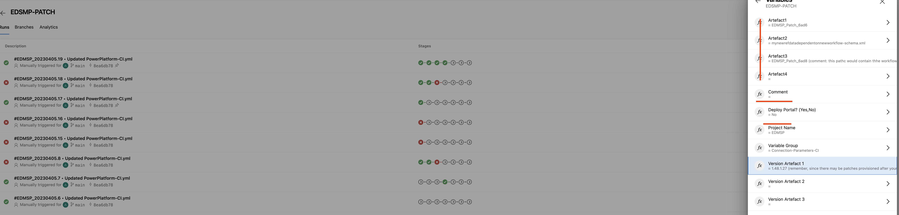

Figure 38: CI Pipeline Variables

The figure below illustrates the automation of our deployment process. This aligns with Microsoft’s recommendations with the exception of our specific environment implementation which includes more emphasis of testing for conventions, mis-configurations, an the environment backup snapshot we trigger as the first state of the pipeline for disaster recovery (which is stored and retained in our Azure Storage account as per Microsoft recommendation – this lowers our capacity costs).

Figure 39: ALM Illustration

### Build tools

Azure DevOps is the exclusive version control (GIT) and deployment tool for our build. However, the pipeline developed for this uses the Power Platform Build Tools first party plugin in DevOps in conjunction with the Power Platform Command Line Interface (CLI) for more flexibility. When writing a CLI script in a pipeline step, we use PowerShell instead of Bash, as we use a Windows Server (latest) image to host our agent. The CLI support also takes precedence over UNIX based OS support unfortunately (for now) therefore we do have some limitations around path length and some of the GIT capabilities you get with a Linux agent (in particular path lengths). In a later phase of this project, we plan on moving our ALM to a Linux based agent as it’s a well supported operating system for the web and pipelines. However, since we are using the CLI this is not really an issue in this implementation as the OS is abstracted from developer and the pipeline ALM (CICD) is working flawlessly. Its important to note that the DevOps project is linked to a subscription has we are running parallel jobs (up to 2 at time) – instead of incremental stages. The free tier of DevOps gives us 5 free basic licensed users and 1 free hosted agent pool agent job.

The CLI is comprised of the following commands, when developers clone or pull the current repository version of our code base for this implementation, they are recommended to use VSCode with the Power Platform Build Tools extensions installed in VSCode to run the commands to grab the latest version of the code, download, unpack, test, and re-back their patches. They also use the CLI to invoke tools such ss the plugin registration tool (for C\# class libraries to publish plugins and custom workflow steps), and the configuration migration utility (rarely as they need to simply update the existing schema (XML file) in the repository to include to new tables and for fields that are considered as reference data or dependent data for a process they are building (e.g. a business rule may depend on the existence of a country record to exist thus this record must live in target otherwise wont activate. All this work happens within their own branch, and they are required to merge their work into our main development branch, resolve merge conflicts (if any) then issue a pull-request with appropriate comments and link to work items and approve and auto complete themselves (only for development branch). Once done, they run the {ORGANIZATION}-PATCH pipeline and provide the variable values of what they are deploying, and this will run the entire pipeline tasks including all tests and provide logging. This pipeline only deploys to staging, which is an environment that developers only have access to test their deployments and create artifacts of their release for an actual release to downstream environments up to production. These releases are managed by the release manager and there is a separation of duty whereby the releaser cannot approve his / her own release, this must be completed by someone else on the team. Releases have a retention policy of 30 days (the same applies to release artifacts stored in DevOps). Note, and this must be emphasized, our pipeline should be able to build an environment from scratch and provide a simple tool for developers to avoid making common mistakes and create security vulnerabilities. {ORGANIZATION} must ensure to closely monitor the group of folks who have system administrator access in any other environment than development. Under no circumstances will system administrative privileges will be granted to managed environment (anything other than dev) as deployments can also be done manually (like any other custom framework or COTS) and therefore we’ve created the group ftnc_compliance_dev_administrators who belong to the system administrator team in development via the AAD Group integration with CRM team (explained in this document). The log analytics workspace will log security role assignments and if this scenario takes place, a high incident will be alerted to the appropriate folks to take action. There are rare scenarios whereby system administrator privileges are required to issue quick fixes or diagnose an issue post deploy but in these scenarios, these folks must PIM themselves in the ftnc_compliance-{env}-administrators group (4 hour limit)

Below is another more elaborate illustration of this process.

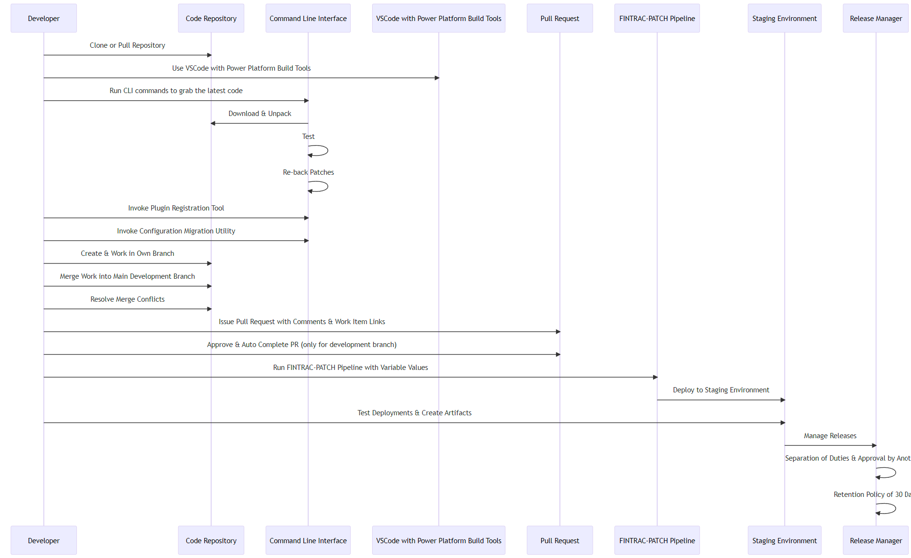

### Repositoris (GIT)

A GIT repository is used to source control our CRM solutions, reference data schema files (e.g., languages, genders, countries, teams, orgs, and individuals. Below illustrates the repo structure and the YAML and PS1 script files to support the pipeline (CI/CD). It’s important note that for security reasons, the .gitignore file exclude environment variables stores in text and JSON files. This means that the pipeline(s) operating. Agent which is hosted in our Azure subscription rather than using the default hosted agent. The agent specifications are provided in this table:

| Agent Name | Operating System | Specifications (capacity/threads) |
|------------|------------------|-----------------------------------|
|            |                  |                                   |
|            |                  |                                   |

Table 39: Custom Agents/Hosted Pools

The repository folder structure is the convention we are applying for any Power Platform project although some may not require canvas and portal apps.

### Branching Strategy / Code Review Process

For continuous integration, developers have the freedom to deploy their pipeline artifacts (if it passes our solution and portal checker tasks in the pipeline. If it fails, developers are alerted via email with an anchor tag to view the verbose log of the failure reason and then act (e.g., make the necessary fixes/add missing dependencies etc. and re-deploy). This is the extent to which developers can deploy and test using staging. One developer successfully deploys to staging he / she can appeal to the project manager or release to other downstream environments provided the tech lead reviews and approves the release (mandatory 1 approval).

Branches will be assigned to each developer and will be cloned from Development. Even though we are using the same environment / code base, we will be leveraging patches for this mapping and each developer will have his or her own developer portal type development to avoid / minimize conflicts. (SECOND SCENARIO BE AUTHORED)

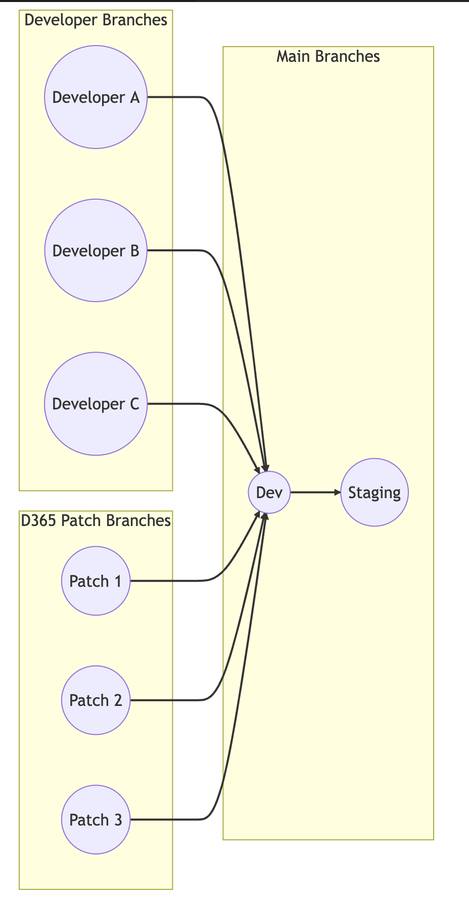

Table 40: Branch mapping strategy (Patching)

### Service Connections

Service Connections in Azure DevOps provide a secure and efficient way to manage connections to external resources, including Dataverse environments. By creating a Service Connection for Dataverse, you can easily reference and manage configurations across different Dataverse environments in your pipelines and other DevOps resources.

To use Service Connections for Dataverse, you will need to create a new connection and enter the required connection details, such as the URL of your Dataverse environment and your user credentials. Once you have created the Service Connection, you can use it in your pipelines to deploy and manage configurations across multiple Dataverse environments, such as plugins, workflows, and data synchronization.

Using Service Connections in this way helps to ensure that your pipeline executions are secure and efficient, by managing the authentication and authorization details required to access your Dataverse environments in a centralized and reusable way. This approach also makes it easier to manage changes to your Dataverse environments over time, by allowing you to deploy and manage configurations consistently across multiple environments.

The table below lists each service connection used by the release pipeline and their type.

| Service Connection Name | Type      |
|-------------------------|-----------|
| {ORGANIZATION}-DEV             | Dataverse |
| {ORGANIZATION}-STAGING         | Dataverse |
| {ORGANIZATION}-QA              | Dataverse |
| {ORGANIZATION}-UAT             | Dataverse |
| {ORGANIZATION}-PREPROD         | Dataverse |
| {ORGANIZATION}-TRAINING        | Dataverse |
| {ORGANIZATION}-SANDBOX         | Dataverse |

### Azure AD Service Account Connection for Power Automate Flows

The {ORGANIZATION}-SYSTEM App Registration (App ID: ) is leveraged as a service account to authorize Flows to communicate with its Dataverse environment to perform automation.

### First-Party Microsoft Plugin to Use CLI Commands in the YAML File for the Pipeline Design

To simplify the developer experience when building and optimizing the pipeline, the Power Platform Build Tools library from the DevOps Marketplace has been installed in the 139fc DevOps organization and being use for the Compliance Case Management Project’s pipeline automation scripts.

### Agent Pools & Self Hosted Agents (future state)

In this current implementation, the Azure Pipelines built in Agent is leveraged to host the infrastructure required to run the pipelines. However, {ORGANIZATION} is implementing a self hosted agent which is further described below:

The self-hosted agent acts as an intermediary between the Developer and the CICD tool, performing builds and deployments as necessary.

Benefits:

- Greater control and customization over the build and deployment process.
- Increased flexibility in terms of where and how builds and deployments are performed.
- Ability to use custom hardware and software configurations to meet specific needs.

Potential issues:

- Requires additional hardware and infrastructure to maintain.
- May require additional setup and configuration time.
- Can introduce additional security concerns if not properly secured.

In general, self-hosted agents can be a great choice for teams that need greater control and flexibility over their build and deployment processes. However, they require additional resources and maintenance, so teams should carefully weigh the benefits and potential issues before deciding to use them.

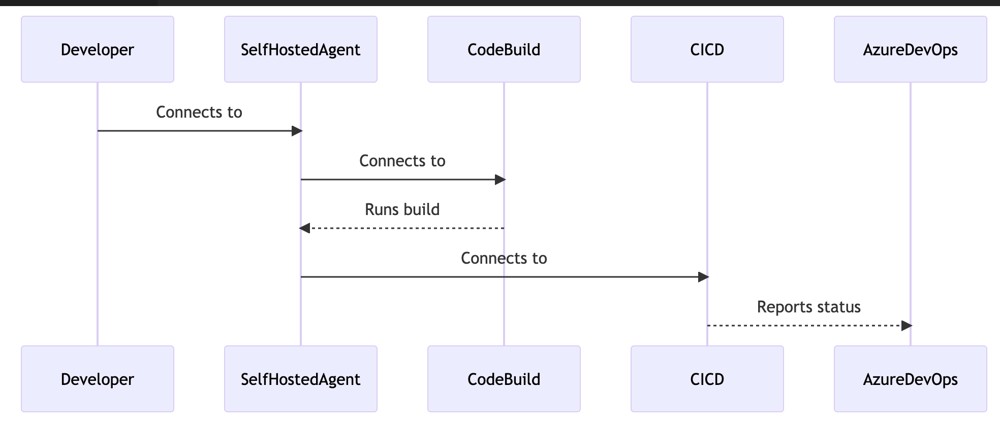

Table 41: Self Hosted Agents (Detailed)

### Technical Documentation Process

Microsoft DocFx has been implemented to host our build book, solution architecture documents, training guides (for various personas) in our private Storage Account (blob). Developers are responsible for updating our documentation each major release and thus must be part of their pull-request post staging (releases) otherwise the PR will be rejected. The pipeline will automatically update the DocFx static site hosted in Azure Storage. Since this storage account is private only and also has a requirement for users to authorize to Active Directory, {ORGANIZATION}’s RBAC (Access Control Policies) are inherited. The figure below illustrates the example home page of the documentation site. Its important to note that DocFx is the framework used by Microsoft for their documentation and is based on Markdown. It also provides the ability to export all documents to PDF for extended stakeholders. For now, any {ORGANIZATION} employee can access the documentation site only once they are on a {ORGANIZATION} device and authenticated to VPN and the CA. The benefit here is that this enterprise and free open-sourced corporate backed framework for technical documentation makes it extremely simply for staff to search anything and navigate and since its baked into our SDLC process, this documentation, unlike word or other types of static documents has less chance or updated. It also helps with on boarding users by providing them with material out of the gate to ingest. This will further refined by video generated content hosted in this site as well and tutorials (future phase).sssssssssss

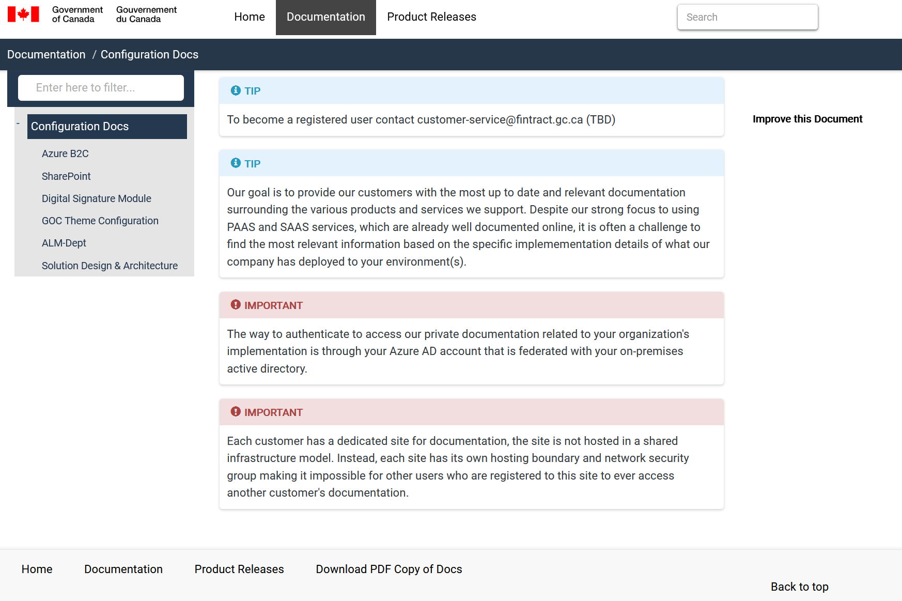

Figure 40: Document Static Site (Azure Storage) - DocFx

## Cost Management

### Billing Policies

### Capacity

### Licensing

## Monitoring

## Exchange Online

This section describes the synchronization of shared mailboxes to send alerts and the Contact-Us mailbox for support linked to a queue in Dynamics. For nonproduction environments, cloud native share mailboxes using the 139gc.onmicrosoft.com domain are being leveraged for development and configuration whereas production will have mailboxes configured in a cloud domain dedicated to the application. This implementation does not require or rely upon “hybrid exchange” as we are not synchronizing any mailboxes that originate from on premises, instead, a new cloud native domain will be configured in Exchange online (which supports multiple domains) to send alerts to recipients and provide a help centre mailbox that is synched to Dynamics and exclusively managed in Dynamics. This means that internal users will be able to review emails from the help centre queue which has an associated help mailbox and promote these to a case or associate to existing case in the system. All email messages synchronized in Dynamics are created as “email message” records” and are of type “activity” thus can be associated manually or automatically to any other activity record such as cases, organizations, and contacts. Once an email is received and associated, it is removed from the queue and responses are automatically tracked in the same thread in the associated record such as a case, thus eliminating the need for users to automatically re-associate a response to the same record. This implementation also does not allow for synchronization of personal employee mailboxes (at this time) and this is another reason why hybrid exchange is not a dependency.

### Synchronization of Shared Mailboxes to Send Alerts

The following mailboxes have been provisioned in M365 Exchange. The table below lists these mailboxes and their associated environments. It’s important to note that an email can only be synched to one environment at a time and that only a G.A or Exchange Administrator can approve a mailbox or uncheck the setting that prevents application layer system administrators to synchronize these mailboxes.

| Mailbox | Environment |
|---------|-------------|
|         |             |
|         |             |
|         |             |
|         |             |
|         |             |
|         |             |
|         |             |

## Environment Map

This final section includes a table that lists all environments and their integrated technologies including SharePoint Subsites, Storage container addresses, B2C App Registrations, Portal URL, Security Group and synched mailboxes.

| D365 URL | Portal URL | Private / Public Portal | Dataverse Environment Security Group | SharePoint Site/Subsite URL | DevOps GIT Repository Branch | B2C API App Registration ID | B2C SSO Registration ID | Storage Container Address | Azure DevOps SPN | Synched Shared Mailboxes |
|----------|------------|-------------------------|--------------------------------------|-----------------------------|------------------------------|-----------------------------|-------------------------|---------------------------|------------------|--------------------------|
|          |            |                         |                                      |                             |                              |                             |                         |                           |                  |                          |
|          |            |                         |                                      |                             |                              |                             |                         |                           |                  |                          |
|          |            |                         |                                      |                             |                              |                             |                         |                           |                  |                          |
|          |            |                         |                                      |                             |                              |                             |                         |                           |                  |                          |
|          |            |                         |                                      |                             |                              |                             |                         |                           |                  |                          |
|          |            |                         |                                      |                             |                              |                             |                         |                           |                  |                          |
|          |            |                         |                                      |                             |                              |                             |                         |                           |                  |                          |

Table 42: Environment Map

## Azure Subscriptions

The Case Compliance System is primarily implemented in the Power Platform, the SAAS CRM technology that ships with Microsoft 365. However, there is a series of supporting services required to secure the platform, monitor it, and enhance the overall management of the entirety of the system. For this implementation, {ORGANIZATION} has two subscriptions, one dedicated to non-production and one for production. The tables below outline the services, resource groups and tags used for each service implemented in each subscription. Every resource’s implementation detail listed in this table is described in this document and hyperlinks are set on the resource name for ease of navigation.

| Resource | Type | Purpose | Resource Group | Tags | IAM |
|----------|------|---------|----------------|------|-----|
|          |      |         |                |      |     |
|          |      |         |                |      |     |
|          |      |         |                |      |     |
|          |      |         |                |      |     |
|          |      |         |                |      |     |
|          |      |         |                |      |     |
|          |      |         |                |      |     |

Table 43: Azure Subscription Resource List (Non-Production)

| Resource | Type | Purpose | Resource Group | Tags | IAM |
|----------|------|---------|----------------|------|-----|
|          |      |         |                |      |     |
|          |      |         |                |      |     |
|          |      |         |                |      |     |
|          |      |         |                |      |     |
|          |      |         |                |      |     |
|          |      |         |                |      |     |
|          |      |         |                |      |     |

Table 44: Azure Subscription Resource List (Production)

## Backup, Restore, and RTO/RPO

This section describes the backup, restore, RTP and RPO features of the platform and its implementation for this solution.

## RTO and RPO

RTO and RPO are terms used to describe the amount of time a system can be down and the amount of data that can be lost without causing significant harm to the business.

For Dynamics 365 online, the RTO (Recovery Time Objective) is the maximum acceptable amount of time that it can take to restore the system after a disruption or outage. Microsoft guarantees an RTO of 4 hours for Dynamics 365 online. This means that Microsoft will work to restore the service within 4 hours of a disruption or outage, and staff can expect the service to be back up and running within that time frame.

The RPO (Recovery Point Objective) for Dynamics 365 online is the maximum amount of data that can be lost during an outage or disruption. Microsoft guarantees an RPO of 12 hours for Dynamics 365 online. This means that in the event of an outage or disruption, staff can expect to lose no more than 12 hours of data.

It is worth noting that RTO and RPO guarantees are subject to the terms of the Microsoft Service Level Agreement (SLA), which outlines the specific terms and conditions of the agreement between Microsoft and the customer. The SLA also outlines the remedies available to the customer in the event that Microsoft fails to meet these guarantees.

## Backup and Restore

The backup and restore feature in Dataverse allow {ORGANIZATION} to create backups of your Dataverse environments and restore them in case of data loss or corruption. Backups can be taken manually or scheduled to run automatically. The backups can be stored in Azure Storage and can be accessed at any time. Restoring a backup overwrites the current environment with the data and configuration from the backup.

### Backup and Restore in Sandbox Environment

In a Sandbox environment, you can create a backup manually by going to the Power Platform Admin Center and selecting the environment. From there, you can click on the "Backup & Restore" tab and select "New Backup". You can also schedule backups to run automatically on a daily or weekly basis. Once a backup is created, it will be stored in Azure Storage.

To restore a backup in a Sandbox environment, you can go to the "Backup & Restore" tab in the Power Platform Admin Center and select "Restore Backup". You will then be prompted to select the backup you want to restore. Restoring a backup will overwrite the current environment with the data and configuration from the backup.

### Backup and Restore in Production Environment

In a Production environment, you can create a backup manually by going to the Power Platform Admin Center and selecting the environment. From there, you can click on the "Backup & Restore" tab and select "New Backup". However, creating a backup manually is not recommended in a Production environment, as it can cause performance issues. It is recommended to schedule backups to run automatically on a weekly or monthly basis.

To restore a backup in a Production environment, you can go to the "Backup & Restore" tab in the Power Platform Admin Center and select "Restore Backup". However, restoring a backup in a Production environment is a more complex process and requires additional steps. It is recommended to seek assistance from Microsoft support via submitting a ticket in the Power Platform Admin Centre.

Finally, when restoring an environment, the environment is automatically set to “administrative mode” meaning that only system administrators can access the system to review that the restore was successfully completed. If successful, administrative mode can be turned off in the admin centre and other users can now access the environment.

### Implementing Backup and Restore in Release Pipeline using CLI

You can use the Common Data Service (CDS) CLI to create and manage backups and restores as part of a release pipeline. The CDS CLI provides a set of commands that allow you to automate the process of creating backups and restoring them.

Creating the backup using the CLI, uses the following command (step in pipeline for disaster recovery):

**cds backup create --environmentName \<environmentName\> --containerName \<containerName\> --description \<description\> --zip**

This command creates a backup of the specified environment and stores it in the specified container in Azure Storage.

To restore a backup using the CLI, you can use the following command:

**cds backup restore --environmentName \<environmentName\> --containerName \<containerName\> --backupName \<backupName\>**

This command restores the specified backup to the specified environment.

These commands have been implemented into our release pipeline as part of your deployment process. This help ensures that our environments are always backed up and can be restored quickly in case of data loss or corruption.

## Business Requirement Implementation Summary & Testing

*TO DO -\> inc. user journey diagram, HL features, state machine*

Business requirements are tracked in Azure DevOps in the same project that hosts this implementation’s GIT repository, release pipelines and artifacts. This is beneficial for tagging work items such as tasks and user stories to specific releases when running the pipeline thus allowing QA and UAT (testers) to scope what to test for each release. Furthermore, a subset of users is assigned the basic+test licenses to make use of the testing tools of DevOps. We make use of both manual and automated testing, both described below.

- Azure Test Plans: This is a testing solution for manual and exploratory testing. It allows users to create test plans, test suites, and test cases, and to execute tests against different configurations of their application. Azure Test Plans also integrates with Azure Pipelines, allowing users to run automated tests as part of their build and release pipelines.
- Azure Test Automation: Azure Test Automation also integrates with Azure Pipelines, allowing users to run automated tests as part of their build and release pipelines. For this implementation, integration testing is being automated by running a series of PowerShell scripts that validate the YAML configurations of tested portal artifacts such as Table Permissions, Column Permissions, Site Settings, Web Templates, Wizard Form Configurations and Global settings. This means that once a feature has been tested “manually” and validated by testers, the developer will store the YAML version of each of the portal tested artifacts in the Validated Portal Test folder in the GIT repository and will compare these against every subsequent release of these same artifacts. If a change has been made to a tested file, a log is generated in the pipeline artifact for the staging pipeline only, therefore will allow the release. However, it is the developer’s responsibility to either update the new version of the YAML file based on new requirements or repair the misconfiguration and re-issue a new release to staging that is clean. For any other environment, the pipeline will block the release if the YAML files do not match the tested artifacts. The diagram below depicts this process.

    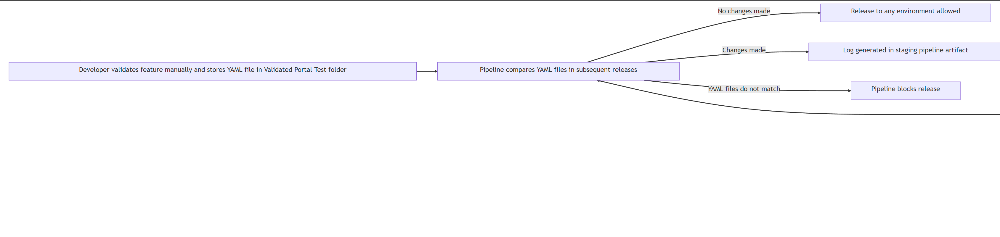

- For CRM (backend testing), there are several tools being used and described below:
  - **Power Apps Test Studio** is an automated testing tool **for Model-driven apps** that developers use to create and run UI test cases and helps them verify that your app's features and functionalities are working as expected. The tool offers a simple, intuitive user interface that makes it easy to create and manage test cases, and it integrates seamlessly with the Power Apps platform. Some of the key benefits of using Power Apps Test Studio for automated testing of Model-driven apps include. It’s important to note that building a model-driven-app, unlike the portal requires very little coding thus the platform provides UX testing tools to test the user, and these are described below and used by developers:
    - Efficient test case creation and execution: With Power Apps Test Studio, you can quickly create test cases using a visual recorder, or by manually creating test steps. You can also run your test cases in parallel, which helps to save time and improve efficiency.
    - Improved test coverage: The tool allows you to test a wide range of scenarios and use cases, which helps to ensure that your app is thoroughly tested and that all features and functionalities are working as expected.
    - Integration with Power Apps platform: Power Apps Test Studio integrates seamlessly with the Power Apps platform, which makes it easy to create and manage test cases and to collaborate with other team members.
    - Easy to maintain and update: The tool makes it easy to maintain and update your test cases, even as your app evolves, and new features are added.
    - Overall, Power Apps Test Studio is a powerful and flexible automated testing tool that is specifically designed for Model-driven apps in Dynamics 365. It can help you to improve the quality and reliability of your app and ensure that it meets the needs and expectations of your users.
  - **Moq** is the automated testing tool used for C\# class libraries that are needed for plugins and custom workflow steps for more complex functionality such as the bilingual plugin utility. Moq is a popular mocking framework for C\# that can be used to create mock objects and simulate dependencies in your code. We also use XUNIT which integrates with Moq. Moq is important as it will create a “Moq” organization context thus allowing to create CRUD operation in our assertion functions without the need to write to a Dataverse environment.
  - **When developers check in their code and solutions both testing tools are run as tasks in the pipeline and must succeed in the build for the release to be issued.**

When it comes to tying in with a release pipeline, all these testing tools can be integrated with Azure Pipelines, which is the continuous integration and continuous delivery (CI/CD) service offered by Azure DevOps. This means that users can include their tests as part of their build and release pipelines, ensuring that their applications are thoroughly tested before they are deployed to production.

For example, users can create a build pipeline that builds and packages their application and includes automated tests using Azure Test Automation. They can then create a release pipeline that deploys the application to a test environment and includes manual and exploratory tests using Azure Test Plans. Finally, they can create a separate release pipeline that deploys the application to production, after all tests have passed.

Overall, the testing tools available in Azure DevOps provide Basic+test licensed users with a comprehensive suite of solutions for testing their applications, from manual and exploratory testing to automated and load testing. These tools can be easily integrated with Azure Pipelines, allowing users to include their tests as part of their build and release pipelines, and to ensure that their applications are thoroughly tested before they are deployed to production. The same applies to the automated test suite using Moq and the Power Apps Studio Testing Tool.

### Case Management & State Behavior

TO DO
