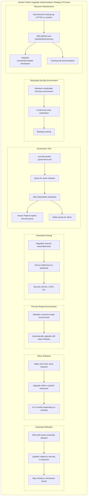
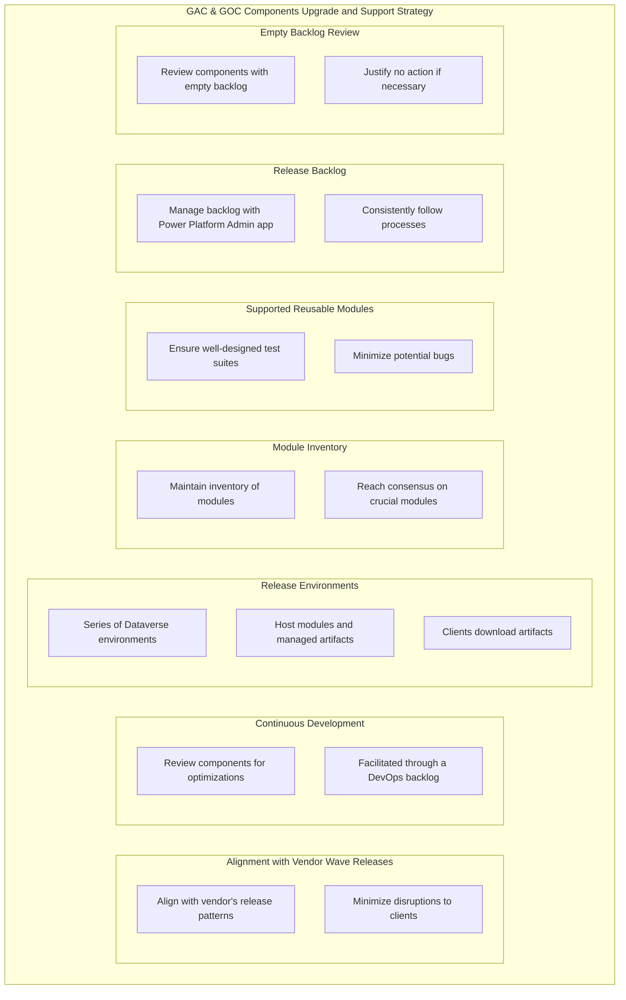

# Global Affairs Canada - Power Platform Services

Enhancing GAC's Power Platform utilization, secure implementations, adherence to PBMM commitments, and delivering digital efficiency within the organization fostering platform adoption

## Purpose

- **Extension of Operationalization**: The main objective is to extend the operationalization of the Power Platform within the organization. This extension is designed to ensure secure implementations, reduce costs through the utilization of templates, apps, and integrations, and minimize the time required for implementation.
- **Alignment with PBMM Commitments**: The service aims to ensure that projects meet Power Platform Best Management Model (PBMM) commitments. It also takes into consideration other relevant standards such as WCAG and CATS.
- **Fostering Platform Adoption**: A significant aspect of this initiative is to foster platform adoption. By providing useful and agile projects, the service encourages divisions and teams to make the most of Power Platform. This adoption can significantly reduce the development effort and technical debt that is often associated with creating similar apps from scratch.
- **Digital Efficiency**: The adoption of Power Platform is not just for internal efficiency. It also enables divisions to offer better services to their external user communities where applicable. This service provides an efficient way to distribute and democratize the usage of the platform, much like other widely adopted SAAS apps such as MS Teams and Office.

## Agenda

1. Vendor Product Upgrade Implementation Strategy & Process
2. GAC & GOC Components Upgrade and Support Strategy (e.g. GCnotify, WET, SSO, consent material/obligations, security modules etc.)
3. Application Specific Support (Project Level)
4. Environment Provisioning (Shopping Cart of Available Reusable Templates/Themes/Modules and Integrations to Expediate Project Implementations)
5. Internal Service Level Agreements (Internal Facing Apps)
6. External Service Level Agreements (External Facing Apps)
7. Automated Tests and Minimum Requirements for PBMM Production Implementation Standards for Both Internal and External Facing Apps (Checklist)
8. Tooling and Integration to Existing Support Systems
9. ALM – DevOps
10. Service Now (or Similar)
11. CoE & Library
12. Resourcing and Support
13. Next Steps / Q&A

### Vendor Product Upgrade Implementation Strategy & Process

- **Automatic Releases**: Microsoft periodically issues automatic releases, mainly related to security or platform bug fixes. While these updates are typically unobtrusive, they can occasionally introduce unforeseen issues that affect ongoing projects.
- **Wave Releases**: Microsoft follows a schedule of major and minor wave releases, typically occurring every quarter. These releases are essential, and customers are required to upgrade within a specific timeframe. This timeframe usually ranges between 6 to 12 months, depending on the criticality of the upgrade.
- **Preview Ready Environments**: Each project must maintain a "preview ready" environment as part of their release management cycle. This environment's primary purpose is to automatically upgrade with each wave release.
- **Automated Testing**: The service mandates that automated tests, meeting minimum requirements, should be regularly executed for these "preview" environments. These tests ensure that the wave release adheres to essential standards, including security, WCAG, CATS, and other application layer criteria.
- **Governance Tool**: To reduce the timeline for implementing wave releases, a governance tool from Microsoft is recommended. This tool, often part of the core components or a basic model-driven app, queries for wave releases via workflow. Individuals responsible for tracking and addressing wave releases are added to the Power Platform Admin security group, and possibly the maker group for alerts only.
- **Dedicated DevOps Environment**: The Power Platform Admin group should maintain a dedicated DevOps environment for sourcing control of the test suite automation and backlog tracking. The integration between DevOps and Power Platform allows for the auto-creation of DevOps work items, enabling the administration of backlogs using standard sprints and conventional backlog administration.
- **Resource Maintenance**: To effectively maintain the processes outlined above, a small group of full-time employees (FTEs) or vendors is recommended. The process for maintaining these systems should be well-defined and standardized. This ensures that Global Affairs Canada (GAC) can quickly integrate junior/intermediate developers with Power Platform experience into the group within a 30-day period (60 days initially). This process may include training materials and basic testing to validate the resource's capabilities, encompassing documentation in Markdown format, video content, and possibly in-person training sessions.

### Process for vendor upgrades

### GAC & GOC Components Upgrade and Support Strategy

- **Alignment with Vendor "Wave" Releases**: This strategy aligns with the vendor's release patterns to minimize disruptions, whether minor or major, to clients.
- **Continuous Development**: Continuous development involves reviewing the current library of components for optimizations, bug fixes, and upgrades sourced from external providers (e.g., WET, GCnotify, GCCF, EGCS, etc.). This process is facilitated through a DevOps backlog.
- **Release Environments**: The strategy requires a series of Dataverse environments, ranging from development to release. Release environments host the modules, including managed artifacts. Clients can download these artifacts via a repository with associated release notes generated by backlog work items.
- **Module Inventory**: Maintaining an inventory of these modules is essential. Internally, it's critical to reach a consensus on which modules or templates are crucial and reusable enough to be added to the standard service support for Power Platform.
- **Supported Reusable Modules**: Supported reusable modules must have well-designed test suites to prevent or minimize potential bugs in applications that utilize them.
- **Release Backlog**: The backlog for these activities should be managed using the Power Platform Admin components app, or a similar tool like Azure DevOps, to ensure that the backlog is governed and that processes are consistently followed.
- **Empty Backlog Review**: In the event that a GOC/GAC component has an empty backlog and has been reviewed as part of the process, the empty backlog should still include a decision work item that justifies "no action." This review process might occur quarterly and should be relatively rare. It might depend on the current team's capacity/resources and the stability of the module.

#### Process for Component

## Application Specific Support (Project Level)

- **Immediate Implementation**: Unlike product and platform-specific upgrades or patches, application-specific support often requires immediate implementation through an accessible service desk or resource, potentially involving vendor support.
- **Triage Tickets**: The team needs to triage tickets to determine their severity and decide whether to escalate them to the vendor or assign them to a support agent at GAC.
- **Collaboration with Vendors**: Depending on the complexity of the ticket, collaboration between GAC and the vendor may be necessary. In such cases, invoking the Enterprise Service Level Agreement (SLA) with Microsoft should be straightforward. It's possible that a partner support vendor (specialists) might be required if GAC is understaffed or facing challenging platform layer issues.
- **Ambiguity Reduction**: The ticket support process should have minimal ambiguity. Any app layer custom bug should be escalated to enterprise support. For platform layer bugs or template bugs, the Power Platform service line is responsible. These issues are related to connecting the service line with the vendor.
- **Environment Requests**: The scope of environment requests should also include AAD app registrations, KeyVault URLs, security group membership, and B2C registrations (if applicable).
- **Release Notes**: Release notes should be readily available in Markdown (DocFX) format. This allows individual project development/build teams to download previews and GA releases at their discretion. However, production support for these releases is not in scope.
- **Access Control**: Developers should not have sysadmin access to production without proper Power Platform Maker and Privileged Identity Management (PIM) access controls in place.

### Process for App Support

```mermaid
graph TB
  subgraph Application Specific Support Project Level
    subgraph Immediate Implementation
      A[Requires immediate implementation]
      B[Accessible service desk or resource]
    end
    subgraph Triage Tickets
      C[Triage tickets for severity]
      D[Escalate to vendor or GAC support]
    end
    subgraph Collaboration with Vendors
      E[Collaboration may be necessary]
      F[Invoke Enterprise SLA with Microsoft]
      G[Partner support vendor may be required]
    end
    subgraph Ambiguity Reduction
      H[Minimal ambiguity in ticket support]
      I[Escalate app layer custom bugs to enterprise support]
      J[Platform layer bugs to Power Platform service line]
    end
    subgraph Environment Requests
      K[Scope includes AAD app registrations]
      L[KeyVault URLs]
      M[Security group membership]
      N[B2C registrations - if applicable]
    end
    subgraph Release Notes
      O[Release notes in Markdown DocFX format]
      P[Available for preview and GA releases]
      Q[Production support not in scope]
    end
    subgraph Access Control
      R[Developers should not have sysadmin access]
      S[Proper Power Platform Maker and PIM controls]
    end
  end
  A --> B
  C --> D
  E --> F
  F --> G
  H --> I
  I --> J
  K --> L
  L --> M
  M --> N
  O --> P
  P --> Q
  R --> S
```

## Tooling

- **Public Web App**: To foster platform adoption, it's crucial to minimize barriers to entry. A public web app, similar to modern libraries, should be created. This web app should allow anyone at GAC to download modules, read documentation, and request various types of environments. This approach should align with the model used by GCcnotify and Microsoft Docs.
- **Simplified Request Process**: The request process should be straightforward and user-friendly.
- **Ticketing Tool**: The web app should also host a ticketing tool, which can be implemented using Power Apps/Pages.
- **Artifact Library**: Users should have access to a library of artifacts, enabling them to select what they want to deploy in their environment requests.
- **Public Azure DevOps Repository**: The Azure DevOps repository should be made public, making it accessible to the broader GAC community.

## Resources and Training

- **Resourcing Assistance**: To reduce the risk associated with resourcing, standard grids and testing processes should be provided to support various service lines.
- **Procurement Guidance**: Service lines that are new to the platform should receive guidance and support in procurement and evaluation processes to avoid implementation issues.
- **Tiered Training**: Training should be available for Developers, Makers, and Admin personas. These personas can exist anywhere in the organization, and their memberships can be automated by registering through the Power Platform services portal.
- **Training Material**: Training material should be comprehensive and comprise documentation, videos, and in-person training sessions, all readily available without manual request through a dedicated portal. This material should be designed to equip individuals with the necessary skills and knowledge to effectively use Power Platform.
- **Community of Excellence (CoE) Kit**: The implementation of CoE kit items can be selective, with core components being installed, and additional items considered as the organization matures. These kits help in improving the efficiency and effectiveness of Power Platform usage.
- **Reference Material**: A library of reference material should be accessible to users. This material includes environment management apps and Power Platform CoE Hygiene resources to support various projects and initiatives.
